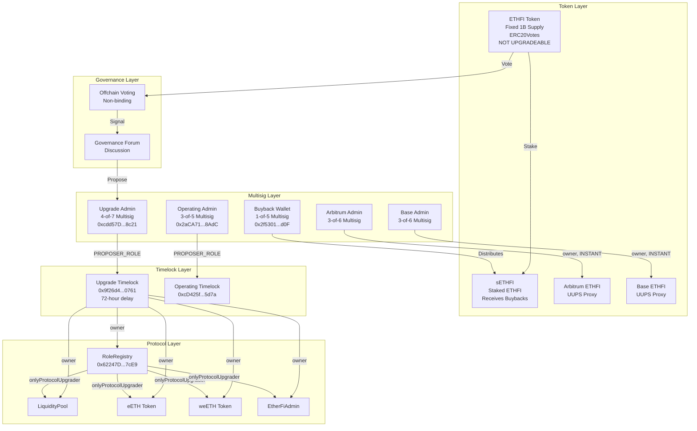
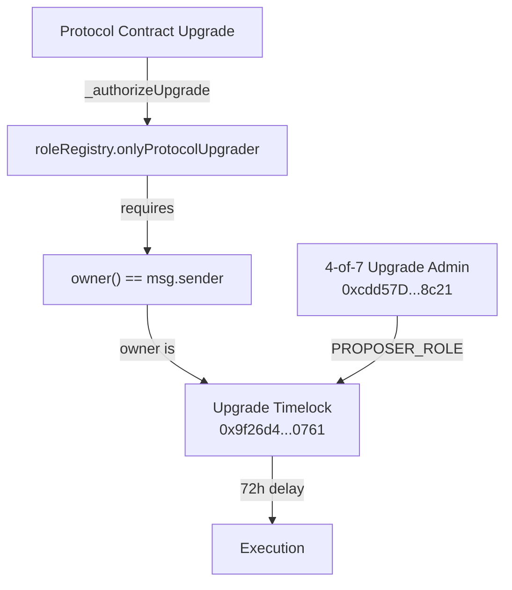
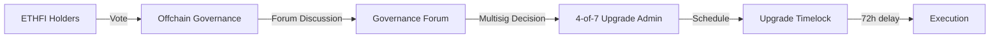

# ETHFI Token Research Report

## Aragon Ownership Token Framework Analysis

**Target:** ETHFI (Ether.fi Governance Token)
**Token Address:** [`0xFe0c30065B384F05761f15d0CC899D4F9F9Cc0eB`](https://etherscan.io/address/0xFe0c30065B384F05761f15d0CC899D4F9F9Cc0eB) (Ethereum Mainnet)
**Date:** 2026-02-24
**Researcher:** Aragon OTF Agent

---

## Executive Summary

ETHFI is a governance token for the ether.fi protocol, which has expanded from liquid staking into a broader neobank product suite. The token implements ERC20Votes for on-chain voting capability, but **governance is currently in Phase 0 of a multi-stage decentralisation roadmap** with votes occurring off-chain, executed by a team-controlled multisig.

**Critical Correction:** Previous research incorrectly identified the upgrade authority. After tracing the full ownership chain from the deployed contracts, protocol upgrades are **timelocked with a 72-hour delay**, not instant.

**Key Findings:**
- **Supply:** Fixed at 1B with ~998.5M currently circulating (some burned). No mint function exists.
- **Governance:** Off-chain voting → multisig execution. Not on-chain binding.
- **Upgrade Authority:** 4-of-7 multisig → 72-hour Timelock → RoleRegistry → Protocol contracts. Upgrades require a 72-hour delay.
- **Value Accrual:** Active buyback program distributing to ETHFI stakers (sETHFI holders), but Foundation-discretionary via 1-of-5 wallet.
- **Token Rights:** No censorship, no pause, no blacklist in ETHFI token contract.
- **L2 Tokens:** Upgradeable on Arbitrum and Base, controlled by 3-of-6 multisigs (no timelock).

---

## Governance and Ownership Model

### Contract Architecture

| Contract | Address | Type | Upgradeable |
|----------|---------|------|-------------|
| ETHFI Token | [`0xFe0c30065B384F05761f15d0CC899D4F9F9Cc0eB`](https://etherscan.io/address/0xFe0c30065B384F05761f15d0CC899D4F9F9Cc0eB) | ERC20 | No |
| RoleRegistry | [`0x62247D29B4B9BECf4BB73E0c722cf6445cfC7cE9`](https://etherscan.io/address/0x62247D29B4B9BECf4BB73E0c722cf6445cfC7cE9) | Access Control | Yes (UUPS) |
| LiquidityPool | [`0x308861A430be4cce5502d0A12724771Fc6DaF216`](https://etherscan.io/address/0x308861A430be4cce5502d0A12724771Fc6DaF216) | Core Protocol | Yes (UUPS) |
| eETH | [`0x35fA164735182de50811E8e2E824cFb9B6118ac2`](https://etherscan.io/address/0x35fA164735182de50811E8e2E824cFb9B6118ac2) | Rebasing Token | Yes (UUPS) |
| weETH | [`0xCd5fE23C85820F7B72D0926FC9b05b43E359b7ee`](https://etherscan.io/address/0xCd5fE23C85820F7B72D0926FC9b05b43E359b7ee) | Wrapped Token | Yes (UUPS) |
| EtherFiAdmin | [`0x0EF8fa4760Db8f5Cd4d993f3e3416f30f942D705`](https://etherscan.io/address/0x0EF8fa4760Db8f5Cd4d993f3e3416f30f942D705) | Admin | Yes (UUPS) |
| Treasury | [`0x0c83EAe1FE72c390A02E426572854931EefF93BA`](https://etherscan.io/address/0x0c83EAe1FE72c390A02E426572854931EefF93BA) | 3-of-8 Safe | No |
| Upgrade Timelock | [`0x9f26d4C958fD811A1F59B01B86Be7dFFc9d20761`](https://etherscan.io/address/0x9f26d4C958fD811A1F59B01B86Be7dFFc9d20761) ([source](https://github.com/etherfi-protocol/smart-contracts/blob/master/src/EtherFiTimelock.sol)) | TimelockController (72h) | No |
| Operating Timelock | [`0xcD425f44758a08BaAB3C4908f3e3dE5776e45d7a`](https://etherscan.io/address/0xcD425f44758a08BaAB3C4908f3e3dE5776e45d7a) ([source](https://github.com/etherfi-protocol/smart-contracts/blob/master/src/EtherFiTimelock.sol)) | TimelockController (8h) | No |
| sETHFI | [`0x86B5780b606940Eb59A062aA85a07959518c0161`](https://etherscan.io/address/0x86B5780b606940Eb59A062aA85a07959518c0161) | Boring Vault (ETHFI staking) | No |

### L2 Token Contracts

| Network | Address | Type | Owner |
|---------|---------|------|-------|
| Arbitrum | [`0x7189fb5B6504bbfF6a852B13B7B82a3c118fDc27`](https://arbiscan.io/address/0x7189fb5B6504bbfF6a852B13B7B82a3c118fDc27) | UUPS Proxy | 3-of-6 Multisig ([`0x0c6ca...`](https://arbiscan.io/address/0x0c6ca434756eedf928a55ebeaf0019364b279732)) |
| Base | [`0x6C240DDA6b5c336DF09A4D011139beAAa1eA2Aa2`](https://basescan.org/address/0x6C240DDA6b5c336DF09A4D011139beAAa1eA2Aa2) | UUPS Proxy | 3-of-6 Multisig ([`0x7a006...`](https://basescan.org/address/0x7a00657a45420044bc526b90ad667affaee0a868)) |

### Privileged Role Matrix

| Contract | Role | Current Holder | Holder Type | Verification | Controller |
|----------|------|----------------|-------------|--------------|------------|
| RoleRegistry | owner | `0x9f26d4C958fD811A1F59B01B86Be7dFFc9d20761` | Timelock | `eth_call owner() = 0x9f26d4c958fd811a1f59b01b86be7dffc9d20761` | 4-of-7 Upgrade Admin |
| LiquidityPool | owner | `0x9f26d4C958fD811A1F59B01B86Be7dFFc9d20761` | Timelock | `eth_call owner() = 0x9f26d4c958fd811a1f59b01b86be7dffc9d20761` | 4-of-7 Upgrade Admin |
| eETH | owner | `0x9f26d4C958fD811A1F59B01B86Be7dFFc9d20761` | Timelock | `eth_call owner() = 0x9f26d4c958fd811a1f59b01b86be7dffc9d20761` | 4-of-7 Upgrade Admin |
| weETH | owner | `0x9f26d4C958fD811A1F59B01B86Be7dFFc9d20761` | Timelock | `eth_call owner() = 0x9f26d4c958fd811a1f59b01b86be7dffc9d20761` | 4-of-7 Upgrade Admin |
| EtherFiAdmin | owner | `0x9f26d4C958fD811A1F59B01B86Be7dFFc9d20761` | Timelock | `eth_call owner() = 0x9f26d4c958fd811a1f59b01b86be7dffc9d20761` | 4-of-7 Upgrade Admin |
| Upgrade Timelock | PROPOSER_ROLE | `0xcdd57D11476c22d265722F68390b036f3DA48c21` | 4-of-7 Multisig | `hasRole(PROPOSER_ROLE, addr) = true` | Team-controlled |
| Upgrade Timelock | EXECUTOR_ROLE | `0xcdd57D11476c22d265722F68390b036f3DA48c21` | 4-of-7 Multisig | `hasRole(EXECUTOR_ROLE, addr) = true` | Team-controlled |
| Upgrade Timelock | CANCELLER_ROLE | `0xcdd57D11476c22d265722F68390b036f3DA48c21` | 4-of-7 Multisig | `hasRole(CANCELLER_ROLE, addr) = true` | Team-controlled |
| Operating Timelock | PROPOSER_ROLE | `0x2aCA71020De61bb532008049e1Bd41E451AE8AdC` | 3-of-5 Multisig | `hasRole(PROPOSER_ROLE, addr) = true` | Team-controlled |
| Operating Timelock | EXECUTOR_ROLE | `0x2aCA71020De61bb532008049e1Bd41E451AE8AdC` | 3-of-5 Multisig | `hasRole(EXECUTOR_ROLE, addr) = true` | Team-controlled |
| Arbitrum ETHFI | owner | [`0x0c6ca434...`](https://arbiscan.io/address/0x0c6ca434756eedf928a55ebeaf0019364b279732) | 3-of-6 Multisig | `eth_call owner()` | Team-controlled |
| Base ETHFI | owner | [`0x7a00657a...`](https://basescan.org/address/0x7a00657a45420044bc526b90ad667affaee0a868) | 3-of-6 Multisig | `eth_call owner()` | Team-controlled |
| sETHFI | authority | [`0x3994741a...`](https://etherscan.io/address/0x3994741a5b29c60d0ab318de1024f9256fe959dc) | RolesAuthority | `authority() = 0x3994741a...` | 4-of-6 Multisig |
| Treasury | threshold | 3-of-8 | Safe Multisig | `getThreshold() = 3, getOwners().length = 8` | Team-controlled |

### Multisig Details

| Multisig | Address | Threshold | Purpose |
|----------|---------|-----------|---------|
| Upgrade Admin | [`0xcdd57D11476c22d265722F68390b036f3DA48c21`](https://etherscan.io/address/0xcdd57D11476c22d265722F68390b036f3DA48c21) | 4-of-7 | Timelock PROPOSER/EXECUTOR for protocol upgrades |
| Operating Admin | [`0x2aCA71020De61bb532008049e1Bd41E451AE8AdC`](https://etherscan.io/address/0x2aCA71020De61bb532008049e1Bd41E451AE8AdC) | 3-of-5 | Operating Timelock proposer |
| Buyback/Foundation | [`0x2f5301a3D59388c509C65f8698f521377D41Fd0F`](https://etherscan.io/address/0x2f5301a3D59388c509C65f8698f521377D41Fd0F) | 1-of-5 | ETHFI buybacks and distribution |
| Arbitrum L2 Admin | [`0x0c6ca434756eedf928a55ebeaf0019364b279732`](https://arbiscan.io/address/0x0c6ca434756eedf928a55ebeaf0019364b279732) | 3-of-6 | Arbitrum ETHFI token upgrades |
| Base L2 Admin | [`0x7a00657a45420044bc526b90ad667affaee0a868`](https://basescan.org/address/0x7a00657a45420044bc526b90ad667affaee0a868) | 3-of-6 | Base ETHFI token upgrades |

**Upgrade Admin Signers (4-of-7):**
1. [`0x9506429a421757711806c5caf25ba1830e349b09`](https://etherscan.io/address/0x9506429a421757711806c5caf25ba1830e349b09)
2. [`0x4507cfb4b077d5dbddd520c701e30173d5b59fad`](https://etherscan.io/address/0x4507cfb4b077d5dbddd520c701e30173d5b59fad)
3. [`0x5c8c76f2e990f194462dc5f8a8c76ba16966ed42`](https://etherscan.io/address/0x5c8c76f2e990f194462dc5f8a8c76ba16966ed42)
4. [`0x0fce5cd3fb6f3b3fb7f0f707070a0a7e2442f444`](https://etherscan.io/address/0x0fce5cd3fb6f3b3fb7f0f707070a0a7e2442f444)
5. [`0x648aa14e4424e0825a5ce739c8c68610e143fb79`](https://etherscan.io/address/0x648aa14e4424e0825a5ce739c8c68610e143fb79)
6. [`0x2f2806e8b288428f23707a69faa60f52bc565c17`](https://etherscan.io/address/0x2f2806e8b288428f23707a69faa60f52bc565c17)
7. [`0x173286fafabea063eeb3726ee5efd4ff414057b9`](https://etherscan.io/address/0x173286fafabea063eeb3726ee5efd4ff414057b9)

### Ownership Topology Diagram



### Upgrade Authority Path (Corrected)

The previous research incorrectly stated upgrades bypass the timelock. The correct upgrade path is:



**Code Evidence (RoleRegistry.sol lines 76-78):**
```solidity
function onlyProtocolUpgrader(address account) public view {
    if (owner() != account) revert OnlyProtocolUpgrader();
}
```
- Source: [RoleRegistry.sol:76-78](https://github.com/etherfi-protocol/smart-contracts/blob/master/src/RoleRegistry.sol#L76-L78)

**On-chain Verification:**
```
RoleRegistry.owner() = 0x9f26d4c958fd811a1f59b01b86be7dffc9d20761 (Upgrade Timelock)
Timelock.getMinDelay() = 259200 (72 hours)
Timelock.hasRole(PROPOSER_ROLE, 0xcdd57D11476c22d265722F68390b036f3DA48c21) = true
```

**Conclusion:** Protocol upgrades (LiquidityPool, eETH, weETH, EtherFiAdmin, RoleRegistry) REQUIRE:
1. 4-of-7 multisig proposal
2. 72-hour timelock delay
3. Execution by the same multisig

### Two-Timelock System

The protocol uses two separate timelocks for different purposes:

| Timelock | Address | Min Delay | Proposer | Purpose |
|----------|---------|-----------|----------|---------|
| Upgrade Timelock | `0x9f26d4C958fD811A1F59B01B86Be7dFFc9d20761` | **72 hours** | 4-of-7 Upgrade Admin | Protocol upgrades, RoleRegistry ownership |
| Operating Timelock | `0xcD425f44758a08BaAB3C4908f3e3dE5776e45d7a` | **8 hours** | 3-of-5 Operating Admin | Day-to-day operations |

**On-chain Verification:**
```
Upgrade Timelock getMinDelay() = 0x3f480 = 259200 seconds = 72 hours
Operating Timelock getMinDelay() = 0x7080 = 28800 seconds = 8 hours

Operating Timelock hasRole(PROPOSER_ROLE, 0x2aCA71020De61bb532008049e1Bd41E451AE8AdC) = true
Operating Timelock hasRole(EXECUTOR_ROLE, 0x2aCA71020De61bb532008049e1Bd41E451AE8AdC) = true
```

**Key Distinction:**
- **Upgrade Timelock (72h):** Controls RoleRegistry ownership and therefore all protocol upgrades. Changes to protocol code require 72 hours notice.
- **Operating Timelock (8h):** Used for operational changes that don't affect upgrade authority. Provides 8 hours notice.

### Timelock Scope: What It Controls vs. What Bypasses It

The Upgrade Timelock (`0x9f26d4C958fD811A1F59B01B86Be7dFFc9d20761`) owns the RoleRegistry, which means timelock approval is required for contract upgrades and role management. However, many operational functions use role-based access control that bypasses the timelock entirely.

**What Requires Timelock (72h):**
- Contract upgrades (LiquidityPool, eETH, weETH, EtherFiAdmin) - via `RoleRegistry.onlyProtocolUpgrader()`
- RoleRegistry upgrades - via `onlyOwner`
- Granting or revoking roles - via `RoleRegistry.grantRole()/revokeRole()` (requires owner)

**What Bypasses Timelock (role-based, instant):**
- Validator operations (create, approve, fund) - `LIQUIDITY_POOL_VALIDATOR_CREATOR_ROLE`, `LIQUIDITY_POOL_VALIDATOR_APPROVER_ROLE`
- Pool configuration (fee recipient, validator size) - `LIQUIDITY_POOL_ADMIN_ROLE`
- Emergency pause/unpause - `PROTOCOL_PAUSER`, `PROTOCOL_UNPAUSER`
- Oracle execution - `ETHERFI_ORACLE_EXECUTOR_TASK_MANAGER_ROLE`
- Parameter updates - `ETHERFI_ORACLE_EXECUTOR_ADMIN_ROLE`
- Asset recovery - `EETH_OPERATING_ADMIN_ROLE`, `WEETH_OPERATING_ADMIN_ROLE`
- **L2 token upgrades:** Arbitrum and Base ETHFI tokens can be upgraded via `upgradeToAndCall()` and have minting control via `setMinter()` - controlled by 3-of-6 multisigs with NO timelock

**Role Holders for Key Roles (verified on-chain):**
- `LIQUIDITY_POOL_ADMIN_ROLE`: EtherFiAdmin (`0x0EF8fa...`) and Operating Timelock (`0xcD425f...`)

**Implication:** While L1 contract upgrades require 72 hours notice via the Upgrade Timelock, operational actions can happen instantly by role holders. L2 ETHFI tokens have no timelock protection at all. Role holders are managed by the Upgrade Timelock, but once granted, they can act without further approval.

---

## 1. On-Chain Control

### 1.1 Onchain Governance Workflow

**Status:** ⚠️ PARTIAL

**Finding:** ETHFI implements ERC20Votes enabling delegation and voting power tracking. However, the protocol does **not** currently have a deployed on-chain Governor contract that binds token votes to protocol execution.

**Current Flow:**


**Evidence:**
- Governance roadmap states Phase 0 includes: "launching offchain voting, delegate elections, security council, and discourse groups"
  - Source: [Governance Roadmap](https://etherfi.gitbook.io/gov/governance-roadmap)
- Current governance is offchain and advisory, not binding on-chain voting
- 4-day voting window with 1M ETHFI quorum required
  - Source: [Governance Forum](https://governance.ether.fi/)

**Implication:** ETHFI tokenholders can signal preference but cannot unilaterally force execution. The multisig committee can theoretically ignore offchain voting results.

---

### 1.2 Role Accountability

**Status:** ⚠️ PARTIAL

**Finding:** Protocol roles are managed through a layered system with multiple access control patterns:

1. **RoleRegistry** ([`0x62247D29B4B9BECf4BB73E0c722cf6445cfC7cE9`](https://etherscan.io/address/0x62247D29B4B9BECf4BB73E0c722cf6445cfC7cE9)): Manages system-wide roles using Solady's EnumerableRoles. Owned by the **Upgrade Timelock** (72-hour delay). Role hashes are defined on individual contracts but registered here.

2. **Timelocks**: Both timelocks use OpenZeppelin's TimelockController with their own internal `hasRole()` — not managed by the RoleRegistry.

3. **Boring Vaults** (sETHFI, eUSD, etc.): Use `RolesAuthority` pattern, separate from the RoleRegistry. Authority contracts are controlled by the 4-of-6 multisig.

4. **Gnosis Safes**: Treasury and other Safes have their own threshold-based access pattern.

**Key Role Holders (verified on-chain):**
- `LIQUIDITY_POOL_ADMIN_ROLE`: EtherFiAdmin + Operating Timelock (8h)
- `PROTOCOL_PAUSER` / `PROTOCOL_UNPAUSER`: Managed by RoleRegistry
- Timelock PROPOSER/EXECUTOR roles: 4-of-7 (Upgrade) and 3-of-5 (Operating) multisigs

**On-chain verification:**
```
RoleRegistry.owner() = 0x9f26d4c958fd811a1f59b01b86be7dffc9d20761 (Upgrade Timelock)
Upgrade Timelock minDelay = 259200 seconds (72 hours)
Operating Timelock minDelay = 28800 seconds (8 hours)
```

**Complexity Note:** This is a convoluted role system that is difficult to trace fully. The important points: timelocks provide delays for upgrades and role changes, key operational roles are held by the Operating multisig and EtherFiAdmin, and ultimately all these systems are controlled by team multisigs. ETHFI tokenholders have no direct role in any of these systems. We have seen no evidence of bad faith, but tokenholders must trust the EtherFi team.

**Implication:** Role changes via RoleRegistry require a 72-hour timelock, providing exit opportunity. However, operational roles (once granted) can act immediately.

---

### 1.3 Protocol Upgrade Authority

**Status:** ⚠️ TIMELOCKED (72 hours)

**Finding:** Protocol contracts are upgradeable (UUPS pattern) but upgrades are protected by a **72-hour timelock**. The 4-of-7 Upgrade Admin multisig proposes and executes upgrades through the timelock.

**Upgrade Authorization Path (verified on-chain):**
1. 4-of-7 Upgrade Admin (`0xcdd57D11476c22d265722F68390b036f3DA48c21`) proposes to Timelock
2. 72-hour delay enforced by Timelock (`0x9f26d4C958fD811A1F59B01B86Be7dFFc9d20761`)
3. Timelock (as RoleRegistry owner) authorizes upgrade via `onlyProtocolUpgrader()`
4. Contract implementation is replaced

**Contract Ownership vs Upgrade Authority:**
| Contract | Type | owner() | Upgrade Authority |
|----------|------|---------|-------------------|
| LiquidityPool | UUPS | Upgrade Timelock | **72h delay** |
| eETH | UUPS | Upgrade Timelock | **72h delay** |
| weETH | UUPS | Upgrade Timelock | **72h delay** |
| EtherFiAdmin | UUPS | Upgrade Timelock | **72h delay** |
| RoleRegistry | UUPS | Upgrade Timelock | **72h delay** |
| sETHFI | Boring Vault | - | **Not upgradeable** (authority: 4-of-6) |
| eUSD | Boring Vault | - | **Not upgradeable** (authority: 4-of-6) |
| weETHs | Boring Vault | - | **Not upgradeable** (authority: 4-of-6) |
| weETHk | Boring Vault | - | **Not upgradeable** (authority: 4-of-6) |
| eBTC | Boring Vault | - | **Not upgradeable** (authority: 5-day Timelock) |
| Treasury | Gnosis Safe | - | **Not upgradeable** (3-of-8) |
| Arbitrum ETHFI | UUPS | 3-of-6 | **Instant** (no timelock) |
| Base ETHFI | UUPS | 3-of-6 | **Instant** (no timelock) |

**Note:** Boring Vaults use `authority()` instead of `owner()`. The authority contract (RolesAuthority) controls privileged functions. Boring Vaults are non-upgradeable by design. See "Additional Protocol Contracts (Veda Vaults)" section for details.

**Verification Commands:**
```bash
# RoleRegistry owner
curl -X POST https://eth-mainnet.public.blastapi.io -d '{"jsonrpc":"2.0","method":"eth_call","params":[{"to":"0x62247D29B4B9BECf4BB73E0c722cf6445cfC7cE9","data":"0x8da5cb5b"},"latest"],"id":1}'
# Result: 0x9f26d4c958fd811a1f59b01b86be7dffc9d20761 (Timelock)

# Timelock minDelay
curl -X POST https://eth-mainnet.public.blastapi.io -d '{"jsonrpc":"2.0","method":"eth_call","params":[{"to":"0x9f26d4C958fD811A1F59B01B86Be7dFFc9d20761","data":"0xf27a0c92"},"latest"],"id":1}'
# Result: 0x3f480 = 259200 seconds = 72 hours

# Check Upgrade Admin has PROPOSER_ROLE
curl -X POST https://eth-mainnet.public.blastapi.io -d '{"jsonrpc":"2.0","method":"eth_call","params":[{"to":"0x9f26d4C958fD811A1F59B01B86Be7dFFc9d20761","data":"0x91d14854b09aa5aeb3702cfd50b6b62bc4532604938f21248a27a1d5ca736082b6819cc1000000000000000000000000cdd57d11476c22d265722f68390b036f3da48c21"},"latest"],"id":1}'
# Result: true
```

---

### 1.4 Token Upgrade Authority

**Status:** ⚠️ MIXED

**Ethereum Mainnet:** ✅ NOT UPGRADEABLE
- The ETHFI token on Ethereum mainnet is a standard ERC-20 (non-proxy). It cannot be upgraded.
- Contract bytecode begins with `0x608060405234801561001057...` (standard contract, not proxy)
- No EIP-1967 implementation slot found

**L2 Tokens:** ❌ UPGRADEABLE (No Timelock)
- **Arbitrum ETHFI:** UUPS proxy, owner is [3-of-6 multisig](https://arbiscan.io/address/0x0c6ca434756eedf928a55ebeaf0019364b279732) - **NO TIMELOCK**
- **Base ETHFI:** UUPS proxy, owner is [3-of-6 multisig](https://basescan.org/address/0x7a00657a45420044bc526b90ad667affaee0a868) - **NO TIMELOCK**

**Risk:** L2 token contracts can be upgraded instantly by 3-of-6 multisig, potentially introducing censorship or other restrictions.

---

### 1.5 Supply Control

**Status:** ✅ FIXED SUPPLY

**Finding:** ETHFI has a fixed supply of 1 billion tokens. No mint function exists in the contract. Supply can only decrease through burning.

**On-chain Verification:**
```
totalSupply() = 998,535,999 ETHFI (approximately 1.46M burned)
```

**Contract Analysis:**
- Inherits `ERC20Burnable` - allows holders to burn their own tokens
- No `mint()` function in contract
- All 1B minted at deployment to a 4-of-6 Safe: [`0x7A6A41F353B3002751d94118aA7f4935dA39bB53`](https://etherscan.io/address/0x7A6A41F353B3002751d94118aA7f4935dA39bB53)

**Documentation Confirmation:**
> "ETHFI has a fixed supply of 1B, with no further issuance."
- Source: [ETHFI Allocations](https://etherfi.gitbook.io/gov/ethfi-allocations)

---

### 1.6 Privileged Access Gating

**Status:** ⚠️ TEAM-CONTROLLED (No Tokenholder Access)

**Finding:** ETHFI tokenholders have no direct access to protocol operations. All privileged functions are controlled by team multisigs or role holders appointed by team multisigs. Beyond pause, privileged access includes fee configuration, validator management, oracle execution, and asset recovery.

**Key Privileged Functions:**
- **Pause/Unpause:** `PROTOCOL_PAUSER` and `PROTOCOL_UNPAUSER` roles can halt protocol operations
- **Fee Configuration:** `LIQUIDITY_POOL_ADMIN_ROLE` can change fee recipients via `setFeeRecipient()`
- **Validator Management:** Multiple roles control validator creation, approval, and funding
- **Oracle Execution:** `ETHERFI_ORACLE_EXECUTOR_TASK_MANAGER_ROLE` executes reward distributions
- **Asset Recovery:** Operating admin roles can recover assets from protocol contracts

**Pause Authority (LiquidityPool.sol lines 448-453):**
```solidity
function pauseContract() external {
    if (!roleRegistry.hasRole(roleRegistry.PROTOCOL_PAUSER(), msg.sender)) revert IncorrectRole();
    if (paused) revert("Pausable: already paused");
    paused = true;
    emit Paused(msg.sender);
}
```
- Source: [LiquidityPool.sol:448-453](https://github.com/etherfi-protocol/smart-contracts/blob/master/src/LiquidityPool.sol#L448-L453)

**Tokenholder Control:** None. ETHFI tokenholders cannot directly invoke any protocol function. Their only power is advisory voting in offchain governance, which the team multisigs may choose to follow.

### EtherFiAdmin Contract

EtherFiAdmin ([`0x0EF8fa4760Db8f5Cd4d993f3e3416f30f942D705`](https://etherscan.io/address/0x0EF8fa4760Db8f5Cd4d993f3e3416f30f942D705)) is the primary execution engine for protocol operations. It coordinates batch operations and timing-sensitive tasks.

**Key Functions:**
- `pauseAll()` / `unPauseAll()`: Protocol-wide pause control
- `executeTasks()`: Batch execution of oracle-triggered tasks (reward distribution, rebase, validator management)
- `updateAdmin()`: Change admin configuration (requires Upgrade Timelock)
- `setDailyExecutionTimestamp()`: Controls execution windows

**Privileged Roles Required:**
- `ETHERFI_ORACLE_EXECUTOR_TASK_MANAGER_ROLE`: Execute reward distribution tasks
- `ETHERFI_ORACLE_EXECUTOR_ADMIN_ROLE`: Configure execution parameters
- `PROTOCOL_PAUSER` / `PROTOCOL_UNPAUSER`: Pause control

**Source:** [EtherFiAdmin.sol](https://github.com/etherfi-protocol/smart-contracts/blob/master/src/EtherFiAdmin.sol)

---

### 1.7 Token Censorship

**Status:** ⚠️ MIXED

**Ethereum Mainnet:** ✅ NO CENSORSHIP
- Standard ERC-20 transfer with no hooks or restrictions
- No `blacklist` or `freeze` mapping
- No admin override for transfers
- Inherits only: ERC20, ERC20Burnable, ERC20Permit, ERC20Votes

**L2 Tokens:** ⚠️ POTENTIAL RISK
- Arbitrum and Base ETHFI tokens are upgradeable proxies
- Owners (3-of-6 multisigs) could theoretically upgrade to add censorship
- No timelock protection for L2 upgrades

---

## 2. Value Accrual

### 2.1 Accrual Active

**Status:** ✅ ACTIVE (with caveats)

**Finding:** An ETHFI buyback program is operational, distributing purchased tokens to ETHFI stakers (sETHFI holders). However, execution is Foundation-discretionary rather than programmatic.

**Protocol Fee Split (for eETH staking rewards):**
- eETH Stakers: 90%
- Node Operators: 5%
- Protocol: 5%
- Source: [ether.fi Staking Documentation](https://etherfi.gitbook.io/etherfi/ether.fi-whitepaper/ether.fi-staking)

**Note:** This fee split applies to ETH staking rewards accrued by eETH holders. The 5% protocol revenue contributes to ETHFI buybacks.

**Buyback Sources:**
1. **Weekly:** 100% of eETH withdrawal fees
2. **Monthly:** Foundation-discretionary portion of broader protocol revenue (Stake, Liquid, Cash products)

**Distribution:**
- All buyback proceeds → ETHFI stakers (sETHFI holders)
- Staking at: [ether.fi/app/ethfi](https://www.ether.fi/app/ethfi)

**On-chain Evidence:**
- Buyback Wallet: `0x2f5301a3D59388c509C65f8698f521377D41Fd0F` (1-of-5 multisig)
- sETHFI Contract: `0x86B5780b606940Eb59A062aA85a07959518c0161`

**Caveat:**
- Buyback execution is controlled by a **1-of-5 multisig** (any single signer can execute)
- All 5 signers are EOAs (verified on-chain)
- Distribution is announced via Foundation communications, not enforced by smart contract
- The Foundation has discretion over timing, amounts, and whether broader protocol revenue is contributed
- The buyback wallet appears to have no other protocol powers beyond holding and distributing ETHFI

**Sources:**
- [ETHFI Buyback Program](https://etherfi.gitbook.io/gov/ethfi-buyback-program)
- [Dune Dashboard: ETHFI Buybacks & Revenue](https://dune.com/ether_fi/ethfi-buybacks-and-protocol-revenue-sources)

---

### 2.2 Treasury Ownership

**Status:** ⚠️ TIMELOCK-CONTROLLED (not tokenholder-controlled)

**Finding:** Protocol treasury contracts are owned by timelocks. However, timelock proposers are multisigs, not tokenholders.

**Treasury Contracts:**
| Contract | Address | Owner |
|----------|---------|-------|
| Treasury (from Deployed.s.sol) | [`0x0c83EAe1FE72c390A02E426572854931EefF93BA`](https://etherscan.io/address/0x0c83EAe1FE72c390A02E426572854931EefF93BA) | 3-of-8 Safe Multisig |
| Old Treasury Reference | [`0x6329004E903B7F420245E7aF3f355186f2432466`](https://etherscan.io/address/0x6329004E903B7F420245E7aF3f355186f2432466) | Timelock |

---

### 2.3 Accrual Mechanism Control

**Status:** ⚠️ FOUNDATION-CONTROLLED

**Finding:** Protocol fee parameters and buyback allocation are not enforced on-chain. The buyback wallet is a 1-of-5 multisig, meaning any single authorized signer can control fund distribution.

**Fee Configuration (LiquidityPool.sol lines 434-438):**
```solidity
function setFeeRecipient(address _feeRecipient) external {
    if (!roleRegistry.hasRole(LIQUIDITY_POOL_ADMIN_ROLE, msg.sender)) revert IncorrectRole();
    feeRecipient = _feeRecipient;
    emit UpdatedFeeRecipient(_feeRecipient);
}
```
- Source: [LiquidityPool.sol:434-438](https://github.com/etherfi-protocol/smart-contracts/blob/master/src/LiquidityPool.sol#L434-L438)

**Buyback Parameters:**
- Buyback wallet: 1-of-5 multisig (low security threshold)
- Percentage allocation: Documentation states 100% of withdrawal fees
- No on-chain enforcement of this commitment

---

### 2.4 Offchain Value Accrual

**Status:** ❌ NONE IDENTIFIED

**Finding:** No legally binding revenue sharing arrangements or licensing revenue documented.

---

## 3. Verifiability

### 3.1 Token Contract Source Verification

**Status:** ⚠️ PARTIAL

**Finding:** ETHFI token contract is verified on Etherscan, but the source code is not available in the public GitHub repository.

**Evidence:**
- [Etherscan Verified Source](https://etherscan.io/address/0xFe0c30065B384F05761f15d0CC899D4F9F9Cc0eB#code)
- Compiler: Solidity 0.8.20
- License: MIT
- GitHub Source: Not available in public repository

**Note:** The token contract source is visible on Etherscan but not in the etherfi-protocol/smart-contracts GitHub repository.

---

### 3.2 Protocol Component Source Verification

**Status:** ✅ VERIFIED

**Finding:** All core protocol contracts are verified on Etherscan and match the public GitHub repository.

**Repository:** [etherfi-protocol/smart-contracts](https://github.com/etherfi-protocol/smart-contracts)
**License:** MIT (declared in README, SPDX headers in contracts)

**Deployed Contract Addresses:** Verified in [Deployed.s.sol](https://github.com/etherfi-protocol/smart-contracts/blob/master/script/deploys/Deployed.s.sol)

**Audit Coverage:**
- Multiple audits available at [audits folder](https://github.com/etherfi-protocol/smart-contracts/tree/master/audits)
- Formal verification via Certora

---

## 4. Token Distribution

### 4.1 Ownership Concentration

**Status:** ⚠️ CONCENTRATED (Transparently Documented)

**Finding:** The token allocation is clearly documented in official governance documentation. Over 55% is allocated to Investors and Core Contributors, with transparent vesting schedules that progressively release tokens over time.

**Allocation Breakdown:**
| Category | Percentage | Vesting | Cliff |
|----------|-----------|---------|-------|
| Investors | 33.74% | 2 years | 1 year |
| Treasury | 21.62% | None | - |
| Core Contributors | 21.47% | 3 years | 1 year |
| User Airdrops | 19.27% | Various | - |
| Partnerships | 3.9% | - | - |

**Fully Diluted:** 1B ETHFI

- Source: [ETHFI Allocations](https://etherfi.gitbook.io/gov/ethfi-allocations)

---

### 4.2 Future Token Unlocks

**Status:** ⚠️ ONGOING UNLOCKS (Transparently Tracked)

**Finding:** The protocol provides transparent visibility into token unlock schedules. Continuous daily unlocks occur from team and investor allocations according to the published vesting schedule.

**Unlock Status (approximate):**
- Team: 77.96M unlocked of 232.6M (33.5%)
- Investors: 217.55M unlocked of 325M (67%)

**Full vesting completion:** By end of 2030

- Source: [DefiLlama Unlocks](https://defillama.com/unlocks/ether.fi)

---

## 5. Offchain Dependencies

### 5.1 Trademark

**Status:** ⚠️ COMPANY-CONTROLLED

**Finding:** Trademarks are owned by Ether.Fi SEZC (Cayman Islands company), not a tokenholder-controlled entity.

**Evidence:**
> "The Company name, the terms, the Company logo, and all related names, logos, product and service names, designs, and slogans are trademarks of the Company or its affiliates or licensors."
- Source: [Terms of Use](https://etherfi.gitbook.io/etherfi/ether.fi-legal/terms-of-use)

---

### 5.2 Distribution

**Status:** ⚠️ COMPANY-CONTROLLED

**Finding:** The ether.fi domain and platform are operated by Ether.Fi SEZC, a Cayman Islands Special Economic Zone Company.

**Legal Entity:** Ether.Fi SEZC
**Jurisdiction:** Cayman Islands
**Relationship to DAO:** None documented. The company operates with "unilateral control over terms and services."

---

### 5.3 Licensing

**Status:** ⚠️ MIXED

**Smart Contracts:** MIT licensed, allowing unrestricted use, modification, and distribution.
- README states: "ether.fi is open-source and licensed under the MIT License"
- SPDX-License-Identifier: MIT in contract headers
- Source: [GitHub Repository](https://github.com/etherfi-protocol/smart-contracts)

**Non-Smart-Contract IP:** Company-controlled with restrictions.
- Website content, documentation, and brand assets are owned by Ether.Fi SEZC
- Users receive only a "limited, non-transferable, non-sublicensable, non-exclusive, revocable license"
- No explicit open licensing for documentation, SDKs, or APIs
- Source: [Terms of Use](https://etherfi.gitbook.io/etherfi/ether.fi-legal/terms-of-use)

---

## Control Summary

| Component | Controller | Tokenholder Control |
|-----------|------------|---------------------|
| ETHFI Supply | Immutable | ✅ Cannot be changed |
| ETHFI Transfers (L1) | Permissionless | ✅ No restrictions |
| ETHFI Transfers (L2) | 3-of-6 Multisigs | ⚠️ Upgradeable, no timelock |
| Protocol Upgrades | 4-of-7 Multisig + 72h Timelock | ⚠️ Timelocked but multisig controlled |
| Role Assignments | Timelock | ⚠️ Timelocked but multisig controlled |
| Treasury | Timelock | ⚠️ Timelocked but multisig controlled |
| Pause Functions | PROTOCOL_PAUSER role | ⚠️ Role assigned via Timelock |
| Buybacks | 1-of-5 Foundation wallet | ❌ Foundation discretionary |
| Trademarks | Ether.Fi SEZC | ❌ Company controlled |

---

## Conflicts of Interest

### Identified Risks

1. **Governance Advisory Only:** Team/Foundation multisig can propose and execute changes through timelock without binding tokenholder approval. Offchain votes are advisory.

2. **Insider Concentration:** 55% allocated to investors + team (vesting mitigates but doesn't eliminate)

3. **Value Accrual Discretion:** Buyback execution is controlled by a **1-of-5 multisig** - any single signer can control distribution. Not programmatic.

4. **Legal Entity Disconnect:** Ether.Fi SEZC (Cayman company) owns trademarks and operates platform. No documented legal obligation to tokenholders.

5. **L2 Upgrade Risk:** Arbitrum and Base ETHFI tokens can be upgraded **instantly** by 3-of-6 multisigs with no timelock delay. This is a significant centralization risk for L2 users.

6. **Two-Timelock System:** The protocol uses Upgrade Timelock (72h) and Operating Timelock (8h) with different admin multisigs. Both timelocks verified.

7. **sETHFI and Treasury Access Control:**
   - **sETHFI** ([`0x86B5780b606940Eb59A062aA85a07959518c0161`](https://etherscan.io/address/0x86B5780b606940Eb59A062aA85a07959518c0161)): Boring Vault using `authority()` pattern. RolesAuthority at [`0x3994741a5b29c60d0ab318de1024f9256fe959dc`](https://etherscan.io/address/0x3994741a5b29c60d0ab318de1024f9256fe959dc) owned by 4-of-6 multisig ([`0xcea8039076e35a825854c5c2f85659430b06ec96`](https://etherscan.io/address/0xcea8039076e35a825854c5c2f85659430b06ec96)). Not upgradeable.
   - **Treasury** ([`0x0c83EAe1FE72c390A02E426572854931EefF93BA`](https://etherscan.io/address/0x0c83EAe1FE72c390A02E426572854931EefF93BA)): 3-of-8 Gnosis Safe multisig. Not upgradeable.

---

## Additional Protocol Contracts (Veda Vaults)

Beyond the core ETHFI token and protocol contracts, Ether.fi offers a suite of liquid vault products built on Veda infrastructure. These vaults use a different access control pattern where `owner()` returns `0x0`, but access is managed through a `RolesAuthority` contract.

### Vault Overview

| Product | Contract | Type | Authority Owner |
|---------|----------|------|-----------------|
| eUSD | [`0x939778D83b46B456224A33Fb59630B11DEC56663`](https://etherscan.io/address/0x939778D83b46B456224A33Fb59630B11DEC56663) | Boring Vault | 4-of-6 multisig ([`0xcea80...`](https://etherscan.io/address/0xcea8039076e35a825854c5c2f85659430b06ec96)) |
| weETHs | [`0x917cee801a67f933f2e6b33fc0cd1ed2d5909d88`](https://etherscan.io/address/0x917cee801a67f933f2e6b33fc0cd1ed2d5909d88) | Boring Vault (Symbiotic) | 4-of-6 multisig ([`0xcea80...`](https://etherscan.io/address/0xcea8039076e35a825854c5c2f85659430b06ec96)) |
| weETHk | [`0x7223442cad8e9ca474fc40109ab981608f8c4273`](https://etherscan.io/address/0x7223442cad8e9ca474fc40109ab981608f8c4273) | Boring Vault (Karak) | 4-of-6 multisig ([`0xcea80...`](https://etherscan.io/address/0xcea8039076e35a825854c5c2f85659430b06ec96)) |
| eBTC | [`0x657e8C867D8B37dCC18fA4Caead9C45EB088C642`](https://etherscan.io/address/0x657e8C867D8B37dCC18fA4Caead9C45EB088C642) | Boring Vault | 5-day Timelock |
| beHYPE | [`0xd8FC8F0b03eBA61F64D08B0bef69d80916E5DdA9`](https://hyperscan.xyz/address/0xd8FC8F0b03eBA61F64D08B0bef69d80916E5DdA9) | HyperEVM | Not verified |

### Access Control Pattern

These Veda vaults use an `authority()` function instead of `owner()`. The authority contract (a `RolesAuthority`) determines who can call privileged functions. The RolesAuthority itself has an owner - typically a multisig or timelock.

**On-chain verification:**
```
eUSD.authority() = 0x83da0eabc45b14bbfaec94a1f4de0901db6b9633
RolesAuthority.owner() = 0xcea8039076e35a825854c5c2f85659430b06ec96 (4-of-6 multisig)

eBTC.authority() = 0x6889e57bca038c28520c0b047a75e567502ea5f6
RolesAuthority.owner() = 0x70a64840a353c58f63333570f53dba0948bece3d (5-day Timelock)
```

### Implications for ETHFI Token Analysis

1. **Consistent multisig control:** Most vaults (eUSD, weETHs, weETHk, sETHFI) are controlled by the same 4-of-6 multisig ([`0xcea8039076e35a825854c5c2f85659430b06ec96`](https://etherscan.io/address/0xcea8039076e35a825854c5c2f85659430b06ec96)), similar to L2 ETHFI tokens.

2. **eBTC has timelock protection:** eBTC uses a 5-day timelock for role authority changes, providing better protection than other vaults.

3. **Indirect ETHFI value flow:** While these vaults don't directly distribute to ETHFI tokenholders, they generate protocol revenue. Per the [buyback program docs](https://etherfi.gitbook.io/gov/ethfi-buyback-program), a Foundation-discretionary portion of broader protocol revenue (Stake, Liquid, Cash products) may fund monthly ETHFI buybacks. The [Dune dashboard](https://dune.com/ether_fi/ethfi-buybacks-and-protocol-revenue-sources) tracks liquid vault revenue contributions.

4. **No change to overall assessment:** The vaults confirm the pattern: ether.fi products are controlled by team multisigs, with the 72-hour Upgrade Timelock providing protection only for core L1 contracts (LiquidityPool, eETH, weETH). The value flow to ETHFI remains Foundation-discretionary via the 1-of-5 buyback wallet.

---

## Comparison to Roadmap Claims

| Claimed | Reality |
|---------|---------|
| "Decentralized governance" | Off-chain voting, multisig execution |
| "Community controls treasury" | Timelock controlled, multisig proposes |
| "Tokenholders govern protocol" | Advisory votes only, no binding on-chain |
| "Progressive decentralization" | Currently in Phase 0, full decentralization TBD |

---

## Conclusion

ETHFI token provides:
- ✅ Fixed supply with no inflation risk
- ✅ Transfer freedom with no censorship capability (L1)
- ✅ Active value accrual through buyback program
- ✅ Verified, audited, open-source protocol
- ✅ 72-hour timelock on protocol upgrades (L1)

ETHFI token lacks:
- ❌ Binding on-chain governance
- ❌ Tokenholder control over multisig composition
- ❌ Timelock protection for L2 token upgrades
- ❌ Programmatic (non-discretionary) value distribution
- ❌ Tokenholder-controlled legal entity

**Framework Assessment:** ETHFI is a governance token with limited enforceable rights but meaningful protections. The 72-hour timelock on L1 upgrades provides exit opportunity, but ultimate control remains with team-controlled multisigs. L2 token holders face higher risk due to instant upgrade capability.

---

## Contract Reference Table

| Contract | Address | Owner/Admin | Verified |
|----------|---------|-------------|----------|
| ETHFI Token | `0xFe0c30065B384F05761f15d0CC899D4F9F9Cc0eB` | Immutable | 2026-02-24 |
| RoleRegistry | `0x62247D29B4B9BECf4BB73E0c722cf6445cfC7cE9` | Upgrade Timelock | 2026-02-24 |
| Upgrade Timelock | `0x9f26d4C958fD811A1F59B01B86Be7dFFc9d20761` | - | 2026-02-24 |
| Operating Timelock | `0xcD425f44758a08BaAB3C4908f3e3dE5776e45d7a` | 8h delay, 3-of-5 proposer | 2026-02-24 |
| Treasury | [`0x0c83EAe1FE72c390A02E426572854931EefF93BA`](https://etherscan.io/address/0x0c83EAe1FE72c390A02E426572854931EefF93BA) | 3-of-8 Safe Multisig | 2026-02-27 |
| Upgrade Admin (4-of-7) | `0xcdd57D11476c22d265722F68390b036f3DA48c21` | Team | 2026-02-24 |
| Operating Admin (3-of-5) | `0x2aCA71020De61bb532008049e1Bd41E451AE8AdC` | Team | 2026-02-24 |
| LiquidityPool | `0x308861A430be4cce5502d0A12724771Fc6DaF216` | Upgrade Timelock | 2026-02-24 |
| eETH | `0x35fA164735182de50811E8e2E824cFb9B6118ac2` | Upgrade Timelock | 2026-02-24 |
| weETH | `0xCd5fE23C85820F7B72D0926FC9b05b43E359b7ee` | Upgrade Timelock | 2026-02-24 |
| EtherFiAdmin | `0x0EF8fa4760Db8f5Cd4d993f3e3416f30f942D705` | Upgrade Timelock | 2026-02-24 |
| sETHFI | [`0x86B5780b606940Eb59A062aA85a07959518c0161`](https://etherscan.io/address/0x86B5780b606940Eb59A062aA85a07959518c0161) | RolesAuthority → 4-of-6 Multisig | 2026-02-27 |
| Buyback Wallet (1-of-5) | `0x2f5301a3D59388c509C65f8698f521377D41Fd0F` | Foundation | 2026-02-24 |
| Arbitrum ETHFI | `0x7189fb5B6504bbfF6a852B13B7B82a3c118fDc27` | 3-of-6 Multisig | 2026-02-24 |
| Base ETHFI | `0x6C240DDA6b5c336DF09A4D011139beAAa1eA2Aa2` | 3-of-6 Multisig | 2026-02-24 |

---

## Sources

### Primary Sources
- [etherfi-protocol/smart-contracts GitHub](https://github.com/etherfi-protocol/smart-contracts)
- [Etherscan ETHFI Token](https://etherscan.io/address/0xFe0c30065B384F05761f15d0CC899D4F9F9Cc0eB)
- [Deployed.s.sol - Official Contract Addresses](https://github.com/etherfi-protocol/smart-contracts/blob/master/script/deploys/Deployed.s.sol)
- [Ether.fi Protocol Documentation](https://etherfi.gitbook.io/etherfi/)
- [Ether.fi Governance Documentation](https://etherfi.gitbook.io/gov/)

### Governance
- [Offchain Voting Platform](https://vote.ether.fi/)
- [Governance Forum](https://governance.ether.fi/)
- [Governance Roadmap](https://etherfi.gitbook.io/gov/governance-roadmap)

### Risk Assessments
- [Prisma Risk weETH Assessment](https://hackmd.io/@PrismaRisk/weETH)

### On-chain Verification
- RPC: `https://eth-mainnet.public.blastapi.io`
- All contract calls verified February 24, 2026

### Key Corrections from Previous Research
1. **RoleRegistry Address:** Correct address is [`0x62247D29B4B9BECf4BB73E0c722cf6445cfC7cE9`](https://etherscan.io/address/0x62247D29B4B9BECf4BB73E0c722cf6445cfC7cE9) (not `0x1d3Af47C1607A2EF33033693A9989D1d1013BB50`)
2. **RoleRegistry Owner:** Owner is Upgrade Timelock (not 3-of-5 multisig)
3. **Upgrade Authority:** Requires 72-hour timelock (not instant multisig)
4. **Upgrade Admin:** 4-of-7 multisig at `0xcdd57D11476c22d265722F68390b036f3DA48c21`
