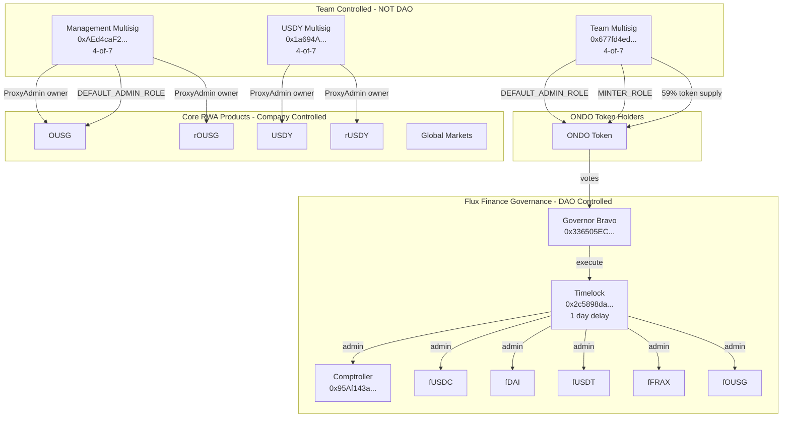

# ONDO Token Research Report

## Aragon Ownership Token Framework Analysis

**Token:** ONDO (Ondo Governance Token)
**Address:** `0xfAbA6f8e4a5E8Ab82F62fe7C39859FA577269BE3`
**Network:** Ethereum Mainnet
**Date:** 2026-03-06
**Analyst:** Researcher Agent

---

## Executive Summary

**Protocol Description:** Ondo Finance is a tokenized real-world asset (RWA) protocol offering products like OUSG (tokenized US Treasuries) and USDY (yield-bearing stablecoin). The ONDO token is the governance token for Ondo DAO, which governs **Flux Finance only**—a Compound V2 fork for permissioned lending.

This analysis evaluates ONDO against the Aragon Ownership Token Framework to answer three core questions:

1. **What do I own?** ONDO tokenholders control governance over Flux Finance only—a small DeFi lending protocol. ONDO governance does **NOT** control Ondo's core RWA products (OUSG, USDY, Ondo Global Markets, or the upcoming Ondo Chain). The ONDO token itself has AccessControl with DEFAULT_ADMIN_ROLE and MINTER_ROLE held by team multisigs, not the DAO.

2. **Why should it have value?** There is **no active value accrual mechanism** for ONDO tokenholders. Flux Finance reserve factors are 0% across all markets—no protocol fees are collected. USDY/OUSG revenue accrues to Ondo Finance Inc., not to ONDO tokenholders. There is no fee distribution, staking rewards, or buyback program.

3. **What threatens that value?** Critical governance scope limitation (controls only Flux Finance, not core products), high token concentration (~59% in team multisig), team control over the ONDO token contract itself (MINTER_ROLE), and absence of binding value accrual.

**Overall Assessment:** 4 positive (✅), 5 neutral (TBD), 9 at-risk (⚠️)

---

## Contract Index Table

| Contract | Address | What it does | Upgradeable? | Ownership-relevant? | Value-accrual-relevant? |
|----------|---------|--------------|--------------|---------------------|-------------------------|
| ONDO Token | `0xfAbA6f8e4a5E8Ab82F62fe7C39859FA577269BE3` | Governance token with AccessControl | No | Y | N |
| Governor (Ondo DAO) | `0x336505EC1BcC1A020EeDe459f57581725D23465A` | GovernorBravo for Flux Finance | No | Y | N |
| Timelock | `0x2c5898da4DF1d45EAb2B7B192a361C3b9EB18d9c` | 1-day execution delay | No | Y | N |
| Comptroller | `0x95Af143a021DF745bc78e845b54591C53a8B3A51` | Flux Finance accounting/risk | No | Y | Y |
| fUSDC | `0x465a5a630482f3abD6d3b84B39B29b07214d19e5` | Flux lending market | Yes (delegator) | Y | Y |
| fDAI | `0xe2bA8693cE7474900A045757fe0efCa900F6530b` | Flux lending market | Yes (delegator) | Y | Y |
| fUSDT | `0x81994b9607e06ab3d5cF3AffF9a67374f05F27d7` | Flux lending market | Yes (delegator) | Y | Y |
| fFRAX | `0x1C9A2d6b33B4826757273D47ebEe0e2DddcD978B` | Flux lending market | Yes (delegator) | Y | Y |
| fOUSG | `0x1dD7950c266fB1be96180a8FDb0591F70200E018` | OUSG lending market | Yes (delegator) | Y | Y |
| Flux Lens | `0xcA83471CE9B0E7E6f628FA2A95Ae97198780acf8` | Query helper | No | N | N |
| OUSG | `0x1B19C19393e2d034D8Ff31ff34c81252FcBbee92` | Tokenized treasuries | Yes (proxy) | Y | Y |
| rOUSG | `0x54043c656F0FAd0652D9Ae2603cDF347c5578d00` | Rebasing OUSG wrapper | Yes (proxy) | Y | Y |
| USDY | `0x96F6eF951840721AdBF46Ac996b59E0235CB985C` | Yield-bearing stablecoin | Yes (proxy) | Y | Y |
| rUSDY | `0xaf37c1167910ebC994e266949387d2c7C326b879` | Rebasing USDY wrapper | Yes (proxy) | Y | Y |
| OUSG_InstantManager | `0x93358db73B6cd4b98D89c8F5f230E81a95c2643a` | OUSG mint/redeem | Yes (proxy) | Y | Y |
| OndoIDRegistry | `0xcf6958D69d535FD03BD6Df3F4fe6CDcd127D97df` | KYC registry | Yes (proxy) | Y | N |
| GMTokenManager | `0x2c158BC456e027b2AfFCCadF1BDBD9f5fC4c5C8c` | Global Markets manager | Unknown | Y | Y |
| USDon | `0xAcE8E719899F6E91831B18AE746C9A965c2119F1` | Global Markets stable | Unknown | Y | Y |
| Team Multisig | `0x677fd4ed8ae623f2f625deb2d64f2070e46ca1a1` | Holds ~59% ONDO, DEFAULT_ADMIN_ROLE | N/A (Safe) | Y | N |
| Management Multisig | `0xAEd4caF2E535D964165B4392342F71bac77e8367` | Admin for OUSG/rOUSG | N/A (Safe) | Y | N |

---

## Contract Ownership Verification

### ONDO Token
```
cast call 0xfAbA6f8e4a5E8Ab82F62fe7C39859FA577269BE3 "name()(string)" --rpc-url https://ethereum-rpc.publicnode.com
→ "Ondo"

cast call 0xfAbA6f8e4a5E8Ab82F62fe7C39859FA577269BE3 "totalSupply()(uint256)" --rpc-url https://ethereum-rpc.publicnode.com
→ 10000000000000000000000000000 [1e28] (10 billion ONDO)

cast call 0xfAbA6f8e4a5E8Ab82F62fe7C39859FA577269BE3 "transferAllowed()(bool)" --rpc-url https://ethereum-rpc.publicnode.com
→ true (transfers enabled since Jan 2024)

cast call 0xfAbA6f8e4a5E8Ab82F62fe7C39859FA577269BE3 "DEFAULT_ADMIN_ROLE()(bytes32)" --rpc-url https://ethereum-rpc.publicnode.com
→ 0x0000000000000000000000000000000000000000000000000000000000000000

cast call 0xfAbA6f8e4a5E8Ab82F62fe7C39859FA577269BE3 "MINTER_ROLE()(bytes32)" --rpc-url https://ethereum-rpc.publicnode.com
→ 0x9f2df0fed2c77648de5860a4cc508cd0818c85b8b8a1ab4ceeef8d981c8956a6

cast call 0xfAbA6f8e4a5E8Ab82F62fe7C39859FA577269BE3 "hasRole(bytes32,address)(bool)" 0x0000000000000000000000000000000000000000000000000000000000000000 0x677fd4ed8ae623f2f625deb2d64f2070e46ca1a1 --rpc-url https://ethereum-rpc.publicnode.com
→ true (Team Multisig has DEFAULT_ADMIN_ROLE)

cast call 0xfAbA6f8e4a5E8Ab82F62fe7C39859FA577269BE3 "hasRole(bytes32,address)(bool)" 0x9f2df0fed2c77648de5860a4cc508cd0818c85b8b8a1ab4ceeef8d981c8956a6 0x677fd4ed8ae623f2f625deb2d64f2070e46ca1a1 --rpc-url https://ethereum-rpc.publicnode.com
→ true (Team Multisig has MINTER_ROLE)

cast call 0xfAbA6f8e4a5E8Ab82F62fe7C39859FA577269BE3 "balanceOf(address)(uint256)" 0x677fd4ed8ae623f2f625deb2d64f2070e46ca1a1 --rpc-url https://ethereum-rpc.publicnode.com
→ 5904207574154394239393946019 [5.904e27] (~59% of supply)
```

### Governor and Timelock
```
cast call 0x336505EC1BcC1A020EeDe459f57581725D23465A "timelock()(address)" --rpc-url https://ethereum-rpc.publicnode.com
→ 0x2c5898da4DF1d45EAb2B7B192a361C3b9EB18d9c (Timelock)

cast call 0x336505EC1BcC1A020EeDe459f57581725D23465A "admin()(address)" --rpc-url https://ethereum-rpc.publicnode.com
→ 0x2c5898da4DF1d45EAb2B7B192a361C3b9EB18d9c (Timelock)

cast call 0x336505EC1BcC1A020EeDe459f57581725D23465A "comp()(address)" --rpc-url https://ethereum-rpc.publicnode.com
→ 0xfAbA6f8e4a5E8Ab82F62fe7C39859FA577269BE3 (ONDO token)

cast call 0x336505EC1BcC1A020EeDe459f57581725D23465A "proposalThreshold()(uint256)" --rpc-url https://ethereum-rpc.publicnode.com
→ 100000000000000000000000000 [1e26] (100M ONDO = 1% of supply)

cast call 0x336505EC1BcC1A020EeDe459f57581725D23465A "quorumVotes()(uint256)" --rpc-url https://ethereum-rpc.publicnode.com
→ 1000000000000000000000000 [1e24] (1M ONDO = 0.01% of supply)

cast call 0x336505EC1BcC1A020EeDe459f57581725D23465A "votingPeriod()(uint256)" --rpc-url https://ethereum-rpc.publicnode.com
→ 21600 blocks (~3 days at 12s/block)

cast call 0x2c5898da4DF1d45EAb2B7B192a361C3b9EB18d9c "admin()(address)" --rpc-url https://ethereum-rpc.publicnode.com
→ 0x336505EC1BcC1A020EeDe459f57581725D23465A (Governor)

cast call 0x2c5898da4DF1d45EAb2B7B192a361C3b9EB18d9c "delay()(uint256)" --rpc-url https://ethereum-rpc.publicnode.com
→ 86400 (1 day)
```

### Flux Finance Contracts
```
cast call 0x95Af143a021DF745bc78e845b54591C53a8B3A51 "admin()(address)" --rpc-url https://ethereum-rpc.publicnode.com
→ 0x2c5898da4DF1d45EAb2B7B192a361C3b9EB18d9c (Timelock - DAO controlled)

cast call 0x465a5a630482f3abD6d3b84B39B29b07214d19e5 "admin()(address)" --rpc-url https://ethereum-rpc.publicnode.com
→ 0x2c5898da4DF1d45EAb2B7B192a361C3b9EB18d9c (Timelock)

cast call 0x465a5a630482f3abD6d3b84B39B29b07214d19e5 "reserveFactorMantissa()(uint256)" --rpc-url https://ethereum-rpc.publicnode.com
→ 0 (0% reserve factor)

cast call 0xe2bA8693cE7474900A045757fe0efCa900F6530b "reserveFactorMantissa()(uint256)" --rpc-url https://ethereum-rpc.publicnode.com
→ 0 (fDAI 0% reserve factor)

cast call 0x81994b9607e06ab3d5cF3AffF9a67374f05F27d7 "reserveFactorMantissa()(uint256)" --rpc-url https://ethereum-rpc.publicnode.com
→ 0 (fUSDT 0% reserve factor)

cast call 0x1C9A2d6b33B4826757273D47ebEe0e2DddcD978B "reserveFactorMantissa()(uint256)" --rpc-url https://ethereum-rpc.publicnode.com
→ 0 (fFRAX 0% reserve factor)

cast call 0x1dD7950c266fB1be96180a8FDb0591F70200E018 "reserveFactorMantissa()(uint256)" --rpc-url https://ethereum-rpc.publicnode.com
→ 0 (fOUSG 0% reserve factor)
```

### OUSG (Company-Controlled)
```
cast implementation 0x1B19C19393e2d034D8Ff31ff34c81252FcBbee92 --rpc-url https://ethereum-rpc.publicnode.com
→ 0x1ceb44b6e515abf009e0ccb6ddafd723886cf3ff

cast admin 0x1B19C19393e2d034D8Ff31ff34c81252FcBbee92 --rpc-url https://ethereum-rpc.publicnode.com
→ 0xba80aa44cc25e85cc30359150dfb1c7d041cf6d5 (ProxyAdmin)

cast call 0xba80aa44cc25e85cc30359150dfb1c7d041cf6d5 "owner()(address)" --rpc-url https://ethereum-rpc.publicnode.com
→ 0xAEd4caF2E535D964165B4392342F71bac77e8367 (Management Multisig - NOT DAO)

cast call 0x1B19C19393e2d034D8Ff31ff34c81252FcBbee92 "hasRole(bytes32,address)(bool)" 0x0000000000000000000000000000000000000000000000000000000000000000 0xAEd4caF2E535D964165B4392342F71bac77e8367 --rpc-url https://ethereum-rpc.publicnode.com
→ true (Management Multisig has DEFAULT_ADMIN_ROLE on OUSG)
```

### USDY (Company-Controlled)
```
cast implementation 0x96F6eF951840721AdBF46Ac996b59E0235CB985C --rpc-url https://ethereum-rpc.publicnode.com
→ 0xea0f7eebdc2ae40edfe33bf03d332f8a7f617528

cast admin 0x96F6eF951840721AdBF46Ac996b59E0235CB985C --rpc-url https://ethereum-rpc.publicnode.com
→ 0x3ed61633057da0bc58f84b2b9002845e56f94c19 (ProxyAdmin)

cast call 0x3ed61633057da0bc58f84b2b9002845e56f94c19 "owner()(address)" --rpc-url https://ethereum-rpc.publicnode.com
→ 0x1a694A09494E214a3Be3652e4B343B7B81A73ad7 (4-of-7 Multisig - NOT DAO)
```

### Multisig Configurations
```
# Team Multisig (holds ~59% ONDO + DEFAULT_ADMIN_ROLE + MINTER_ROLE)
cast call 0x677fd4ed8ae623f2f625deb2d64f2070e46ca1a1 "getOwners()(address[])" --rpc-url https://ethereum-rpc.publicnode.com
→ [0x089108993ADB5cB0059c885E88877335817d0B76, 0x1648F68209BF2aaEd0CE57e2571cC5e232AE91C2, 0xdb13B128C72e8fEB1A4BEb97385fDc7b93566b8E, 0xb61192AD512aE4dd4E7f309f26B7fff276A3dC5E, 0xDF8cb55DcA10592431755A38C29391646f59354b, 0xcC3ABE9967E0a831d6F8B5ecA1b9Ad3e29de9b5e, 0x4bf633d2A2CA3297A97544cEFf1E26a67B2fd615]

cast call 0x677fd4ed8ae623f2f625deb2d64f2070e46ca1a1 "getThreshold()(uint256)" --rpc-url https://ethereum-rpc.publicnode.com
→ 4 (4-of-7 multisig)

# Management Multisig (OUSG admin)
cast call 0xAEd4caF2E535D964165B4392342F71bac77e8367 "getOwners()(address[])" --rpc-url https://ethereum-rpc.publicnode.com
→ [0x74a4C329AA5a6BFa16bD32BAf37209f4C632173D, 0x189D409b807aC1949Fe82c143270992FE9457607, 0xECE6bC29F718085a30b7bC14162B0fad4737e5d0, 0x60F030d621a4Ab27DfF024a8e43eB36e2D95FB02, 0xaA1E4eef723ceaDd137B3AD39ea540dA4B092f8e, 0x020679fF2Bc53758bEbAD1bBe0ab0CF7c1beD241, 0x6A95a204aD4a6842b2f0aE3BBb59f35E85594f46]

cast call 0xAEd4caF2E535D964165B4392342F71bac77e8367 "getThreshold()(uint256)" --rpc-url https://ethereum-rpc.publicnode.com
→ 4 (4-of-7 multisig)
```

---

## Supply Metrics

| Metric | Value | Verified |
|--------|-------|----------|
| Total Supply | 10,000,000,000 ONDO | ✅ On-chain |
| Max Supply | 10,000,000,000 ONDO (fixed) | ✅ totalSupply constant |
| Team Multisig Holdings | ~5.9B ONDO (~59%) | ✅ On-chain |
| Circulating Supply | ~4.1B ONDO (~41%) | Estimated |
| Transfers Enabled | Yes (Jan 18, 2024) | ✅ On-chain |

---

## Metric 1: Onchain Control

### 1.1 Onchain Governance Workflow ⚠️

**Finding:** ONDO tokenholders control Flux Finance governance through a standard GovernorBravo + Timelock setup. However, governance scope is **severely limited** to Flux Finance only—the DAO has **no control** over Ondo's core products (OUSG, USDY, Ondo Global Markets, Ondo Chain).

**Governance Parameters:**
- Proposal Threshold: 100M ONDO (1% of supply)
- Quorum: 1M ONDO (0.01% of supply) - extremely low
- Voting Period: ~3 days (21600 blocks)
- Timelock Delay: 1 day (86400 seconds)

**Source Code:**
- GovernorBravoDelegate: [flux-finance/contracts/contracts/lending/compound/governance/GovernorBravoDelegate.sol](https://github.com/flux-finance/contracts/blob/main/contracts/lending/compound/governance/GovernorBravoDelegate.sol)
- Quorum hardcoded at 1M ONDO: Line 32-33
```solidity
/// @notice The number of votes in support of a proposal required in order for a quorum to be reached and for a vote to succeed
uint public constant quorumVotes = 1_000_000e18; // 1 million Ondo
```

**Evidence:**
- [Governor on Etherscan](https://etherscan.io/address/0x336505EC1BcC1A020EeDe459f57581725D23465A)
- [Timelock on Etherscan](https://etherscan.io/address/0x2c5898da4DF1d45EAb2B7B192a361C3b9EB18d9c)
- [Tally Governance Dashboard](https://www.tally.xyz/gov/ondo-dao)

**Critical Issue:** Governance scope is limited to Flux Finance. Core Ondo products are controlled by company multisigs, not the DAO.

---

### 1.2 Role Accountability ⚠️

**Finding:** Flux Finance roles are DAO-controlled via Timelock. However, the ONDO token itself and core Ondo products are controlled by team multisigs, not the DAO.

**DAO-Controlled (Flux Finance):**
| Contract | Role | Holder | Type |
|----------|------|--------|------|
| Comptroller | admin | Timelock | ✅ DAO |
| fUSDC/fDAI/fUSDT/fFRAX/fOUSG | admin | Timelock | ✅ DAO |

**Team-Controlled (ONDO Token):**
| Contract | Role | Holder | Type |
|----------|------|--------|------|
| ONDO Token | DEFAULT_ADMIN_ROLE | 0x677fd4... | ⚠️ Team Multisig |
| ONDO Token | MINTER_ROLE | 0x677fd4... | ⚠️ Team Multisig |

**Team-Controlled (Core Products):**
| Contract | Role | Holder | Type |
|----------|------|--------|------|
| OUSG | DEFAULT_ADMIN_ROLE | 0xAEd4ca... | ⚠️ Management Multisig |
| OUSG | ProxyAdmin owner | 0xAEd4ca... | ⚠️ Management Multisig |
| rOUSG | ProxyAdmin owner | 0xAEd4ca... | ⚠️ Management Multisig |
| USDY | ProxyAdmin owner | 0x1a694A... | ⚠️ Team Multisig (4/7) |
| rUSDY | ProxyAdmin owner | 0x1a694A... | ⚠️ Team Multisig (4/7) |

---

### 1.3 Protocol Upgrade Authority ⚠️

**Finding:** Flux Finance upgrades are controlled by the DAO via Timelock. OUSG, USDY, and their rebasing variants are upgradeable proxies controlled by team multisigs.

**Flux Finance (DAO-Controlled):**
- fToken contracts use delegator pattern
- Admin = Timelock (`0x2c5898da4DF1d45EAb2B7B192a361C3b9EB18d9c`)
- DAO can upgrade implementations

**OUSG (Team-Controlled):**
- Proxy pattern: TransparentUpgradeableProxy
- ProxyAdmin: `0xba80aa44cc25e85cc30359150dfb1c7d041cf6d5`
- ProxyAdmin owner: `0xAEd4caF2E535D964165B4392342F71bac77e8367` (Management Multisig)
- DAO has **no upgrade control**

**USDY (Team-Controlled):**
- Proxy pattern: TransparentUpgradeableProxy
- ProxyAdmin: `0x3ed61633057da0bc58f84b2b9002845e56f94c19`
- ProxyAdmin owner: `0x1a694A09494E214a3Be3652e4B343B7B81A73ad7` (4/7 Multisig)
- DAO has **no upgrade control**

---

### 1.4 Token Upgrade Authority ⚠️

**Finding:** The ONDO token is **NOT upgradeable** (no proxy pattern). However, it uses AccessControl with DEFAULT_ADMIN_ROLE and MINTER_ROLE held by a team multisig—NOT the DAO.

**Powers of DEFAULT_ADMIN_ROLE holder (`0x677fd4ed8ae623f2f625deb2d64f2070e46ca1a1`):**
- Can grant/revoke roles including MINTER_ROLE
- Can grant DEFAULT_ADMIN_ROLE to new addresses
- Can change role admin configurations

**Powers of MINTER_ROLE holder:**
- Can mint new ONDO tokens up to the supply cap

**Source Code:** The deployed ONDO token contract uses OpenZeppelin AccessControl. The public ondo-v1 repository shows a simpler Ownable-based contract, indicating the deployed contract differs from public source.

Note: The contract on Etherscan shows `supportsInterface(0x7965db0b) = true`, confirming AccessControl interface support.

---

### 1.5 Supply Control ⚠️

**Finding:** ONDO has a fixed total supply of 10B tokens with no scheduled inflation per documentation. However, the MINTER_ROLE exists and is held by a team multisig—the supply is **not immutably fixed**.

**Evidence:**
- `totalSupply()` returns exactly 10B ONDO (verified on-chain)
- MINTER_ROLE exists: `0x9f2df0fed2c77648de5860a4cc508cd0818c85b8b8a1ab4ceeef8d981c8956a6`
- Team multisig (`0x677fd4ed...`) holds MINTER_ROLE
- The team **can mint new tokens** without DAO approval

**Documentation claim ([docs.ondo.foundation](https://docs.ondo.foundation/ondo-token)):**
> "There is no scheduled or planned inflation"

This is a policy statement, not a code enforcement. The code allows minting.

---

### 1.6 Privileged Access Gating ⚠️

**Finding:** OUSG and USDY have extensive transfer restrictions (KYC requirements, blocklists, sanctions checks). These are enforced by Ondo Finance, not the DAO.

**OUSG Transfer Restrictions:**
- KYC required via OndoIDRegistry: `0xcf6958D69d535FD03BD6Df3F4fe6CDcd127D97df`
- KYC check on sender, receiver, and msg.sender
- Source: [ousg.sol:62-89](https://github.com/code-423n4/2024-03-ondo-finance/blob/main/contracts/ousg/ousg.sol#L62-L89)

**USDY Transfer Restrictions:**
- Blocklist check
- Allowlist check
- Sanctions list check
- Source: [USDY.sol:84-115](https://github.com/ondoprotocol/usdy/blob/main/contracts/usdy/USDY.sol#L84-L115)

**Flux Finance (DAO-Controlled):**
- fToken transfers have sanctions checking via Chainalysis oracle
- No user blocklist functionality
- DAO can pause via governance

**ONDO Token:**
- `transferAllowed = true` (transfers enabled since Jan 2024)
- Previously, only owner could transfer when `transferAllowed = false`
- No blocklist or censorship capability in the token contract

---

### 1.7 Token Censorship ✅

**Finding:** The ONDO token has **no blocklist, freeze, or seizure functions**. However, before January 2024, transfers were disabled except for the owner.

**Source Code Analysis ([ondo-v1/contracts/tokens/Ondo.sol](https://github.com/ondoprotocol/ondo-v1/blob/main/contracts/tokens/Ondo.sol)):**
```solidity
modifier whenTransferAllowed() {
  require(
    transferAllowed || msg.sender == owner(),
    "OndoToken: Transfers not allowed or not right privillege"
  );
  _;
}
```

**Current State:**
- `transferAllowed = true` (verified on-chain)
- No blacklist mapping
- No pause function for transfers
- No force transfer or seize functions

---

## Metric 2: Value Accrual

### 2.1 Accrual Active ⚠️

**Finding:** There is **NO active value accrual mechanism** for ONDO tokenholders.

**Flux Finance Revenue:**
- Reserve factors are **0% across all markets**
- No protocol fees are collected
- No revenue flows to DAO treasury or tokenholders

**Proof of 0% Reserve Factors:**
```
fUSDC reserveFactorMantissa: 0
fDAI reserveFactorMantissa: 0
fUSDT reserveFactorMantissa: 0
fFRAX reserveFactorMantissa: 0
fOUSG reserveFactorMantissa: 0
```

**Source Code Reference:**
The reserve factor can be set by admin (Timelock) via `_setReserveFactor()`:
[CTokenModified.sol:1141-1173](https://github.com/flux-finance/contracts/blob/main/contracts/lending/tokens/cToken/CTokenModified.sol#L1141-L1173)

Currently set to 0, meaning 100% of interest goes to lenders, 0% to protocol.

**OUSG/USDY Revenue:**
- Revenue accrues to Ondo Finance Inc., not ONDO tokenholders
- Yield spread between underlying treasury returns and USDY yield is retained by company
- No programmatic distribution to tokenholders

---

### 2.2 Treasury Ownership TBD

**Finding:** Aragon has not been able to identify a specific DAO treasury address receiving Flux Finance revenue or ONDO token allocations.

**Investigation:**
- Flux Finance reserve factors are 0%—no reserves accumulate
- The Timelock (`0x2c5898da4DF1d45EAb2B7B192a361C3b9EB18d9c`) holds no significant assets
- No FeeDistributor or Treasury contract identified for ONDO governance

**Token Allocations:**
Per documentation, vested tokens include:
- Core Team: 5-year vesting
- Seed Investors: <7%, 1-year cliff + 48-month release
- Series A: <7%, 1-year cliff + 48-month release
- CoinList: ~2% total

Aragon has not been able to identify the specific addresses holding these vested allocations beyond the team multisig at `0x677fd4ed...` holding ~59% of supply.

---

### 2.3 Accrual Mechanism Control ✅

**Finding:** ONDO holders **can** change Flux Finance fee parameters via governance—but the current setting is 0%.

**Evidence:**
- Comptroller admin = Timelock
- `_setReserveFactor()` can be called by admin
- DAO can propose to set non-zero reserve factors

**However:** Even with non-zero reserve factors, there is no FeeDistributor contract to distribute collected fees to tokenholders. Reserves would accumulate in fToken contracts, not flow to ONDO holders.

---

### 2.4 Offchain Value Accrual ⚠️

**Finding:** Significant value accrues to Ondo Finance Inc. offchain through USDY/OUSG management fees and yield spreads.

**USDY Revenue Model:**
- USDY is backed by short-term US Treasuries
- Yield is passed to USDY holders (currently ~4-5% APY)
- Ondo Finance retains the spread between treasury yields and USDY yield
- This spread is **not** distributed to ONDO tokenholders

**OUSG Revenue Model:**
- Similar structure to USDY
- Management fees retained by Ondo Finance Inc.

**Ondo Global Markets:**
- Tokenized stocks with "on" suffix (e.g., TSLAon)
- Fees and spreads accrue to company, not DAO

**Conclusion:** ONDO tokenholders have no claim to offchain revenue streams. Value accrues to Ondo Finance Inc.

---

## Metric 3: Verifiability

### 3.1 Token Contract Source Verification ✅

**Finding:** ONDO token contract is verified on Etherscan.

**Evidence:**
- [ONDO Token on Etherscan](https://etherscan.io/address/0xfAbA6f8e4a5E8Ab82F62fe7C39859FA577269BE3#code)
- Verified source code available
- Uses AccessControl pattern

**Note:** The deployed contract differs from the public [ondo-v1 repository](https://github.com/ondoprotocol/ondo-v1/blob/main/contracts/tokens/Ondo.sol) which shows a simpler Ownable-based contract without AccessControl.

---

### 3.2 Protocol Component Source Verification ✅

**Finding:** Flux Finance contracts are verified on Etherscan and match the public GitHub repository.

**Evidence:**
- [Comptroller](https://etherscan.io/address/0x95Af143a021DF745bc78e845b54591C53a8B3A51#code)
- [fUSDC](https://etherscan.io/address/0x465a5a630482f3abD6d3b84B39B29b07214d19e5#code)
- [Governor](https://etherscan.io/address/0x336505EC1BcC1A020EeDe459f57581725D23465A#code)
- [Timelock](https://etherscan.io/address/0x2c5898da4DF1d45EAb2B7B192a361C3b9EB18d9c#code)
- GitHub: [flux-finance/contracts](https://github.com/flux-finance/contracts)

**OUSG/USDY:**
- [OUSG](https://etherscan.io/address/0x1B19C19393e2d034D8Ff31ff34c81252FcBbee92#code)
- [USDY](https://etherscan.io/address/0x96F6eF951840721AdBF46Ac996b59E0235CB985C#code)
- GitHub: [ondoprotocol/usdy](https://github.com/ondoprotocol/usdy)
- Audit code: [code-423n4/2024-03-ondo-finance](https://github.com/code-423n4/2024-03-ondo-finance)

---

## Metric 4: Token Distribution

### 4.1 Ownership Concentration ⚠️

**Finding:** ~59% of ONDO supply is held by a single team multisig. This concentration gives the team effective control over governance.

**On-Chain Verification:**
```
cast call 0xfAbA6f8e4a5E8Ab82F62fe7C39859FA577269BE3 "balanceOf(address)(uint256)" 0x677fd4ed8ae623f2f625deb2d64f2070e46ca1a1 --rpc-url https://ethereum-rpc.publicnode.com
→ 5,904,207,574,154,394,239,393,946,019 (~5.9B ONDO = 59%)
```

**Implications:**
- Team can pass any governance proposal unilaterally
- Team can block any governance proposal
- "Decentralized governance" is effectively team governance

**Team Multisig:**
- Address: `0x677fd4ed8ae623f2f625deb2d64f2070e46ca1a1`
- Configuration: 4-of-7 multisig
- Also holds DEFAULT_ADMIN_ROLE and MINTER_ROLE on ONDO token

---

### 4.2 Future Token Unlocks ⚠️

**Finding:** Per documentation, unlock schedule exists but specific addresses and amounts are not publicly verifiable.

**Documented Schedule:**
| Category | Lock Period | Release Period |
|----------|-------------|----------------|
| CoinList Tranche 1 (~0.3%) | 1 year | 18 months |
| CoinList Tranche 2 (~1.7%) | 1 year | 6 months |
| Seed Investors (<7%) | 1 year | 48 months |
| Series A (<7%) | 1 year | 48 months |
| Core Team | 5 years | Not specified |

**Verification Status:** Aragon has not been able to verify specific vesting contract addresses or unlock schedules from onchain data.

---

## Offchain Dependencies

### 5.1 Trademark TBD

**Finding:** Aragon has not been able to verify trademark ownership for "Ondo" or "Ondo Finance."

**Investigation:**
- USPTO search required for verification
- No trademark assignment to DAO identified

---

### 5.2 Distribution ⚠️

**Finding:** Ondo Finance Inc. controls primary distribution channels.

**Evidence:**
- ondo.finance and fluxfinance.com operated by company
- Terms of Service identify Ondo Finance Inc. as contracting party
- No DAO control over frontend access

---

### 5.3 Licensing TBD

**Finding:** Flux Finance code is open source (Compound V2 fork with BSD-3-Clause license). OUSG/USDY code is BUSL-1.1 licensed.

**Source:**
- Flux Finance: [LICENSE](https://github.com/flux-finance/contracts/blob/main/LICENSE) - BSD-3-Clause
- USDY: [SPDX-License-Identifier: BUSL-1.1](https://github.com/ondoprotocol/usdy/blob/main/contracts/usdy/USDY.sol#L1)

---

## Governance Flow Diagram



---

## Role Matrix

| Contract | Role | Current Holder | Holder Type | Verified Via | Who Controls Holder |
|----------|------|----------------|-------------|--------------|---------------------|
| ONDO Token | DEFAULT_ADMIN_ROLE | 0x677fd4ed8ae623f2f625deb2d64f2070e46ca1a1 | Team Multisig (4/7) | hasRole() call | 7 team signers |
| ONDO Token | MINTER_ROLE | 0x677fd4ed8ae623f2f625deb2d64f2070e46ca1a1 | Team Multisig (4/7) | hasRole() call | 7 team signers |
| Governor | admin | 0x2c5898da4DF1d45EAb2B7B192a361C3b9EB18d9c | Timelock | admin() call | DAO (via Governor) |
| Timelock | admin | 0x336505EC1BcC1A020EeDe459f57581725D23465A | Governor | admin() call | ONDO holders |
| Comptroller | admin | 0x2c5898da4DF1d45EAb2B7B192a361C3b9EB18d9c | Timelock | admin() call | DAO |
| fUSDC | admin | 0x2c5898da4DF1d45EAb2B7B192a361C3b9EB18d9c | Timelock | admin() call | DAO |
| OUSG | DEFAULT_ADMIN_ROLE | 0xAEd4caF2E535D964165B4392342F71bac77e8367 | Mgmt Multisig (4/7) | hasRole() call | 7 team signers |
| OUSG | ProxyAdmin owner | 0xAEd4caF2E535D964165B4392342F71bac77e8367 | Mgmt Multisig (4/7) | owner() call | 7 team signers |
| USDY | ProxyAdmin owner | 0x1a694A09494E214a3Be3652e4B343B7B81A73ad7 | Team Multisig (4/7) | owner() call | 7 team signers |

---

## Ondo Chain

**Status:** Ondo Chain has not launched.

**Per documentation:** Ondo Chain is a planned Layer-1 blockchain for institutional finance. It will feature:
- Permissioned validators (institutional asset managers, broker-dealers)
- Enshrined oracles and proof of reserves
- Native omnichain messaging

**ONDO Token Relationship:** Documentation does not specify any ONDO token utility for Ondo Chain. Aragon has not been able to verify whether ONDO will have governance or staking functions on Ondo Chain.

---

## Ondo Global Markets

**Status:** Live on Ethereum, BNB Chain, and Solana.

**What it is:** Tokenization platform for US publicly traded securities. Issues tokens like TSLAon (Tesla).

**ONDO Token Relationship:** No governance relationship identified. Global Markets is controlled by Ondo Finance Inc., not the DAO.

**Contracts:**
- GMTokenManager (Ethereum): `0x2c158BC456e027b2AfFCCadF1BDBD9f5fC4c5C8c`
- USDon (Ethereum): `0xAcE8E719899F6E91831B18AE746C9A965c2119F1`

---

## Risk Summary

### Critical Risks

1. **Governance Scope Limitation:** ONDO governance controls only Flux Finance—a small DeFi lending protocol. OUSG, USDY, Global Markets, and Ondo Chain are entirely outside tokenholder control.

2. **Token Concentration:** ~59% of supply held by team multisig. This gives the team unilateral control over governance outcomes.

3. **Team Control of Token Contract:** DEFAULT_ADMIN_ROLE and MINTER_ROLE are held by team multisig, not DAO. The team can mint new tokens without tokenholder approval.

4. **No Value Accrual:** Reserve factors are 0% across all Flux Finance markets. No fee distribution mechanism exists. USDY/OUSG revenue accrues to company.

### Moderate Risks

5. **Low Quorum:** 1M ONDO quorum (0.01% of supply) makes governance susceptible to low-participation outcomes.

6. **Upgradeable Core Products:** OUSG and USDY are upgradeable proxies controlled by team multisigs.

7. **KYC Gates on Core Products:** OUSG and USDY transfers require KYC approval controlled by company.

### Positive Findings

8. **ONDO Token Not Censurable:** No blocklist, freeze, or seizure functions. Transfers are permissionless.

9. **Flux Finance DAO-Controlled:** Comptroller and fToken admin roles point to Timelock controlled by Governor.

10. **Verified Contracts:** All key contracts are verified on Etherscan.

---

## Conclusion

The ONDO token provides **limited ownership** over Ondo Finance's ecosystem:

**What ONDO tokenholders control:**
- Flux Finance governance (a Compound V2 fork for permissioned lending)
- Ability to set reserve factors and protocol parameters for Flux

**What ONDO tokenholders do NOT control:**
- The ONDO token contract itself (team holds admin roles)
- OUSG (tokenized treasuries)
- USDY (yield-bearing stablecoin)
- Ondo Global Markets (tokenized stocks)
- Ondo Chain (future L1)
- Any revenue or value accrual mechanism

**Value Proposition:**
ONDO has **no binding value accrual mechanism**. Reserve factors are 0%, meaning no protocol fees are collected. USDY/OUSG revenue accrues to Ondo Finance Inc., not to tokenholders.

**Concentration:**
With ~59% of supply in a team multisig, governance is effectively centralized. The team can pass or block any proposal.

**Assessment:** ONDO is a governance token for a small lending protocol (Flux Finance) within a larger company (Ondo Finance). The token does not provide meaningful ownership or control over Ondo's core business (RWA tokenization). Future value depends entirely on the team's discretion to expand governance scope or implement value accrual—neither of which is enforced in code.

---

## Sources

### Official Documentation
- [Ondo Foundation Docs](https://docs.ondo.foundation/)
- [Ondo Finance Docs](https://docs.ondo.finance/)
- [Flux Finance Docs](https://docs.fluxfinance.com/)
- [Ondo DAO Governance Process](https://docs.ondo.foundation/ondo-dao#governance-process)
- [ONDO Token Documentation](https://docs.ondo.foundation/ondo-token)

### GitHub Repositories
- [flux-finance/contracts](https://github.com/flux-finance/contracts)
- [ondoprotocol/usdy](https://github.com/ondoprotocol/usdy)
- [ondoprotocol/ondo-v1](https://github.com/ondoprotocol/ondo-v1)
- [code-423n4/2024-03-ondo-finance](https://github.com/code-423n4/2024-03-ondo-finance)

### Etherscan Links
- [ONDO Token](https://etherscan.io/address/0xfAbA6f8e4a5E8Ab82F62fe7C39859FA577269BE3)
- [Governor](https://etherscan.io/address/0x336505EC1BcC1A020EeDe459f57581725D23465A)
- [Timelock](https://etherscan.io/address/0x2c5898da4DF1d45EAb2B7B192a361C3b9EB18d9c)
- [Comptroller](https://etherscan.io/address/0x95Af143a021DF745bc78e845b54591C53a8B3A51)
- [fUSDC](https://etherscan.io/address/0x465a5a630482f3abD6d3b84B39B29b07214d19e5)
- [fDAI](https://etherscan.io/address/0xe2bA8693cE7474900A045757fe0efCa900F6530b)
- [fUSDT](https://etherscan.io/address/0x81994b9607e06ab3d5cF3AffF9a67374f05F27d7)
- [fFRAX](https://etherscan.io/address/0x1C9A2d6b33B4826757273D47ebEe0e2DddcD978B)
- [fOUSG](https://etherscan.io/address/0x1dD7950c266fB1be96180a8FDb0591F70200E018)
- [OUSG](https://etherscan.io/address/0x1B19C19393e2d034D8Ff31ff34c81252FcBbee92)
- [rOUSG](https://etherscan.io/address/0x54043c656F0FAd0652D9Ae2603cDF347c5578d00)
- [USDY](https://etherscan.io/address/0x96F6eF951840721AdBF46Ac996b59E0235CB985C)
- [rUSDY](https://etherscan.io/address/0xaf37c1167910ebC994e266949387d2c7C326b879)
- [Team Multisig](https://etherscan.io/address/0x677fd4ed8ae623f2f625deb2d64f2070e46ca1a1)
- [Management Multisig](https://etherscan.io/address/0xAEd4caF2E535D964165B4392342F71bac77e8367)

### Governance
- [Tally - Ondo DAO](https://www.tally.xyz/gov/ondo-dao)
- [Flux Finance Governance Forum](https://forum.fluxfinance.com/)
