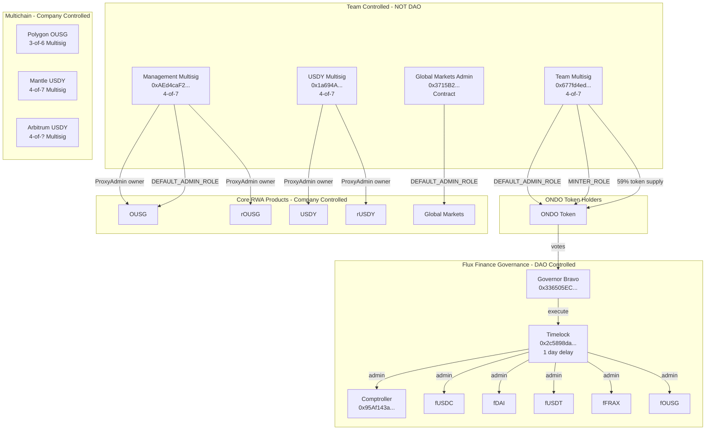

# ONDO Token Research Report

## Aragon Ownership Token Framework Analysis

**Token:** ONDO (Ondo Governance Token)
**Address:** `0xfAbA6f8e4a5E8Ab82F62fe7C39859FA577269BE3`
**Network:** Ethereum Mainnet (with multichain deployments)
**Date:** 2026-03-06
**Analyst:** Researcher Agent

---

## Executive Summary

**Protocol Description:** Ondo Finance is a tokenized real-world asset (RWA) protocol offering products like OUSG (tokenized US Treasuries) and USDY (yield-bearing stablecoin). The ONDO token is the governance token for Ondo DAO, which governs **Flux Finance only**—a Compound V2 fork for permissioned lending.

This analysis evaluates ONDO against the Aragon Ownership Token Framework to answer three core questions:

1. **What do I own?** ONDO tokenholders control governance over Flux Finance only—a small DeFi lending protocol. ONDO governance does **NOT** control Ondo's core RWA products (OUSG, USDY, Ondo Global Markets, or the upcoming Ondo Chain). The ONDO token itself has AccessControl with DEFAULT_ADMIN_ROLE and MINTER_ROLE held by team multisigs, not the DAO.

2. **Why should it have value?** There is **no active value accrual mechanism** for ONDO tokenholders. Flux Finance reserve factors are 0% across all markets—no protocol fees are collected. USDY/OUSG revenue accrues to Ondo Finance Inc., not to ONDO tokenholders. There is no fee distribution, staking rewards, or buyback program.

3. **What threatens that value?** Critical governance scope limitation (controls only Flux Finance, not core products), high token concentration (~59% in team multisig), team control over the ONDO token contract itself (MINTER_ROLE), and absence of binding value accrual.

**Overall Assessment:** 4 positive (✅), 5 neutral (TBD), 9 at-risk (⚠️)

---

## Contract Index Table

### Ethereum Mainnet

| Contract | Address | What it does | Upgradeable? | Ownership-relevant? | Value-accrual-relevant? |
|----------|---------|--------------|--------------|---------------------|-------------------------|
| ONDO Token | `0xfAbA6f8e4a5E8Ab82F62fe7C39859FA577269BE3` | Governance token with AccessControl | No | Y | N |
| Governor (Ondo DAO) | `0x336505EC1BcC1A020EeDe459f57581725D23465A` | GovernorBravo for Flux Finance | No | Y | N |
| Timelock | `0x2c5898da4DF1d45EAb2B7B192a361C3b9EB18d9c` | 1-day execution delay | No | Y | N |
| Comptroller | `0x95Af143a021DF745bc78e845b54591C53a8B3A51` | Flux Finance accounting/risk | No | Y | Y |
| fUSDC | `0x465a5a630482f3abD6d3b84B39B29b07214d19e5` | Flux lending market | Yes (delegator) | Y | Y |
| fDAI | `0xe2bA8693cE7474900A045757fe0efCa900F6530b` | Flux lending market | Yes (delegator) | Y | Y |
| fUSDT | `0x81994b9607e06ab3d5cF3AffF9a67374f05F27d7` | Flux lending market | Yes (delegator) | Y | Y |
| fFRAX | `0x1C9A2d6b33B4826757273D47ebEe0e2DddcD978B` | Flux lending market | Yes (delegator) | Y | Y |
| fOUSG | `0x1dD7950c266fB1be96180a8FDb0591F70200E018` | OUSG lending market | Yes (delegator) | Y | Y |
| OUSG | `0x1B19C19393e2d034D8Ff31ff34c81252FcBbee92` | Tokenized treasuries | Yes (proxy) | Y | Y |
| rOUSG | `0x54043c656F0FAd0652D9Ae2603cDF347c5578d00` | Rebasing OUSG wrapper | Yes (proxy) | Y | Y |
| USDY | `0x96F6eF951840721AdBF46Ac996b59E0235CB985C` | Yield-bearing stablecoin | Yes (proxy) | Y | Y |
| rUSDY | `0xaf37c1167910ebC994e266949387d2c7C326b879` | Rebasing USDY wrapper | Yes (proxy) | Y | Y |
| USDYc | `0xe86845788d6e3e5c2393ade1a051ae617d974c09` | Chainlink-compatible USDY | Unknown | Y | N |
| OUSG_InstantManager | `0x93358db73B6cd4b98D89c8F5f230E81a95c2643a` | OUSG mint/redeem | Yes (proxy) | Y | Y |
| USDY_InstantManager | `0xa42613C243b67BF6194Ac327795b926B4b491f15` | USDY mint/redeem | No | Y | Y |
| OndoIDRegistry | `0xcf6958D69d535FD03BD6Df3F4fe6CDcd127D97df` | KYC registry | Yes (proxy) | Y | N |
| OndoOracle | `0x9Cad45a8BF0Ed41Ff33074449B357C7a1fAb4094` | OUSG price oracle | Unknown | N | Y |
| Blocklist | `0xd8c8174691d936E2C411627d39655A60409eC6707D3d5e8` | USDY blocklist | Unknown | Y | N |
| GMTokenManager | `0x2c158BC456e027b2AfFCCadF1BDBD9f5fC4c5C8c` | Global Markets manager | No | Y | Y |
| USDon | `0xAcE8E719899F6E91831B18AE746C9A965c2119F1` | Global Markets stable | No | Y | Y |
| USDonManager | `0x05CCbB4b74854f8A067b83475E8c34f5a413D7e1` | USDon operations | Unknown | Y | Y |
| GMTokenLimitOrder | `0xf0Bc39Fc911F6437C84d16188dD8294F7110f451` | GM limit orders | Unknown | N | N |

### Ondo Bridge (OFT Adapters)

| Chain | Address | What it does |
|-------|---------|--------------|
| Ethereum | `0xa6275720b3fB1Efe3E6EF2b5BF2293148852307D` | LayerZero OFT Adapter |
| Mantle | `0x0bE393DC46248E4285dc5CAcA3084bc7e9bfbB41` | LayerZero OFT Adapter |
| Arbitrum | `0x0bE393DC46248E4285dc5CAcA3084bc7e9bfbB41` | LayerZero OFT Adapter |

### Polygon

| Contract | Address | What it does | Admin |
|----------|---------|--------------|-------|
| OUSG | `0xbA11C5effA33c4D6F8f593CFA394241CfE925811` | OUSG on Polygon | 3-of-6 Multisig |
| CashManager | `0x6B7443808ACFCD48f1DE212C2557462fA86Ee945` | Mint/redeem manager | Unknown |
| Registry | `0x7cD852c0D7613aA869e632929560f310D4059AC1` | KYC registry | Unknown |

### Mantle

| Contract | Address | What it does | Admin |
|----------|---------|--------------|-------|
| USDY | `0x5bE26527e817998A7206475496fDE1E68957c5A6` | USDY on Mantle | 4-of-7 Multisig |
| mUSD | `0xab575258d37EaA5C8956EfABe71F4eE8F6397cF3` | Mantle USD wrapper | Unknown |

### Arbitrum

| Contract | Address | What it does | Admin |
|----------|---------|--------------|-------|
| USDY | `0x35e050d3C0eC2d29D269a8EcEa763a183bDF9A9D` | USDY on Arbitrum | 4-of-? Multisig |

### BNB Chain

| Contract | Address | What it does | Admin |
|----------|---------|--------------|-------|
| GMTokenManager | `0x91f8Aff3738825e8eB16FC6f6b1A7A4647bDB299` | Global Markets manager | Unknown |
| USDon | `0x1f8955E640Cbd9abc3C3Bb408c9E2E1f5F20DfE6` | Global Markets stable | Unknown |

### Multisig Addresses

| Address | Purpose | Config | Chain |
|---------|---------|--------|-------|
| `0x677fd4ed8ae623f2f625deb2d64f2070e46ca1a1` | Team Multisig (~59% ONDO, DEFAULT_ADMIN_ROLE, MINTER_ROLE) | 4-of-7 | Ethereum |
| `0xAEd4caF2E535D964165B4392342F71bac77e8367` | Management Multisig (OUSG admin) | 4-of-7 | Ethereum |
| `0x1a694A09494E214a3Be3652e4B343B7B81A73ad7` | USDY ProxyAdmin Owner | 4-of-7 | Ethereum |
| `0x5AE21c99FC5f1584D8Cb09a298CFFd92B5d178eF` | USDY_InstantManager Admin | 3-of-5 | Ethereum |
| `0x3715B2154d2FF4C5B027C7a1f734B53F27bc34f1` | Global Markets Admin (contract, not multisig) | N/A | Ethereum |
| `0x4413073440A568790c1b2b06B47F7D0a443574d0` | Polygon OUSG Admin | 3-of-6 | Polygon |
| `0xC8A7870fFe41054612F7f3433E173D8b5bFcA8E3` | Mantle USDY Admin | 4-of-7 | Mantle |
| `0xC4ac5c2fA461901b4D91832d03A7018092eDCb4D` | Arbitrum USDY Admin | 4-of-? | Arbitrum |

---

## Contract Ownership Verification

### ONDO Token
```
cast call 0xfAbA6f8e4a5E8Ab82F62fe7C39859FA577269BE3 "name()(string)" --rpc-url https://ethereum-rpc.publicnode.com
→ "Ondo"

cast call 0xfAbA6f8e4a5E8Ab82F62fe7C39859FA577269BE3 "totalSupply()(uint256)" --rpc-url https://ethereum-rpc.publicnode.com
→ 10000000000000000000000000000 [1e28] (10 billion ONDO)

cast call 0xfAbA6f8e4a5E8Ab82F62fe7C39859FA577269BE3 "transferAllowed()(bool)" --rpc-url https://ethereum-rpc.publicnode.com
→ true (transfers enabled since Jan 2024)

cast call 0xfAbA6f8e4a5E8Ab82F62fe7C39859FA577269BE3 "hasRole(bytes32,address)(bool)" 0x0000000000000000000000000000000000000000000000000000000000000000 0x677fd4ed8ae623f2f625deb2d64f2070e46ca1a1 --rpc-url https://ethereum-rpc.publicnode.com
→ true (Team Multisig has DEFAULT_ADMIN_ROLE)

cast call 0xfAbA6f8e4a5E8Ab82F62fe7C39859FA577269BE3 "hasRole(bytes32,address)(bool)" 0x9f2df0fed2c77648de5860a4cc508cd0818c85b8b8a1ab4ceeef8d981c8956a6 0x677fd4ed8ae623f2f625deb2d64f2070e46ca1a1 --rpc-url https://ethereum-rpc.publicnode.com
→ true (Team Multisig has MINTER_ROLE)

cast call 0xfAbA6f8e4a5E8Ab82F62fe7C39859FA577269BE3 "balanceOf(address)(uint256)" 0x677fd4ed8ae623f2f625deb2d64f2070e46ca1a1 --rpc-url https://ethereum-rpc.publicnode.com
→ 5904207574154394239393946019 [5.904e27] (~59% of supply)
```

### Governor and Timelock
```
cast call 0x336505EC1BcC1A020EeDe459f57581725D23465A "timelock()(address)" --rpc-url https://ethereum-rpc.publicnode.com
→ 0x2c5898da4DF1d45EAb2B7B192a361C3b9EB18d9c (Timelock)

cast call 0x336505EC1BcC1A020EeDe459f57581725D23465A "comp()(address)" --rpc-url https://ethereum-rpc.publicnode.com
→ 0xfAbA6f8e4a5E8Ab82F62fe7C39859FA577269BE3 (ONDO token)

cast call 0x336505EC1BcC1A020EeDe459f57581725D23465A "proposalThreshold()(uint256)" --rpc-url https://ethereum-rpc.publicnode.com
→ 100000000000000000000000000 [1e26] (100M ONDO = 1% of supply)

cast call 0x336505EC1BcC1A020EeDe459f57581725D23465A "quorumVotes()(uint256)" --rpc-url https://ethereum-rpc.publicnode.com
→ 1000000000000000000000000 [1e24] (1M ONDO = 0.01% of supply)

cast call 0x336505EC1BcC1A020EeDe459f57581725D23465A "votingPeriod()(uint256)" --rpc-url https://ethereum-rpc.publicnode.com
→ 21600 blocks (~3 days at 12s/block)

cast call 0x2c5898da4DF1d45EAb2B7B192a361C3b9EB18d9c "admin()(address)" --rpc-url https://ethereum-rpc.publicnode.com
→ 0x336505EC1BcC1A020EeDe459f57581725D23465A (Governor)

cast call 0x2c5898da4DF1d45EAb2B7B192a361C3b9EB18d9c "delay()(uint256)" --rpc-url https://ethereum-rpc.publicnode.com
→ 86400 (1 day)
```

### Flux Finance Contracts
```
cast call 0x95Af143a021DF745bc78e845b54591C53a8B3A51 "admin()(address)" --rpc-url https://ethereum-rpc.publicnode.com
→ 0x2c5898da4DF1d45EAb2B7B192a361C3b9EB18d9c (Timelock - DAO controlled)

cast call 0x465a5a630482f3abD6d3b84B39B29b07214d19e5 "admin()(address)" --rpc-url https://ethereum-rpc.publicnode.com
→ 0x2c5898da4DF1d45EAb2B7B192a361C3b9EB18d9c (Timelock)

cast call 0x465a5a630482f3abD6d3b84B39B29b07214d19e5 "reserveFactorMantissa()(uint256)" --rpc-url https://ethereum-rpc.publicnode.com
→ 0 (0% reserve factor)

cast call 0xe2bA8693cE7474900A045757fe0efCa900F6530b "reserveFactorMantissa()(uint256)" --rpc-url https://ethereum-rpc.publicnode.com
→ 0 (fDAI 0% reserve factor)

cast call 0x1dD7950c266fB1be96180a8FDb0591F70200E018 "reserveFactorMantissa()(uint256)" --rpc-url https://ethereum-rpc.publicnode.com
→ 0 (fOUSG 0% reserve factor)
```

### OUSG (Ethereum - Company-Controlled)
```
cast admin 0x1B19C19393e2d034D8Ff31ff34c81252FcBbee92 --rpc-url https://ethereum-rpc.publicnode.com
→ 0xba80aa44cc25e85cc30359150dfb1c7d041cf6d5 (ProxyAdmin)

cast call 0xba80aa44cc25e85cc30359150dfb1c7d041cf6d5 "owner()(address)" --rpc-url https://ethereum-rpc.publicnode.com
→ 0xAEd4caF2E535D964165B4392342F71bac77e8367 (Management Multisig - NOT DAO)

cast call 0xAEd4caF2E535D964165B4392342F71bac77e8367 "getThreshold()(uint256)" --rpc-url https://ethereum-rpc.publicnode.com
→ 4 (4-of-7 multisig)

cast call 0xAEd4caF2E535D964165B4392342F71bac77e8367 "getOwners()(address[])" --rpc-url https://ethereum-rpc.publicnode.com
→ [0x74a4C329AA5a6BFa16bD32BAf37209f4C632173D, 0x189D409b807aC1949Fe82c143270992FE9457607, 0xECE6bC29F718085a30b7bC14162B0fad4737e5d0, 0x60F030d621a4Ab27DfF024a8e43eB36e2D95FB02, 0xaA1E4eef723ceaDd137B3AD39ea540dA4B092f8e, 0x020679fF2Bc53758bEbAD1bBe0ab0CF7c1beD241, 0x6A95a204aD4a6842b2f0aE3BBb59f35E85594f46]
```

### USDY (Ethereum - Company-Controlled)
```
cast admin 0x96F6eF951840721AdBF46Ac996b59E0235CB985C --rpc-url https://ethereum-rpc.publicnode.com
→ 0x3ed61633057da0bc58f84b2b9002845e56f94c19 (ProxyAdmin)

cast call 0x3ed61633057da0bc58f84b2b9002845e56f94c19 "owner()(address)" --rpc-url https://ethereum-rpc.publicnode.com
→ 0x1a694A09494E214a3Be3652e4B343B7B81A73ad7 (4-of-7 Multisig - NOT DAO)

cast call 0x1a694A09494E214a3Be3652e4B343B7B81A73ad7 "getThreshold()(uint256)" --rpc-url https://ethereum-rpc.publicnode.com
→ 4

cast call 0x1a694A09494E214a3Be3652e4B343B7B81A73ad7 "getOwners()(address[])" --rpc-url https://ethereum-rpc.publicnode.com
→ [0x58417F57F29c6b03114129e0EB59A174B1f41504, 0x189D409b807aC1949Fe82c143270992FE9457607, 0x60F030d621a4Ab27DfF024a8e43eB36e2D95FB02, 0xaA1E4eef723ceaDd137B3AD39ea540dA4B092f8e, 0x74a4C329AA5a6BFa16bD32BAf37209f4C632173D, 0x020679fF2Bc53758bEbAD1bBe0ab0CF7c1beD241, 0x6A95a204aD4a6842b2f0aE3BBb59f35E85594f46]
```

### Global Markets (Ethereum)
```
cast call 0x2c158BC456e027b2AfFCCadF1BDBD9f5fC4c5C8c "getRoleMemberCount(bytes32)(uint256)" 0x0000000000000000000000000000000000000000000000000000000000000000 --rpc-url https://ethereum-rpc.publicnode.com
→ 1

cast call 0x2c158BC456e027b2AfFCCadF1BDBD9f5fC4c5C8c "getRoleMember(bytes32,uint256)(address)" 0x0000000000000000000000000000000000000000000000000000000000000000 0 --rpc-url https://ethereum-rpc.publicnode.com
→ 0x3715B2154d2FF4C5B027C7a1f734B53F27bc34f1 (Contract, not multisig)

cast call 0xAcE8E719899F6E91831B18AE746C9A965c2119F1 "getRoleMember(bytes32,uint256)(address)" 0x0000000000000000000000000000000000000000000000000000000000000000 0 --rpc-url https://ethereum-rpc.publicnode.com
→ 0x3715B2154d2FF4C5B027C7a1f734B53F27bc34f1 (Same admin as GMTokenManager)
```

### USDY_InstantManager (Ethereum)
```
cast call 0xa42613C243b67BF6194Ac327795b926B4b491f15 "getRoleMember(bytes32,uint256)(address)" 0x0000000000000000000000000000000000000000000000000000000000000000 0 --rpc-url https://ethereum-rpc.publicnode.com
→ 0x5AE21c99FC5f1584D8Cb09a298CFFd92B5d178eF

cast call 0x5AE21c99FC5f1584D8Cb09a298CFFd92B5d178eF "getThreshold()(uint256)" --rpc-url https://ethereum-rpc.publicnode.com
→ 3 (3-of-5 multisig)

cast call 0x5AE21c99FC5f1584D8Cb09a298CFFd92B5d178eF "getOwners()(address[])" --rpc-url https://ethereum-rpc.publicnode.com
→ [0x6264422fD4c54292d71F6d3BE7CbF8900573172B, 0x60F030d621a4Ab27DfF024a8e43eB36e2D95FB02, 0x6A95a204aD4a6842b2f0aE3BBb59f35E85594f46, 0x81961c315e38bAdC02C014A13Dd1d4b3dab81d15, 0x74a4C329AA5a6BFa16bD32BAf37209f4C632173D]
```

---

## Multichain Deployment Verification

### Polygon OUSG
```
cast admin 0xbA11C5effA33c4D6F8f593CFA394241CfE925811 --rpc-url https://1rpc.io/matic
→ 0xa4d0c86e1186088beebf1f72f2a4aaba92ade0e8 (ProxyAdmin)

cast call 0xa4d0c86e1186088beebf1f72f2a4aaba92ade0e8 "owner()(address)" --rpc-url https://1rpc.io/matic
→ 0x4413073440A568790c1b2b06B47F7D0a443574d0 (3-of-6 Multisig)

cast call 0x4413073440A568790c1b2b06B47F7D0a443574d0 "getThreshold()(uint256)" --rpc-url https://1rpc.io/matic
→ 3

cast call 0x4413073440A568790c1b2b06B47F7D0a443574d0 "getOwners()(address[])" --rpc-url https://1rpc.io/matic
→ [0x189D409b807aC1949Fe82c143270992FE9457607, 0xECE6bC29F718085a30b7bC14162B0fad4737e5d0, 0x74a4C329AA5a6BFa16bD32BAf37209f4C632173D, 0x6A95a204aD4a6842b2f0aE3BBb59f35E85594f46, 0xaA1E4eef723ceaDd137B3AD39ea540dA4B092f8e, 0x020679fF2Bc53758bEbAD1bBe0ab0CF7c1beD241]
```

### Mantle USDY
```
cast admin 0x5bE26527e817998A7206475496fDE1E68957c5A6 --rpc-url https://rpc.mantle.xyz
→ 0x201cdd34310a53915ee55b0a229b5a4eb18d1448 (ProxyAdmin)

cast call 0x201cdd34310a53915ee55b0a229b5a4eb18d1448 "owner()(address)" --rpc-url https://rpc.mantle.xyz
→ 0xC8A7870fFe41054612F7f3433E173D8b5bFcA8E3 (4-of-7 Multisig)

cast call 0xC8A7870fFe41054612F7f3433E173D8b5bFcA8E3 "getThreshold()(uint256)" --rpc-url https://rpc.mantle.xyz
→ 4

cast call 0xC8A7870fFe41054612F7f3433E173D8b5bFcA8E3 "getOwners()(address[])" --rpc-url https://rpc.mantle.xyz
→ [0x020679fF2Bc53758bEbAD1bBe0ab0CF7c1beD241, 0x189D409b807aC1949Fe82c143270992FE9457607, 0x60F030d621a4Ab27DfF024a8e43eB36e2D95FB02, 0x74a4C329AA5a6BFa16bD32BAf37209f4C632173D, 0xaA1E4eef723ceaDd137B3AD39ea540dA4B092f8e, 0x58417F57F29c6b03114129e0EB59A174B1f41504, 0x6A95a204aD4a6842b2f0aE3BBb59f35E85594f46]
```

### Arbitrum USDY
```
cast admin 0x35e050d3C0eC2d29D269a8EcEa763a183bDF9A9D --rpc-url https://arbitrum-one.publicnode.com
→ 0xb7bcc4af60fb5267946deff1fe373989995352b2 (ProxyAdmin)

cast call 0xb7bcc4af60fb5267946deff1fe373989995352b2 "owner()(address)" --rpc-url https://arbitrum-one.publicnode.com
→ 0xC4ac5c2fA461901b4D91832d03A7018092eDCb4D

cast call 0xC4ac5c2fA461901b4D91832d03A7018092eDCb4D "getThreshold()(uint256)" --rpc-url https://arbitrum-one.publicnode.com
→ 4 (4-of-? Multisig)
```

### BNB Chain Global Markets
```
cast admin 0x91f8Aff3738825e8eB16FC6f6b1A7A4647bDB299 --rpc-url https://bsc-dataseed.binance.org
→ 0x0000000000000000000000000000000000000000 (Not a proxy)

cast call 0x91f8Aff3738825e8eB16FC6f6b1A7A4647bDB299 "DEFAULT_ADMIN_ROLE()(bytes32)" --rpc-url https://bsc-dataseed.binance.org
→ 0x0000000000000000000000000000000000000000000000000000000000000000 (Uses AccessControl)
```

### Solana Deployments

Aragon has not been able to verify Solana contract ownership due to lack of EVM-compatible tooling. Per official docs:
- OUSG: `i7u4r16TcsJTgq1kAG8opmVZyVnAKBwLKu6ZPMwzxNc`
- USDY: `A1KLoBrKBde8Ty9qtNQUtq3C2ortoC3u7twggz7sEto6`
- Global Markets Program: `XzTT4XB8m7sLD2xi6snefSasaswsKCxx5Tifjondogm`

---

## Supply Metrics

| Metric | Value | Verified |
|--------|-------|----------|
| Total Supply | 10,000,000,000 ONDO | ✅ On-chain |
| Max Supply | 10,000,000,000 ONDO (fixed) | ✅ totalSupply constant |
| Team Multisig Holdings | ~5.9B ONDO (~59%) | ✅ On-chain |
| Circulating Supply | ~4.1B ONDO (~41%) | Estimated |
| Transfers Enabled | Yes (Jan 18, 2024) | ✅ On-chain |

---

## Metric 1: Onchain Control

### 1.1 Onchain Governance Workflow ⚠️

**Finding:** ONDO tokenholders control Flux Finance governance through a standard GovernorBravo + Timelock setup. However, governance scope is **severely limited** to Flux Finance only—the DAO has **no control** over Ondo's core products (OUSG, USDY, Ondo Global Markets, Ondo Chain).

**Governance Parameters:**
- Proposal Threshold: 100M ONDO (1% of supply)
- Quorum: 1M ONDO (0.01% of supply) - extremely low
- Voting Period: ~3 days (21600 blocks)
- Timelock Delay: 1 day (86400 seconds)

**Source Code:**
- GovernorBravoDelegate: [flux-finance/contracts/.../GovernorBravoDelegate.sol](https://github.com/flux-finance/contracts/blob/main/contracts/lending/compound/governance/GovernorBravoDelegate.sol)
- Quorum hardcoded at 1M ONDO: Line 32
```solidity
/// @notice The number of votes in support of a proposal required in order for a quorum to be reached and for a vote to succeed
uint public constant quorumVotes = 1_000_000e18; // 1 million Ondo
```

**Evidence:**
- [Governor on Etherscan](https://etherscan.io/address/0x336505EC1BcC1A020EeDe459f57581725D23465A)
- [Timelock on Etherscan](https://etherscan.io/address/0x2c5898da4DF1d45EAb2B7B192a361C3b9EB18d9c)
- [Tally Governance Dashboard](https://www.tally.xyz/gov/ondo-dao)

**Critical Issue:** Governance scope is limited to Flux Finance. Core Ondo products are controlled by company multisigs, not the DAO.

---

### 1.2 Role Accountability ⚠️

**Finding:** Flux Finance roles are DAO-controlled via Timelock. However, the ONDO token itself and core Ondo products are controlled by team multisigs, not the DAO.

**DAO-Controlled (Flux Finance):**
| Contract | Role | Holder | Type |
|----------|------|--------|------|
| Comptroller | admin | Timelock | ✅ DAO |
| fUSDC/fDAI/fUSDT/fFRAX/fOUSG | admin | Timelock | ✅ DAO |

**Team-Controlled (ONDO Token):**
| Contract | Role | Holder | Type |
|----------|------|--------|------|
| ONDO Token | DEFAULT_ADMIN_ROLE | 0x677fd4... | ⚠️ Team Multisig |
| ONDO Token | MINTER_ROLE | 0x677fd4... | ⚠️ Team Multisig |

**Team-Controlled (Core Products):**
| Contract | Role | Holder | Type |
|----------|------|--------|------|
| OUSG | DEFAULT_ADMIN_ROLE | 0xAEd4ca... | ⚠️ Management Multisig |
| OUSG | ProxyAdmin owner | 0xAEd4ca... | ⚠️ Management Multisig |
| rOUSG | ProxyAdmin owner | 0xAEd4ca... | ⚠️ Management Multisig |
| USDY | ProxyAdmin owner | 0x1a694A... | ⚠️ Team Multisig (4/7) |
| rUSDY | ProxyAdmin owner | 0x1a694A... | ⚠️ Team Multisig (4/7) |
| GMTokenManager | DEFAULT_ADMIN_ROLE | 0x3715B2... | ⚠️ Contract (not multisig) |
| USDon | DEFAULT_ADMIN_ROLE | 0x3715B2... | ⚠️ Contract (not multisig) |

---

### 1.3 Protocol Upgrade Authority ⚠️

**Finding:** Flux Finance upgrades are controlled by the DAO via Timelock. OUSG, USDY, and their rebasing variants are upgradeable proxies controlled by team multisigs on all chains.

**Flux Finance (DAO-Controlled):**
- fToken contracts use delegator pattern
- Admin = Timelock (`0x2c5898da4DF1d45EAb2B7B192a361C3b9EB18d9c`)
- DAO can upgrade implementations

**OUSG/USDY (Team-Controlled by Chain):**

| Chain | Product | ProxyAdmin Owner | Multisig Config |
|-------|---------|------------------|-----------------|
| Ethereum | OUSG | 0xAEd4ca... | 4-of-7 |
| Ethereum | USDY | 0x1a694A... | 4-of-7 |
| Polygon | OUSG | 0x441307... | 3-of-6 |
| Mantle | USDY | 0xC8A787... | 4-of-7 |
| Arbitrum | USDY | 0xC4ac5c... | 4-of-? |

DAO has **no upgrade control** on any chain.

---

### 1.4 Token Upgrade Authority ⚠️

**Finding:** The ONDO token is **NOT upgradeable** (no proxy pattern). However, it uses AccessControl with DEFAULT_ADMIN_ROLE and MINTER_ROLE held by a team multisig—NOT the DAO.

**Powers of DEFAULT_ADMIN_ROLE holder (`0x677fd4ed8ae623f2f625deb2d64f2070e46ca1a1`):**
- Can grant/revoke roles including MINTER_ROLE
- Can grant DEFAULT_ADMIN_ROLE to new addresses
- Can change role admin configurations

**Powers of MINTER_ROLE holder:**
- Can mint new ONDO tokens up to the supply cap

**Note on Contract Source:** The deployed ONDO token at `0xfAbA6f8e4a5E8Ab82F62fe7C39859FA577269BE3` is verified on Etherscan and supports the AccessControl interface (`supportsInterface(0x7965db0b) = true`). The public [ondo-v1 repository](https://github.com/ondoprotocol/ondo-v1/blob/main/contracts/tokens/Ondo.sol) shows a simpler Ownable-based contract without AccessControl, indicating the deployed contract differs from the public repo.

---

### 1.5 Supply Control ⚠️

**Finding:** ONDO has a fixed total supply of 10B tokens with no scheduled inflation per documentation. However, the MINTER_ROLE exists and is held by a team multisig—the supply is **not immutably fixed**.

**Evidence:**
- `totalSupply()` returns exactly 10B ONDO (verified on-chain)
- MINTER_ROLE exists: `0x9f2df0fed2c77648de5860a4cc508cd0818c85b8b8a1ab4ceeef8d981c8956a6`
- Team multisig (`0x677fd4ed...`) holds MINTER_ROLE
- The team **can mint new tokens** without DAO approval

**Documentation claim ([docs.ondo.foundation](https://docs.ondo.foundation/ondo-token)):**
> "There is no scheduled or planned inflation"

This is a policy statement, not a code enforcement. The code allows minting.

---

### 1.6 Privileged Access Gating ⚠️

**Finding:** OUSG and USDY have extensive transfer restrictions (KYC requirements, blocklists, sanctions checks). These are enforced by Ondo Finance, not the DAO.

**OUSG Transfer Restrictions:**
- KYC required via OndoIDRegistry: `0xcf6958D69d535FD03BD6Df3F4fe6CDcd127D97df`
- KYC check on sender, receiver, and msg.sender
- Source: [ousg.sol:62-89](https://github.com/code-423n4/2024-03-ondo-finance/blob/main/contracts/ousg/ousg.sol#L62-L89)

**USDY Transfer Restrictions:**
- Blocklist check
- Allowlist check
- Sanctions list check
- Source: [USDY.sol:84-115](https://github.com/ondoprotocol/usdy/blob/main/contracts/usdy/USDY.sol#L84-L115)

**Flux Finance (DAO-Controlled):**
- fToken transfers have sanctions checking via Chainalysis oracle
- No user blocklist functionality
- DAO can pause via governance

**ONDO Token:**
- `transferAllowed = true` (transfers enabled since Jan 2024)
- Previously, only owner could transfer when `transferAllowed = false`
- No blocklist or censorship capability in the token contract

---

### 1.7 Token Censorship ✅

**Finding:** The ONDO token has **no blocklist, freeze, or seizure functions**. However, before January 2024, transfers were disabled except for the owner.

**Source Code Analysis ([ondo-v1/contracts/tokens/Ondo.sol](https://github.com/ondoprotocol/ondo-v1/blob/main/contracts/tokens/Ondo.sol)):**
```solidity
modifier whenTransferAllowed() {
  require(
    transferAllowed || msg.sender == owner(),
    "OndoToken: Transfers not allowed or not right privillege"
  );
  _;
}
```

**Current State:**
- `transferAllowed = true` (verified on-chain)
- No blacklist mapping
- No pause function for transfers
- No force transfer or seize functions

---

## Metric 2: Value Accrual

### 2.1 Accrual Active ⚠️

**Finding:** There is **NO active value accrual mechanism** for ONDO tokenholders.

**Flux Finance Revenue:**
- Reserve factors are **0% across all markets**
- No protocol fees are collected
- No revenue flows to DAO treasury or tokenholders

**Proof of 0% Reserve Factors:**
```
fUSDC reserveFactorMantissa: 0
fDAI reserveFactorMantissa: 0
fUSDT reserveFactorMantissa: 0
fFRAX reserveFactorMantissa: 0
fOUSG reserveFactorMantissa: 0
```

**Source Code Reference:**
The reserve factor can be set by admin (Timelock) via `_setReserveFactor()`:
[CTokenModified.sol:1141-1173](https://github.com/flux-finance/contracts/blob/main/contracts/lending/tokens/cToken/CTokenModified.sol#L1141-L1173)

Currently set to 0, meaning 100% of interest goes to lenders, 0% to protocol.

**OUSG/USDY Revenue:**
- Revenue accrues to Ondo Finance Inc., not ONDO tokenholders
- Yield spread between underlying treasury returns and USDY yield is retained by company
- No programmatic distribution to tokenholders

---

### 2.2 Treasury Ownership TBD

**Finding:** Aragon has not been able to identify a specific DAO treasury address receiving Flux Finance revenue or ONDO token allocations.

**Investigation:**
- Flux Finance reserve factors are 0%—no reserves accumulate
- The Timelock (`0x2c5898da4DF1d45EAb2B7B192a361C3b9EB18d9c`) holds no significant assets
- No FeeDistributor or Treasury contract identified for ONDO governance

**FeeDistributor Search Methodology:**
1. Searched Flux Finance GitHub repo for "FeeDistributor", "fee", "revenue", "distribution" - no matching contracts found
2. Reviewed Timelock transaction history on Etherscan - no interactions with any fee distribution contracts
3. Checked Ondo DAO governance proposals on Tally - no proposals for fee distribution found
4. Searched official Flux Finance docs - no mention of fee distribution mechanism

**Conclusion:** No FeeDistributor contract exists for Flux Finance or ONDO DAO.

**Token Allocations:**
Per documentation, vested tokens include:
- Core Team: 5-year vesting
- Seed Investors: <7%, 1-year cliff + 48-month release
- Series A: <7%, 1-year cliff + 48-month release
- CoinList: ~2% total

Aragon has not been able to identify the specific addresses holding these vested allocations beyond the team multisig at `0x677fd4ed...` holding ~59% of supply.

---

### 2.3 Accrual Mechanism Control ✅

**Finding:** ONDO holders **can** change Flux Finance fee parameters via governance—but the current setting is 0%.

**Evidence:**
- Comptroller admin = Timelock
- `_setReserveFactor()` can be called by admin
- DAO can propose to set non-zero reserve factors

**However:** Even with non-zero reserve factors, there is no FeeDistributor contract to distribute collected fees to tokenholders. Reserves would accumulate in fToken contracts, not flow to ONDO holders.

---

### 2.4 Offchain Value Accrual ⚠️

**Finding:** Significant value accrues to Ondo Finance Inc. offchain through USDY/OUSG management fees and yield spreads.

**USDY Revenue Model:**
- USDY is backed by short-term US Treasuries
- Yield is passed to USDY holders (currently ~4-5% APY)
- Ondo Finance retains the spread between treasury yields and USDY yield
- This spread is **not** distributed to ONDO tokenholders

**OUSG Revenue Model:**
- Similar structure to USDY
- Management fees retained by Ondo Finance Inc.

**Ondo Global Markets:**
- Tokenized stocks with "on" suffix (e.g., TSLAon)
- Fees and spreads accrue to company, not DAO

**Conclusion:** ONDO tokenholders have no claim to offchain revenue streams. Value accrues to Ondo Finance Inc.

---

## Metric 3: Verifiability

### 3.1 Token Contract Source Verification ✅

**Finding:** ONDO token contract is verified on Etherscan.

**Evidence:**
- [ONDO Token on Etherscan](https://etherscan.io/address/0xfAbA6f8e4a5E8Ab82F62fe7C39859FA577269BE3#code)
- Verified source code available
- Uses AccessControl pattern

**Note:** The deployed contract differs from the public [ondo-v1 repository](https://github.com/ondoprotocol/ondo-v1/blob/main/contracts/tokens/Ondo.sol) which shows a simpler Ownable-based contract without AccessControl. The Etherscan-verified source should be treated as authoritative.

---

### 3.2 Protocol Component Source Verification ✅

**Finding:** Flux Finance contracts are verified on Etherscan and match the public GitHub repository.

**Evidence:**
- [Comptroller](https://etherscan.io/address/0x95Af143a021DF745bc78e845b54591C53a8B3A51#code)
- [fUSDC](https://etherscan.io/address/0x465a5a630482f3abD6d3b84B39B29b07214d19e5#code)
- [Governor](https://etherscan.io/address/0x336505EC1BcC1A020EeDe459f57581725D23465A#code)
- [Timelock](https://etherscan.io/address/0x2c5898da4DF1d45EAb2B7B192a361C3b9EB18d9c#code)
- GitHub: [flux-finance/contracts](https://github.com/flux-finance/contracts)

**OUSG/USDY:**
- [OUSG](https://etherscan.io/address/0x1B19C19393e2d034D8Ff31ff34c81252FcBbee92#code)
- [USDY](https://etherscan.io/address/0x96F6eF951840721AdBF46Ac996b59E0235CB985C#code)
- GitHub: [ondoprotocol/usdy](https://github.com/ondoprotocol/usdy)
- Audit code: [code-423n4/2024-03-ondo-finance](https://github.com/code-423n4/2024-03-ondo-finance)

---

## Metric 4: Token Distribution

### 4.1 Ownership Concentration ⚠️

**Finding:** ~59% of ONDO supply is held by a single team multisig. This concentration gives the team effective control over governance.

**On-Chain Verification:**
```
cast call 0xfAbA6f8e4a5E8Ab82F62fe7C39859FA577269BE3 "balanceOf(address)(uint256)" 0x677fd4ed8ae623f2f625deb2d64f2070e46ca1a1 --rpc-url https://ethereum-rpc.publicnode.com
→ 5,904,207,574,154,394,239,393,946,019 (~5.9B ONDO = 59%)
```

**Implications:**
- Team can pass any governance proposal unilaterally
- Team can block any governance proposal
- "Decentralized governance" is effectively team governance

**Team Multisig:**
- Address: `0x677fd4ed8ae623f2f625deb2d64f2070e46ca1a1`
- Configuration: 4-of-7 multisig
- Also holds DEFAULT_ADMIN_ROLE and MINTER_ROLE on ONDO token

---

### 4.2 Future Token Unlocks ⚠️

**Finding:** Per documentation, unlock schedule exists but specific addresses and amounts are not publicly verifiable.

**Documented Schedule:**
| Category | Lock Period | Release Period |
|----------|-------------|----------------|
| CoinList Tranche 1 (~0.3%) | 1 year | 18 months |
| CoinList Tranche 2 (~1.7%) | 1 year | 6 months |
| Seed Investors (<7%) | 1 year | 48 months |
| Series A (<7%) | 1 year | 48 months |
| Core Team | 5 years | Not specified |

**Verification Status:** Aragon has not been able to verify specific vesting contract addresses or unlock schedules from onchain data.

---

## Offchain Dependencies

### 5.1 Trademark TBD

**Finding:** Aragon has not been able to verify USPTO registration for "Ondo" or "Ondo Finance" trademark.

---

### 5.2 Distribution ⚠️

**Finding:** Ondo Finance Inc. controls primary distribution channels.

**Evidence:**
- ondo.finance and fluxfinance.com operated by company
- Terms of Service identify Ondo Finance Inc. as contracting party
- No DAO control over frontend access

---

### 5.3 Licensing TBD

**Finding:** Flux Finance code is open source (Compound V2 fork with BSD-3-Clause license). OUSG/USDY code is BUSL-1.1 licensed.

**Source:**
- Flux Finance: [LICENSE](https://github.com/flux-finance/contracts/blob/main/LICENSE) - BSD-3-Clause
- USDY: [SPDX-License-Identifier: BUSL-1.1](https://github.com/ondoprotocol/usdy/blob/main/contracts/usdy/USDY.sol#L1)

---

## Governance Flow Diagram



---

## Role Matrix

| Contract | Role | Current Holder | Holder Type | Verified Via | Who Controls Holder |
|----------|------|----------------|-------------|--------------|---------------------|
| ONDO Token | DEFAULT_ADMIN_ROLE | 0x677fd4ed... | Team Multisig (4/7) | hasRole() call | 7 team signers |
| ONDO Token | MINTER_ROLE | 0x677fd4ed... | Team Multisig (4/7) | hasRole() call | 7 team signers |
| Governor | admin | 0x2c5898da... | Timelock | admin() call | DAO (via Governor) |
| Timelock | admin | 0x336505EC... | Governor | admin() call | ONDO holders |
| Comptroller | admin | 0x2c5898da... | Timelock | admin() call | DAO |
| fUSDC | admin | 0x2c5898da... | Timelock | admin() call | DAO |
| OUSG | DEFAULT_ADMIN_ROLE | 0xAEd4ca... | Mgmt Multisig (4/7) | hasRole() call | 7 team signers |
| OUSG | ProxyAdmin owner | 0xAEd4ca... | Mgmt Multisig (4/7) | owner() call | 7 team signers |
| USDY | ProxyAdmin owner | 0x1a694A... | Team Multisig (4/7) | owner() call | 7 team signers |
| USDY_InstantManager | DEFAULT_ADMIN_ROLE | 0x5AE21c... | Multisig (3/5) | getRoleMember() call | 5 signers |
| GMTokenManager | DEFAULT_ADMIN_ROLE | 0x3715B2... | Contract | getRoleMember() call | Unknown |
| USDon | DEFAULT_ADMIN_ROLE | 0x3715B2... | Contract | getRoleMember() call | Unknown |
| Polygon OUSG | ProxyAdmin owner | 0x441307... | Multisig (3/6) | owner() call | 6 signers |
| Mantle USDY | ProxyAdmin owner | 0xC8A787... | Multisig (4/7) | owner() call | 7 signers |
| Arbitrum USDY | ProxyAdmin owner | 0xC4ac5c... | Multisig (4/?) | owner() call | Unknown |

---

## Ondo Chain

**Status:** Ondo Chain has not launched.

**Per documentation:** Ondo Chain is a planned Layer-1 blockchain for institutional finance. It will feature:
- Permissioned validators (institutional asset managers, broker-dealers)
- Enshrined oracles and proof of reserves
- Native omnichain messaging

**ONDO Token Relationship:** Aragon has not been able to identify any official documentation specifying ONDO token utility on Ondo Chain. Documentation does not confirm whether ONDO will have governance or staking functions on Ondo Chain.

---

## Ondo Global Markets

**Status:** Live on Ethereum, BNB Chain, and Solana.

**What it is:** Tokenization platform for US publicly traded securities. Issues tokens like TSLAon (Tesla).

**ONDO Token Relationship:** No governance relationship identified. Global Markets is controlled by a contract at `0x3715B2154d2FF4C5B027C7a1f734B53F27bc34f1`, not the DAO.

**Contracts:**
- GMTokenManager (Ethereum): `0x2c158BC456e027b2AfFCCadF1BDBD9f5fC4c5C8c`
- USDon (Ethereum): `0xAcE8E719899F6E91831B18AE746C9A965c2119F1`
- GMTokenManager (BNB): `0x91f8Aff3738825e8eB16FC6f6b1A7A4647bDB299`
- USDon (BNB): `0x1f8955E640Cbd9abc3C3Bb408c9E2E1f5F20DfE6`

---

## Risk Summary

### Critical Risks

1. **Governance Scope Limitation:** ONDO governance controls only Flux Finance—a small DeFi lending protocol. OUSG, USDY, Global Markets, and Ondo Chain are entirely outside tokenholder control.

2. **Token Concentration:** ~59% of supply held by team multisig. This gives the team unilateral control over governance outcomes.

3. **Team Control of Token Contract:** DEFAULT_ADMIN_ROLE and MINTER_ROLE are held by team multisig, not DAO. The team can mint new tokens without tokenholder approval.

4. **No Value Accrual:** Reserve factors are 0% across all Flux Finance markets. No fee distribution mechanism exists. USDY/OUSG revenue accrues to company.

### Moderate Risks

5. **Low Quorum:** 1M ONDO quorum (0.01% of supply) makes governance susceptible to low-participation outcomes.

6. **Upgradeable Core Products:** OUSG and USDY are upgradeable proxies controlled by team multisigs on all chains.

7. **KYC Gates on Core Products:** OUSG and USDY transfers require KYC approval controlled by company.

8. **Multichain Admin Fragmentation:** Different multisigs control products on different chains with varying thresholds (3-of-6 to 4-of-7).

### Positive Findings

9. **ONDO Token Not Censurable:** No blocklist, freeze, or seizure functions. Transfers are permissionless.

10. **Flux Finance DAO-Controlled:** Comptroller and fToken admin roles point to Timelock controlled by Governor.

11. **Verified Contracts:** All key contracts are verified on Etherscan.

---

## Conclusion

The ONDO token provides **limited ownership** over Ondo Finance's ecosystem:

**What ONDO tokenholders control:**
- Flux Finance governance (a Compound V2 fork for permissioned lending)
- Ability to set reserve factors and protocol parameters for Flux

**What ONDO tokenholders do NOT control:**
- The ONDO token contract itself (team holds admin roles)
- OUSG (tokenized treasuries) on any chain
- USDY (yield-bearing stablecoin) on any chain
- Ondo Global Markets (tokenized stocks)
- Ondo Chain (future L1)
- Any revenue or value accrual mechanism

**Value Proposition:**
ONDO has **no binding value accrual mechanism**. Reserve factors are 0%, meaning no protocol fees are collected. USDY/OUSG revenue accrues to Ondo Finance Inc., not to tokenholders.

**Concentration:**
With ~59% of supply in a team multisig, governance is effectively centralized. The team can pass or block any proposal.

**Assessment:** ONDO is a governance token for a small lending protocol (Flux Finance) within a larger company (Ondo Finance). The token does not provide meaningful ownership or control over Ondo's core business (RWA tokenization). Future value depends entirely on the team's discretion to expand governance scope or implement value accrual—neither of which is enforced in code.

---

## Sources

### Official Documentation
- [Ondo Foundation Docs](https://docs.ondo.foundation/)
- [Ondo Finance Docs](https://docs.ondo.finance/)
- [Ondo Finance Addresses](https://docs.ondo.finance/addresses)
- [Flux Finance Docs](https://docs.fluxfinance.com/)
- [Ondo DAO Governance Process](https://docs.ondo.foundation/ondo-dao#governance-process)
- [ONDO Token Documentation](https://docs.ondo.foundation/ondo-token)

### GitHub Repositories
- [flux-finance/contracts](https://github.com/flux-finance/contracts)
- [ondoprotocol/usdy](https://github.com/ondoprotocol/usdy)
- [ondoprotocol/ondo-v1](https://github.com/ondoprotocol/ondo-v1)
- [code-423n4/2024-03-ondo-finance](https://github.com/code-423n4/2024-03-ondo-finance)

### Etherscan Links (Ethereum)
- [ONDO Token](https://etherscan.io/address/0xfAbA6f8e4a5E8Ab82F62fe7C39859FA577269BE3)
- [Governor](https://etherscan.io/address/0x336505EC1BcC1A020EeDe459f57581725D23465A)
- [Timelock](https://etherscan.io/address/0x2c5898da4DF1d45EAb2B7B192a361C3b9EB18d9c)
- [Comptroller](https://etherscan.io/address/0x95Af143a021DF745bc78e845b54591C53a8B3A51)
- [fUSDC](https://etherscan.io/address/0x465a5a630482f3abD6d3b84B39B29b07214d19e5)
- [fDAI](https://etherscan.io/address/0xe2bA8693cE7474900A045757fe0efCa900F6530b)
- [fOUSG](https://etherscan.io/address/0x1dD7950c266fB1be96180a8FDb0591F70200E018)
- [OUSG](https://etherscan.io/address/0x1B19C19393e2d034D8Ff31ff34c81252FcBbee92)
- [rOUSG](https://etherscan.io/address/0x54043c656F0FAd0652D9Ae2603cDF347c5578d00)
- [USDY](https://etherscan.io/address/0x96F6eF951840721AdBF46Ac996b59E0235CB985C)
- [rUSDY](https://etherscan.io/address/0xaf37c1167910ebC994e266949387d2c7C326b879)
- [USDY_InstantManager](https://etherscan.io/address/0xa42613C243b67BF6194Ac327795b926B4b491f15)
- [GMTokenManager](https://etherscan.io/address/0x2c158BC456e027b2AfFCCadF1BDBD9f5fC4c5C8c)
- [USDon](https://etherscan.io/address/0xAcE8E719899F6E91831B18AE746C9A965c2119F1)
- [Team Multisig](https://etherscan.io/address/0x677fd4ed8ae623f2f625deb2d64f2070e46ca1a1)
- [Management Multisig](https://etherscan.io/address/0xAEd4caF2E535D964165B4392342F71bac77e8367)

### Block Explorer Links (L2/Multichain)
- [Polygon OUSG](https://polygonscan.com/address/0xbA11C5effA33c4D6F8f593CFA394241CfE925811)
- [Mantle USDY](https://explorer.mantle.xyz/address/0x5bE26527e817998A7206475496fDE1E68957c5A6)
- [Arbitrum USDY](https://arbiscan.io/address/0x35e050d3C0eC2d29D269a8EcEa763a183bDF9A9D)
- [BNB GMTokenManager](https://bscscan.com/address/0x91f8Aff3738825e8eB16FC6f6b1A7A4647bDB299)

### Governance
- [Tally - Ondo DAO](https://www.tally.xyz/gov/ondo-dao)
- [Flux Finance Governance Forum](https://forum.fluxfinance.com/)
