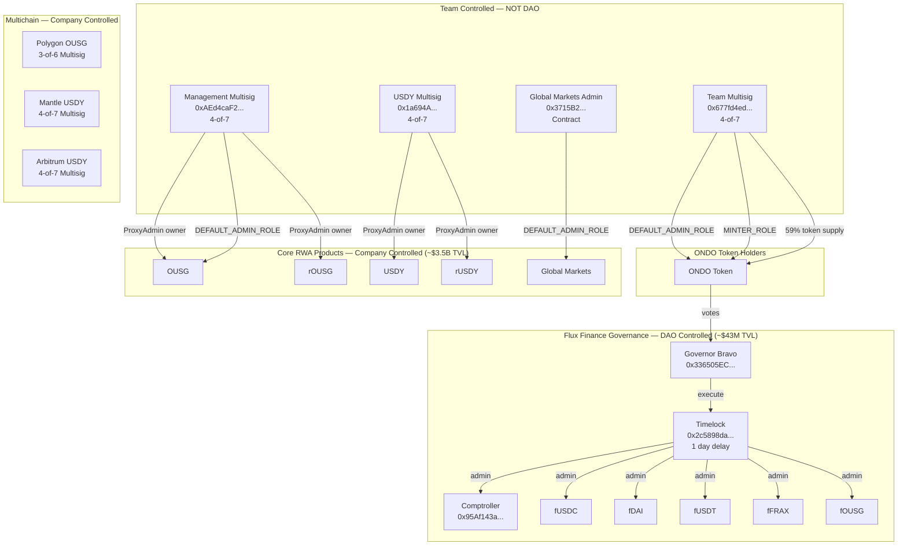

# ONDO Token Research Report

## Aragon Ownership Token Framework Analysis

**Token:** ONDO (Ondo Governance Token)
**Address:** `0xfAbA6f8e4a5E8Ab82F62fe7C39859FA577269BE3`
**Network:** Ethereum Mainnet (with multichain deployments)
**Date:** 2026-03-10 (Updated 2026-04-13)
**Analyst:** Researcher Agent

---

## Executive Summary

**Protocol Description:** Ondo Finance is a tokenized real-world asset (RWA) protocol with ~$3.56B TVL across OUSG (tokenized US Treasuries), USDY (yield-bearing stablecoin), and Global Markets (tokenized equities). The ONDO token is the governance token for Ondo DAO, which governs only Flux Finance—a small Compound V2 fork with ~$43M TVL (~1.2% of Ondo's total TVL).

This analysis evaluates ONDO against the Aragon Ownership Token Framework to answer three core questions:

1. **What do I own?** ONDO tokenholders control governance over Flux Finance only—a minor DeFi lending protocol representing 1.2% of Ondo's TVL. ONDO governance does **NOT** control Ondo's core RWA products (OUSG, USDY, Ondo Global Markets, or the upcoming Ondo Chain). The ONDO token itself has AccessControl with DEFAULT_ADMIN_ROLE and MINTER_ROLE held by team multisigs, not the DAO.

2. **Why should it have value?** There is **no active value accrual mechanism** for ONDO tokenholders. Flux Finance reserve factors are 0% across all markets—no protocol fees are collected. USDY/OUSG revenue (~$3-4M monthly yield) accrues to product holders (USDY/OUSG investors), not to ONDO tokenholders. There is no fee distribution, staking rewards, or buyback program.

3. **What threatens that value?** Critical governance scope limitation (controls only Flux Finance, not core products), high token concentration (~59% in team multisig), team control over the ONDO token contract itself (MINTER_ROLE), and absence of binding value accrual.

**TVL Context:**
- **OUSG/USDY/Global Markets:** ~$3.56B TVL (company-controlled)
- **Flux Finance:** ~$43M TVL (DAO-controlled via ONDO governance)

**Overall Assessment:** 4 positive (✅), 5 neutral (TBD), 9 at-risk (⚠️)

---

## Contract Index Table

### Ethereum Mainnet — Core Products (Company-Controlled)

| Contract | Address | What it does | Upgradeable? | Ownership-relevant? | Value-accrual-relevant? |
|----------|---------|--------------|--------------|---------------------|-------------------------|
| OUSG | [`0x1B19C19393e2d034D8Ff31ff34c81252FcBbee92`](https://etherscan.io/address/0x1B19C19393e2d034D8Ff31ff34c81252FcBbee92) | Tokenized treasuries | Yes (proxy) | Y | Y |
| rOUSG | [`0x54043c656F0FAd0652D9Ae2603cDF347c5578d00`](https://etherscan.io/address/0x54043c656F0FAd0652D9Ae2603cDF347c5578d00) | Rebasing OUSG wrapper | Yes (proxy) | Y | Y |
| USDY | [`0x96F6eF951840721AdBF46Ac996b59E0235CB985C`](https://etherscan.io/address/0x96F6eF951840721AdBF46Ac996b59E0235CB985C) | Yield-bearing stablecoin | Yes (proxy) | Y | Y |
| rUSDY | [`0xaf37c1167910ebC994e266949387d2c7C326b879`](https://etherscan.io/address/0xaf37c1167910ebC994e266949387d2c7C326b879) | Rebasing USDY wrapper | Yes (proxy) | Y | Y |
| USDYc | [`0xe86845788d6e3e5c2393ade1a051ae617d974c09`](https://etherscan.io/address/0xe86845788d6e3e5c2393ade1a051ae617d974c09#code) | Chainlink-compatible USDY | Yes (proxy) | Y | N |
| OUSG_InstantManager | [`0x93358db73B6cd4b98D89c8F5f230E81a95c2643a`](https://etherscan.io/address/0x93358db73B6cd4b98D89c8F5f230E81a95c2643a#code) | OUSG mint/redeem | No | Y | Y |
| USDY_InstantManager | [`0xa42613C243b67BF6194Ac327795b926B4b491f15`](https://etherscan.io/address/0xa42613C243b67BF6194Ac327795b926B4b491f15#code) | USDY mint/redeem | No | Y | Y |
| KYCRegistry | [`0x56A5D911052323D688C731d516530878557463e7`](https://etherscan.io/address/0x56A5D911052323D688C731d516530878557463e7) | OUSG KYC registry | Yes (proxy) | Y | N |
| OndoIDRegistry | [`0xcf6958D69d535FD03BD6Df3F4fe6CDcd127D97df`](https://etherscan.io/address/0xcf6958D69d535FD03BD6Df3F4fe6CDcd127D97df#code) | KYC registry | Yes (proxy) | Y | N |
| OUSG Oracle | [`0x0502c5ae08E7CD64fe1AEDA7D6e229413eCC6abe`](https://etherscan.io/address/0x0502c5ae08E7CD64fe1AEDA7D6e229413eCC6abe) | OUSG price oracle | No | N | Y |
| USDY Oracle | [`0x4c59d8Fbc5707C319A22936bB6F9b1C2a0e3C851`](https://etherscan.io/address/0x4c59d8Fbc5707C319A22936bB6F9b1C2a0e3C851) | USDY price oracle | No | N | Y |
| Blocklist | [`0xd8c8174691d936E2C80114EC449037b13421B0a8`](https://etherscan.io/address/0xd8c8174691d936E2C80114EC449037b13421B0a8#code) | USDY blocklist | No | Y | N |
| GMTokenManager | [`0x2c158BC456e027b2AfFCCadF1BDBD9f5fC4c5C8c`](https://etherscan.io/address/0x2c158BC456e027b2AfFCCadF1BDBD9f5fC4c5C8c#code) | Global Markets manager | No | Y | Y |
| USDon | [`0xAcE8E719899F6E91831B18AE746C9A965c2119F1`](https://etherscan.io/address/0xAcE8E719899F6E91831B18AE746C9A965c2119F1#code) | Global Markets stable | Yes (proxy) | Y | Y |
| USDonManager | [`0x05CCbB4b74854f8A067b83475E8c34f5a413D7e1`](https://etherscan.io/address/0x05CCbB4b74854f8A067b83475E8c34f5a413D7e1#code) | USDon operations | No | Y | Y |
| GMTokenLimitOrder | [`0xf0Bc39Fc911F6437C84d16188dD8294F7110f451`](https://etherscan.io/address/0xf0Bc39Fc911F6437C84d16188dD8294F7110f451#code) | GM limit orders | No | N | N |

### Ethereum Mainnet — ONDO Token and Governance

| Contract | Address | What it does | Upgradeable? | Ownership-relevant? | Value-accrual-relevant? |
|----------|---------|--------------|--------------|---------------------|-------------------------|
| ONDO Token | [`0xfAbA6f8e4a5E8Ab82F62fe7C39859FA577269BE3`](https://etherscan.io/address/0xfAbA6f8e4a5E8Ab82F62fe7C39859FA577269BE3) | Governance token with AccessControl | No | Y | N |
| Governor (Ondo DAO) | [`0x336505EC1BcC1A020EeDe459f57581725D23465A`](https://etherscan.io/address/0x336505EC1BcC1A020EeDe459f57581725D23465A) | GovernorBravo for Flux Finance | No | Y | N |
| Timelock | [`0x2c5898da4DF1d45EAb2B7B192a361C3b9EB18d9c`](https://etherscan.io/address/0x2c5898da4DF1d45EAb2B7B192a361C3b9EB18d9c) | 1-day execution delay | No | Y | N |

### Ethereum Mainnet — Flux Finance (DAO-Controlled, ~$43M TVL)

| Contract | Address | What it does | Upgradeable? | Ownership-relevant? | Value-accrual-relevant? |
|----------|---------|--------------|--------------|---------------------|-------------------------|
| Comptroller | [`0x95Af143a021DF745bc78e845b54591C53a8B3A51`](https://etherscan.io/address/0x95Af143a021DF745bc78e845b54591C53a8B3A51) | Flux Finance accounting/risk | No | Y | Y |
| fUSDC | [`0x465a5a630482f3abD6d3b84B39B29b07214d19e5`](https://etherscan.io/address/0x465a5a630482f3abD6d3b84B39B29b07214d19e5) | Flux lending market | Yes (delegator) | Y | Y |
| fDAI | [`0xe2bA8693cE7474900A045757fe0efCa900F6530b`](https://etherscan.io/address/0xe2bA8693cE7474900A045757fe0efCa900F6530b) | Flux lending market | Yes (delegator) | Y | Y |
| fUSDT | [`0x81994b9607e06ab3d5cF3AffF9a67374f05F27d7`](https://etherscan.io/address/0x81994b9607e06ab3d5cF3AffF9a67374f05F27d7) | Flux lending market | Yes (delegator) | Y | Y |
| fFRAX | [`0x1C9A2d6b33B4826757273D47ebEe0e2DddcD978B`](https://etherscan.io/address/0x1C9A2d6b33B4826757273D47ebEe0e2DddcD978B) | Flux lending market | Yes (delegator) | Y | Y |
| fOUSG | [`0x1dD7950c266fB1be96180a8FDb0591F70200E018`](https://etherscan.io/address/0x1dD7950c266fB1be96180a8FDb0591F70200E018) | OUSG lending market | Yes (delegator) | Y | Y |

### Ondo Bridge (OFT Adapters)

| Chain | Address | What it does |
|-------|---------|--------------|
| Ethereum | `0xa6275720b3fB1Efe3E6EF2b5BF2293148852307D` | LayerZero OFT Adapter |
| Mantle | `0x0bE393DC46248E4285dc5CAcA3084bc7e9bfbB41` | LayerZero OFT Adapter |
| Arbitrum | `0x0bE393DC46248E4285dc5CAcA3084bc7e9bfbB41` | LayerZero OFT Adapter |

### Polygon

| Contract | Address | What it does | Admin |
|----------|---------|--------------|-------|
| OUSG | [`0xbA11C5effA33c4D6F8f593CFA394241CfE925811`](https://polygonscan.com/address/0xbA11C5effA33c4D6F8f593CFA394241CfE925811) | OUSG on Polygon | 3-of-6 Multisig |
| CashManager | `0x6B7443808ACFCD48f1DE212C2557462fA86Ee945` | Mint/redeem manager | Unknown |
| Registry | `0x7cD852c0D7613aA869e632929560f310D4059AC1` | KYC registry | Unknown |

### Mantle

| Contract | Address | What it does | Admin |
|----------|---------|--------------|-------|
| USDY | [`0x5bE26527e817998A7206475496fDE1E68957c5A6`](https://mantlescan.xyz/address/0x5bE26527e817998A7206475496fDE1E68957c5A6) | USDY on Mantle | 4-of-7 Multisig |
| mUSD | `0xab575258d37EaA5C8956EfABe71F4eE8F6397cF3` | Mantle USD wrapper | Unknown |

### Arbitrum

| Contract | Address | What it does | Admin |
|----------|---------|--------------|-------|
| USDY | [`0x35e050d3C0eC2d29D269a8EcEa763a183bDF9A9D`](https://arbiscan.io/address/0x35e050d3C0eC2d29D269a8EcEa763a183bDF9A9D) | USDY on Arbitrum | 4-of-7 Multisig |

### BNB Chain

| Contract | Address | What it does | Admin |
|----------|---------|--------------|-------|
| GMTokenManager | [`0x91f8Aff3738825e8eB16FC6f6b1A7A4647bDB299`](https://bscscan.com/address/0x91f8Aff3738825e8eB16FC6f6b1A7A4647bDB299) | Global Markets manager | Unknown |
| USDon | `0x1f8955E640Cbd9abc3C3Bb408c9E2E1f5F20DfE6` | Global Markets stable | Unknown |

### Multisig Addresses

| Address | Purpose | Config | Chain |
|---------|---------|--------|-------|
| [`0x677fd4ed8ae623f2f625deb2d64f2070e46ca1a1`](https://etherscan.io/address/0x677fd4ed8ae623f2f625deb2d64f2070e46ca1a1) | Team Multisig (~59% ONDO, DEFAULT_ADMIN_ROLE, MINTER_ROLE) | 4-of-7 | Ethereum |
| [`0xAEd4caF2E535D964165B4392342F71bac77e8367`](https://etherscan.io/address/0xAEd4caF2E535D964165B4392342F71bac77e8367) | Management Multisig (OUSG admin) | 4-of-7 | Ethereum |
| [`0x1a694A09494E214a3Be3652e4B343B7B81A73ad7`](https://etherscan.io/address/0x1a694A09494E214a3Be3652e4B343B7B81A73ad7) | USDY ProxyAdmin Owner | 4-of-7 | Ethereum |
| [`0x5AE21c99FC5f1584D8Cb09a298CFFd92B5d178eF`](https://etherscan.io/address/0x5AE21c99FC5f1584D8Cb09a298CFFd92B5d178eF) | USDY_InstantManager Admin | 3-of-5 | Ethereum |
| [`0x3715B2154d2FF4C5B027C7a1f734B53F27bc34f1`](https://etherscan.io/address/0x3715B2154d2FF4C5B027C7a1f734B53F27bc34f1) | Global Markets TimelockController (2-hour delay) | N/A | Ethereum |
| [`0x71A4d411b5f7941Dee020417fca30413712f1646`](https://etherscan.io/address/0x71A4d411b5f7941Dee020417fca30413712f1646) | GM Timelock PROPOSER_ROLE holder | 4-of-7 | Ethereum |
| [`0x2e55b738F5969Eea10fB67e326BEE5e2fA15A2CC`](https://etherscan.io/address/0x2e55b738F5969Eea10fB67e326BEE5e2fA15A2CC) | GM Timelock EXECUTOR_ROLE holder | 1-of-8 | Ethereum |
| [`0xcD35671dCAb88d05EE29dC4D360181529390B17f`](https://etherscan.io/address/0xcD35671dCAb88d05EE29dC4D360181529390B17f) | GM Timelock DEFAULT_ADMIN_ROLE holder | 5-of-9 | Ethereum |
| [`0x4413073440A568790c1b2b06B47F7D0a443574d0`](https://polygonscan.com/address/0x4413073440A568790c1b2b06B47F7D0a443574d0) | Polygon OUSG Admin | 3-of-6 | Polygon |
| [`0xC8A7870fFe41054612F7f3433E173D8b5bFcA8E3`](https://mantlescan.xyz/address/0xC8A7870fFe41054612F7f3433E173D8b5bFcA8E3) | Mantle USDY Admin | 4-of-7 | Mantle |
| [`0xC4ac5c2fA461901b4D91832d03A7018092eDCb4D`](https://arbiscan.io/address/0xC4ac5c2fA461901b4D91832d03A7018092eDCb4D) | Arbitrum USDY Admin | 4-of-7 | Arbitrum |

---

## Supply Metrics

| Metric | Value | Verified |
|--------|-------|----------|
| Total Supply | 10,000,000,000 ONDO | ✅ On-chain |
| Max Supply | 10,000,000,000 ONDO (MINTER_ROLE exists) | ✅ hasRole() verified |
| Team Multisig Holdings | ~5.9B ONDO (~59%) | ✅ On-chain |
| Circulating Supply | ~4.1B ONDO (~41%) | Estimated |
| Transfers Enabled | Yes (Jan 18, 2024) | ✅ On-chain |

---

## Metric 1: Onchain Control

### 1.1 Onchain Governance Workflow ⚠️

**Finding:** ONDO tokenholders control governance over Flux Finance (~$43M TVL) through a two-stage process: forum discussion followed by on-chain voting. However, governance scope is **severely limited** to Flux Finance only—representing just 1.2% of Ondo's total TVL. The DAO has **no control** over Ondo's core products (OUSG, USDY, Global Markets) which represent 98.8% of protocol value.

**Two-Stage Governance Process:**
1. **Forum Discussion:** Proposals are first posted on the [Flux Finance Governance Forum](https://forum.fluxfinance.com/) for community feedback
2. **On-Chain Vote:** After forum discussion, proposals are submitted on-chain via [Tally](https://www.tally.xyz/gov/ondo-dao) for binding votes

**Governance Parameters:**
- Proposal Threshold: 100M ONDO (1% of supply)
- Quorum: 1M ONDO (0.01% of supply)
- Voting Period: ~3 days (21600 blocks)
- Timelock Delay: 1 day (86400 seconds)

**Source Code:**
- GovernorBravoDelegate: [flux-finance/contracts/.../GovernorBravoDelegate.sol](https://github.com/flux-finance/contracts/blob/main/contracts/lending/compound/governance/GovernorBravoDelegate.sol)
- Quorum hardcoded at 1M ONDO: [Line 32](https://github.com/flux-finance/contracts/blob/main/contracts/lending/compound/governance/GovernorBravoDelegate.sol#L32)
```solidity
/// @notice The number of votes in support of a proposal required in order for a quorum to be reached and for a vote to succeed
uint public constant quorumVotes = 1_000_000e18; // 1 million Ondo
```

**Evidence:**
- [Governor on Etherscan](https://etherscan.io/address/0x336505EC1BcC1A020EeDe459f57581725D23465A#code)
- [Timelock on Etherscan](https://etherscan.io/address/0x2c5898da4DF1d45EAb2B7B192a361C3b9EB18d9c#code)
- [Tally Governance Dashboard](https://www.tally.xyz/gov/ondo-dao)
- [Flux Finance Governance Forum](https://forum.fluxfinance.com/)

**Critical Issue:** Governance scope is limited to Flux Finance (~$43M TVL). Core Ondo products (~$3.5B TVL) are controlled by company multisigs, not the DAO.

---

### 1.2 Role Accountability ⚠️

**Finding:** OUSG, USDY, and Global Markets are controlled by team multisigs. The ONDO token itself has DEFAULT_ADMIN_ROLE and MINTER_ROLE held by team multisigs, not the DAO. Only Flux Finance (~$43M TVL) is DAO-controlled.

**Team-Controlled (Core Products — ~$3.5B TVL):**
| Contract | Role | Holder | Type |
|----------|------|--------|------|
| [OUSG](https://etherscan.io/address/0x1B19C19393e2d034D8Ff31ff34c81252FcBbee92) | DEFAULT_ADMIN_ROLE | [`0xAEd4caF2E535D964165B4392342F71bac77e8367`](https://etherscan.io/address/0xAEd4caF2E535D964165B4392342F71bac77e8367) | ⚠️ Management Multisig (4/7) |
| [OUSG](https://etherscan.io/address/0x1B19C19393e2d034D8Ff31ff34c81252FcBbee92) | ProxyAdmin owner | [`0xAEd4caF2E535D964165B4392342F71bac77e8367`](https://etherscan.io/address/0xAEd4caF2E535D964165B4392342F71bac77e8367) | ⚠️ Management Multisig (4/7) |
| [rOUSG](https://etherscan.io/address/0x54043c656F0FAd0652D9Ae2603cDF347c5578d00) | ProxyAdmin owner | [`0xAEd4caF2E535D964165B4392342F71bac77e8367`](https://etherscan.io/address/0xAEd4caF2E535D964165B4392342F71bac77e8367) | ⚠️ Management Multisig (4/7) |
| [USDY](https://etherscan.io/address/0x96F6eF951840721AdBF46Ac996b59E0235CB985C) | ProxyAdmin owner | [`0x1a694A09494E214a3Be3652e4B343B7B81A73ad7`](https://etherscan.io/address/0x1a694A09494E214a3Be3652e4B343B7B81A73ad7) | ⚠️ Team Multisig (4/7) |
| [rUSDY](https://etherscan.io/address/0xaf37c1167910ebC994e266949387d2c7C326b879) | ProxyAdmin owner | [`0x1a694A09494E214a3Be3652e4B343B7B81A73ad7`](https://etherscan.io/address/0x1a694A09494E214a3Be3652e4B343B7B81A73ad7) | ⚠️ Team Multisig (4/7) |
| [GMTokenManager](https://etherscan.io/address/0x2c158BC456e027b2AfFCCadF1BDBD9f5fC4c5C8c) | DEFAULT_ADMIN_ROLE | [`0x3715B2154d2FF4C5B027C7a1f734B53F27bc34f1`](https://etherscan.io/address/0x3715B2154d2FF4C5B027C7a1f734B53F27bc34f1) | ⚠️ TimelockController (2h delay) |
| [USDon](https://etherscan.io/address/0xAcE8E719899F6E91831B18AE746C9A965c2119F1) | DEFAULT_ADMIN_ROLE | [`0x3715B2154d2FF4C5B027C7a1f734B53F27bc34f1`](https://etherscan.io/address/0x3715B2154d2FF4C5B027C7a1f734B53F27bc34f1) | ⚠️ TimelockController (2h delay) |

**Team-Controlled (ONDO Token):**
| Contract | Role | Holder | Type |
|----------|------|--------|------|
| [ONDO Token](https://etherscan.io/address/0xfAbA6f8e4a5E8Ab82F62fe7C39859FA577269BE3) | DEFAULT_ADMIN_ROLE | [`0x677fd4ed8ae623f2f625deb2d64f2070e46ca1a1`](https://etherscan.io/address/0x677fd4ed8ae623f2f625deb2d64f2070e46ca1a1) | ⚠️ Team Multisig (4/7) |
| [ONDO Token](https://etherscan.io/address/0xfAbA6f8e4a5E8Ab82F62fe7C39859FA577269BE3) | MINTER_ROLE | [`0x677fd4ed8ae623f2f625deb2d64f2070e46ca1a1`](https://etherscan.io/address/0x677fd4ed8ae623f2f625deb2d64f2070e46ca1a1) | ⚠️ Team Multisig (4/7) |

**DAO-Controlled (Flux Finance — ~$43M TVL):**
| Contract | Role | Holder | Type |
|----------|------|--------|------|
| [Comptroller](https://etherscan.io/address/0x95Af143a021DF745bc78e845b54591C53a8B3A51) | admin | [Timelock](https://etherscan.io/address/0x2c5898da4DF1d45EAb2B7B192a361C3b9EB18d9c) | ✅ DAO |
| [fUSDC](https://etherscan.io/address/0x465a5a630482f3abD6d3b84B39B29b07214d19e5)/[fDAI](https://etherscan.io/address/0xe2bA8693cE7474900A045757fe0efCa900F6530b)/[fUSDT](https://etherscan.io/address/0x81994b9607e06ab3d5cF3AffF9a67374f05F27d7)/[fFRAX](https://etherscan.io/address/0x1C9A2d6b33B4826757273D47ebEe0e2DddcD978B)/[fOUSG](https://etherscan.io/address/0x1dD7950c266fB1be96180a8FDb0591F70200E018) | admin | [Timelock](https://etherscan.io/address/0x2c5898da4DF1d45EAb2B7B192a361C3b9EB18d9c) | ✅ DAO |

**Global Markets TimelockController (`0x3715B2154d2FF4C5B027C7a1f734B53F27bc34f1`) Role Holders:**
| Role | Holder | Type |
|------|--------|------|
| PROPOSER_ROLE | [`0x71A4d411b5f7941Dee020417fca30413712f1646`](https://etherscan.io/address/0x71A4d411b5f7941Dee020417fca30413712f1646) | Multisig (4/7) |
| EXECUTOR_ROLE | [`0x2e55b738F5969Eea10fB67e326BEE5e2fA15A2CC`](https://etherscan.io/address/0x2e55b738F5969Eea10fB67e326BEE5e2fA15A2CC) | Multisig (1/8) |
| EXECUTOR_ROLE | [`0xfF1621Ee754512B34a6Bd62A941Cc4d5E4d0b85B`](https://etherscan.io/address/0xfF1621Ee754512B34a6Bd62A941Cc4d5E4d0b85B) | EOA |
| DEFAULT_ADMIN_ROLE | [`0xcD35671dCAb88d05EE29dC4D360181529390B17f`](https://etherscan.io/address/0xcD35671dCAb88d05EE29dC4D360181529390B17f) | Multisig (5/9) |

---

### 1.3 Protocol Upgrade Authority ⚠️

**Finding:** OUSG and USDY are upgradeable proxies controlled by team multisigs on all chains. Flux Finance upgrades are DAO-controlled via Timelock, but represent only 1.2% of Ondo's TVL.

**OUSG/USDY (Team-Controlled, ~$3.5B TVL):**

| Chain | Product | ProxyAdmin Owner |
|-------|---------|------------------|
| Ethereum | [OUSG](https://etherscan.io/address/0x1B19C19393e2d034D8Ff31ff34c81252FcBbee92) | [`0xAEd4caF2E535D964165B4392342F71bac77e8367`](https://etherscan.io/address/0xAEd4caF2E535D964165B4392342F71bac77e8367) (4-of-7) |
| Ethereum | [USDY](https://etherscan.io/address/0x96F6eF951840721AdBF46Ac996b59E0235CB985C) | [`0x1a694A09494E214a3Be3652e4B343B7B81A73ad7`](https://etherscan.io/address/0x1a694A09494E214a3Be3652e4B343B7B81A73ad7) (4-of-7) |
| Polygon | [OUSG](https://polygonscan.com/address/0xbA11C5effA33c4D6F8f593CFA394241CfE925811) | [`0x4413073440A568790c1b2b06B47F7D0a443574d0`](https://polygonscan.com/address/0x4413073440A568790c1b2b06B47F7D0a443574d0) (3-of-6) |
| Mantle | [USDY](https://mantlescan.xyz/address/0x5bE26527e817998A7206475496fDE1E68957c5A6) | [`0xC8A7870fFe41054612F7f3433E173D8b5bFcA8E3`](https://mantlescan.xyz/address/0xC8A7870fFe41054612F7f3433E173D8b5bFcA8E3) (4-of-7) |
| Arbitrum | [USDY](https://arbiscan.io/address/0x35e050d3C0eC2d29D269a8EcEa763a183bDF9A9D) | [`0xC4ac5c2fA461901b4D91832d03A7018092eDCb4D`](https://arbiscan.io/address/0xC4ac5c2fA461901b4D91832d03A7018092eDCb4D) (4-of-7) |

DAO has **no upgrade control** over OUSG/USDY on any chain.

**Flux Finance (DAO-Controlled, ~$43M TVL):**
- fToken contracts use delegator pattern ([cErc20ModifiedDelegator.sol](https://github.com/flux-finance/contracts/blob/main/contracts/lending/tokens/cErc20ModifiedDelegator.sol))
- Admin = [Timelock](https://etherscan.io/address/0x2c5898da4DF1d45EAb2B7B192a361C3b9EB18d9c) (`0x2c5898da4DF1d45EAb2B7B192a361C3b9EB18d9c`)
- DAO can upgrade implementations via `_setImplementation()` ([Line 622](https://github.com/flux-finance/contracts/blob/main/contracts/lending/tokens/cErc20ModifiedDelegator.sol#L622))
- Verified: `cast call 0x465a5a630482f3abD6d3b84B39B29b07214d19e5 "admin()(address)"` → `0x2c5898da4DF1d45EAb2B7B192a361C3b9EB18d9c`

---

### 1.4 Token Upgrade Authority ⚠️

**Finding:** The ONDO token is **NOT upgradeable** (no proxy pattern). However, it uses AccessControl with DEFAULT_ADMIN_ROLE and MINTER_ROLE held by a team multisig—NOT the DAO.

**Powers of DEFAULT_ADMIN_ROLE holder (`0x677fd4ed8ae623f2f625deb2d64f2070e46ca1a1`):**
- Can grant/revoke roles including MINTER_ROLE
- Can grant DEFAULT_ADMIN_ROLE to new addresses
- Can change role admin configurations

**Powers of MINTER_ROLE holder:**
- Can mint new ONDO tokens up to the supply cap

**Note on Contract Source:** The deployed ONDO token at `0xfAbA6f8e4a5E8Ab82F62fe7C39859FA577269BE3` is verified on Etherscan and supports the AccessControl interface (`supportsInterface(0x7965db0b) = true`). The public [ondo-v1 repository](https://github.com/ondoprotocol/ondo-v1/blob/main/contracts/tokens/Ondo.sol) shows a simpler Ownable-based contract without AccessControl, indicating the deployed contract differs from the public repo.

---

### 1.5 Supply Control ⚠️

**Finding:** ONDO has a total supply of 10B tokens. The MINTER_ROLE exists and is held by a team multisig—the supply is **not immutably fixed**.

**Evidence:**
- `totalSupply()` returns exactly 10B ONDO (verified on-chain)
- MINTER_ROLE exists: `0x9f2df0fed2c77648de5860a4cc508cd0818c85b8b8a1ab4ceeef8d981c8956a6`
- Team multisig ([`0x677fd4ed8ae623f2f625deb2d64f2070e46ca1a1`](https://etherscan.io/address/0x677fd4ed8ae623f2f625deb2d64f2070e46ca1a1)) holds MINTER_ROLE
- The team **can mint new tokens** without DAO approval

**Mint Function:**
The deployed ONDO token contract ([Etherscan verified source](https://etherscan.io/address/0xfAbA6f8e4a5E8Ab82F62fe7C39859FA577269BE3#code)) includes a mint function restricted to MINTER_ROLE holders:

```solidity
function mint(address to, uint256 amount) external onlyRole(MINTER_ROLE) {
    _mint(to, amount);
}
```

**Verification:**
```
cast call 0xfAbA6f8e4a5E8Ab82F62fe7C39859FA577269BE3 "hasRole(bytes32,address)(bool)" 0x9f2df0fed2c77648de5860a4cc508cd0818c85b8b8a1ab4ceeef8d981c8956a6 0x677fd4ed8ae623f2f625deb2d64f2070e46ca1a1 --rpc-url https://eth.llamarpc.com
→ true (Team Multisig has MINTER_ROLE)
```

**Documentation claim ([docs.ondo.foundation](https://docs.ondo.foundation/ondo-token)):**
> "There is no scheduled or planned inflation"

This is a policy statement, not a code enforcement. The code allows minting.

---

### 1.6 Privileged Access Gating ⚠️

**Finding:** OUSG and USDY have extensive transfer restrictions (KYC requirements, blocklists, sanctions checks). These are enforced by Ondo Finance, not the DAO.

**OUSG Transfer Restrictions:**

OUSG uses the KYCRegistry at [`0x56A5D911052323D688C731d516530878557463e7`](https://etherscan.io/address/0x56A5D911052323D688C731d516530878557463e7) to enforce KYC requirements. The registry is stored in OUSG's storage slot 0.

**How OndoIDRegistry is consumed by OUSG:**

The `_beforeTokenTransfer` hook in OUSG enforces three-way KYC checks on every transfer:
- Source: [ousg.sol:62-89](https://github.com/code-423n4/2024-03-ondo-finance/blob/main/contracts/ousg/ousg.sol#L62-L89)

```solidity
function _beforeTokenTransfer(
  address from,
  address to,
  uint256 amount
) internal override {
  super._beforeTokenTransfer(from, to, amount);

  require(
    _getKYCStatus(_msgSender()),
    "CashKYCSenderReceiver: must be KYC'd to initiate transfer"
  );

  if (from != address(0)) {
    require(
      _getKYCStatus(from),
      "CashKYCSenderReceiver: `from` address must be KYC'd to send tokens"
    );
  }

  if (to != address(0)) {
    require(
      _getKYCStatus(to),
      "CashKYCSenderReceiver: `to` address must be KYC'd to receive tokens"
    );
  }
}
```

The `_getKYCStatus()` function calls the KYCRegistry:
- Source: [KYCRegistryClientUpgradeable.sol:100-102](https://github.com/code-423n4/2024-03-ondo-finance/blob/main/contracts/kyc/KYCRegistryClientUpgradeable.sol#L100-L102)

```solidity
function _getKYCStatus(address account) internal view returns (bool) {
  return kycRegistry.getKYCStatus(kycRequirementGroup, account);
}
```

The KYCRegistry also checks sanctions:
- Source: [KYCRegistry.sol:128-135](https://github.com/code-423n4/2024-03-ondo-finance/blob/main/contracts/kyc/KYCRegistry.sol#L128-L135)

```solidity
function getKYCStatus(
  uint256 kycRequirementGroup,
  address account
) external view override returns (bool) {
  return
    kycState[kycRequirementGroup][account] &&
    !sanctionsList.isSanctioned(account);
}
```

**Key Points:**
- Three addresses must be KYC'd for any transfer: msg.sender, from, and to
- OUSG uses `kycRequirementGroup = 1`
- KYC status is controlled by company (not DAO)
- Sanctions checking via Chainalysis oracle

**Etherscan Links:**
- [OUSG Contract](https://etherscan.io/address/0x1B19C19393e2d034D8Ff31ff34c81252FcBbee92#code)
- [KYCRegistry](https://etherscan.io/address/0x56A5D911052323D688C731d516530878557463e7)

**USDY Transfer Restrictions:**
- Blocklist check
- Allowlist check
- Sanctions list check
- Source: [USDY.sol:84-115](https://github.com/ondoprotocol/usdy/blob/main/contracts/usdy/USDY.sol#L84-L115)

**ONDO Token:**
- `transferAllowed = true` (transfers enabled since Jan 2024)
- Previously, only owner could transfer when `transferAllowed = false`
- No blocklist or censorship capability in the token contract

---

### 1.7 Token Censorship ✅

**Finding:** The ONDO token has **no blocklist, freeze, or seizure functions**. However, before January 2024, transfers were disabled except for the owner.

**Source Code Analysis ([ondo-v1/contracts/tokens/Ondo.sol](https://github.com/ondoprotocol/ondo-v1/blob/main/contracts/tokens/Ondo.sol)):**
```solidity
modifier whenTransferAllowed() {
  require(
    transferAllowed || msg.sender == owner(),
    "OndoToken: Transfers not allowed or not right privillege"
  );
  _;
}
```

**Current State:**
- `transferAllowed = true` (verified on-chain, changed to true on Jan 18, 2024)
- No blacklist mapping
- No pause function for transfers
- No force transfer or seize functions

---

## Metric 2: Value Accrual

### 2.1 Accrual Active ⚠️

**Finding:** There is **NO active value accrual mechanism** for ONDO tokenholders. USDY/OUSG yield (~$3-4M monthly) accrues to product holders (USDY/OUSG investors), not to ONDO tokenholders. Flux Finance (~$43M TVL) has 0% reserve factors—no fees collected.

**USDY/OUSG Revenue (~$3.5B TVL, Company-Controlled):**

The ~$3-4M monthly "fees" shown on [DefiLlama](https://defillama.com/protocol/ondo-finance) represents **yield distributed to USDY/OUSG holders** (the investors who hold these RWA tokens), **NOT to ONDO tokenholders**.

Per the [DefiLlama adapter methodology](https://github.com/DefiLlama/dimension-adapters/blob/master/fees/ondo.ts):
1. "Fees": Total yields collected by investment assets (USDY, OUSG)
2. "SupplySideRevenue": Total yields distributed to investors (USDY/OUSG holders)
3. The adapter states: "No management fees on Ondo"

**How USDY/OUSG Yield Works:**
1. USDY/OUSG are backed by short-term US Treasuries
2. An oracle updates the NAV/price daily to reflect accrued yield
3. USDY/OUSG holders receive yield through increasing token price
4. This yield goes to USDY/OUSG holders, **not** to ONDO tokenholders

**Oracle Price Update Mechanism:**
- OUSG Oracle: [`0x0502c5ae08E7CD64fe1AEDA7D6e229413eCC6abe`](https://etherscan.io/address/0x0502c5ae08E7CD64fe1AEDA7D6e229413eCC6abe) (RWAOracleExternalComparisonCheck)
- USDY Oracle: [`0x4c59d8Fbc5707C319A22936bB6F9b1C2a0e3C851`](https://etherscan.io/address/0x4c59d8Fbc5707C319A22936bB6F9b1C2a0e3C851)
- `setPrice()` function updates NAV (restricted to SETTER_ROLE, rate-limited to max 1% change per 23 hours)
- Source: [RWAOracleRateCheck.sol](https://github.com/ondoprotocol/usdy/blob/main/contracts/rwaOracles/RWAOracleRateCheck.sol)

**Conclusion:** ONDO tokenholders receive **zero** value from USDY/OUSG yield. The ~$48M cumulative "fees" tracked by DefiLlama went entirely to USDY/OUSG product holders.

---

**Flux Finance Revenue (~$43M TVL, DAO-Controlled):**

Reserve factors are **0% across all markets**—no protocol fees are collected.

**Proof of 0% Reserve Factors:**
```
cast call 0x465a5a630482f3abD6d3b84B39B29b07214d19e5 "reserveFactorMantissa()(uint256)" --rpc-url https://eth.llamarpc.com
→ 0 (fUSDC)

cast call 0xe2bA8693cE7474900A045757fe0efCa900F6530b "reserveFactorMantissa()(uint256)" --rpc-url https://eth.llamarpc.com
→ 0 (fDAI)

cast call 0x81994b9607e06ab3d5cF3AffF9a67374f05F27d7 "reserveFactorMantissa()(uint256)" --rpc-url https://eth.llamarpc.com
→ 0 (fUSDT)

cast call 0x1C9A2d6b33B4826757273D47ebEe0e2DddcD978B "reserveFactorMantissa()(uint256)" --rpc-url https://eth.llamarpc.com
→ 0 (fFRAX)
```

**Source Code Reference:**
The public `_setReserveFactor()` function can set reserve factors:
- [CTokenModified.sol:1141-1147](https://github.com/flux-finance/contracts/blob/main/contracts/lending/tokens/cToken/CTokenModified.sol#L1141-L1147)
- [fUSDC on Etherscan](https://etherscan.io/address/0x465a5a630482f3abD6d3b84B39B29b07214d19e5#readProxyContract) (view `reserveFactorMantissa`)

Currently set to 0, meaning 100% of interest goes to lenders, 0% to protocol.

---

### 2.2 Treasury Ownership ⚠️

**Finding:** Aragon has not been able to identify a DAO treasury address for ONDO governance. No FeeDistributor or Treasury contract exists for Flux Finance or Ondo DAO.

**Evidence:**
- Flux Finance reserve factors are 0%—no reserves accumulate ([fUSDC](https://etherscan.io/address/0x465a5a630482f3abD6d3b84B39B29b07214d19e5#readProxyContract): `reserveFactorMantissa = 0`)
- The [Timelock](https://etherscan.io/address/0x2c5898da4DF1d45EAb2B7B192a361C3b9EB18d9c) holds no significant assets
- No FeeDistributor contract exists in [Flux Finance GitHub](https://github.com/flux-finance/contracts)
- No fee distribution proposals on [Tally](https://www.tally.xyz/gov/ondo-dao)

**Token Allocations:**
Per [documentation](https://docs.ondo.foundation/ondo-token), vested tokens include:
- Core Team: 5-year vesting
- Seed Investors: <7%, 1-year cliff + 48-month release
- Series A: <7%, 1-year cliff + 48-month release
- CoinList: ~2% total

Aragon has not been able to identify the specific addresses holding these vested allocations beyond the team multisig at [`0x677fd4ed8ae623f2f625deb2d64f2070e46ca1a1`](https://etherscan.io/address/0x677fd4ed8ae623f2f625deb2d64f2070e46ca1a1) holding ~59% of supply.

---

### 2.3 Accrual Mechanism Control ✅

**Finding:** ONDO holders **can** change Flux Finance fee parameters via governance—but the current setting is 0% and Flux Finance represents only 1.2% of Ondo's total TVL.

**Evidence:**

1. **Comptroller admin = Timelock:**
   ```
   cast call 0x95Af143a021DF745bc78e845b54591C53a8B3A51 "admin()(address)" --rpc-url https://eth.llamarpc.com
   → 0x2c5898da4DF1d45EAb2B7B192a361C3b9EB18d9c (Timelock)
   ```
   - [Comptroller on Etherscan](https://etherscan.io/address/0x95Af143a021DF745bc78e845b54591C53a8B3A51#readContract)

2. **`_setReserveFactor()` can be called by admin:**
   - [CTokenModified.sol:1141-1147](https://github.com/flux-finance/contracts/blob/main/contracts/lending/tokens/cToken/CTokenModified.sol#L1141-L1147) - public function
   - [CTokenModified.sol:1157-1160](https://github.com/flux-finance/contracts/blob/main/contracts/lending/tokens/cToken/CTokenModified.sol#L1157-L1160) - admin check
   - [fUSDC on Etherscan](https://etherscan.io/address/0x465a5a630482f3abD6d3b84B39B29b07214d19e5#writeProxyContract) - `_setReserveFactor` function

3. **DAO can propose to set non-zero reserve factors:**
   - [Tally Ondo DAO](https://www.tally.xyz/gov/ondo-dao) - governance portal
   - Any holder with 100M ONDO can create proposal

**However:** Even with non-zero reserve factors, there is no FeeDistributor contract to distribute collected fees to tokenholders. Reserves would accumulate in fToken contracts via `totalReserves`, not flow to ONDO holders automatically. The DAO would need to deploy a distribution mechanism and propose withdrawing reserves.

---

### 2.4 Offchain Value Accrual ⚠️

**Finding:** Significant value accrues to Ondo Finance Inc. offchain through USDY/OUSG yield spreads. There is no onchain mechanism guaranteeing 100% yield pass-through to product holders.

**USDY Revenue Model:**
- USDY is backed by short-term US Treasuries held in a bankruptcy-remote SPV
- Yield is passed to USDY holders through daily NAV increases via oracle price updates
- Oracle: [`0x4c59d8Fbc5707C319A22936bB6F9b1C2a0e3C851`](https://etherscan.io/address/0x4c59d8Fbc5707C319A22936bB6F9b1C2a0e3C851)
- Source: [RWAOracleRateCheck.sol](https://github.com/ondoprotocol/usdy/blob/main/contracts/rwaOracles/RWAOracleRateCheck.sol)
- [USDY on Etherscan](https://etherscan.io/address/0x96F6eF951840721AdBF46Ac996b59E0235CB985C)

**Proof of Yield Spread Retention (USDY):**
The oracle `setPrice()` function is rate-limited to max 1% change per 23 hours ([Line 81-90](https://github.com/ondoprotocol/usdy/blob/main/contracts/rwaOracles/RWAOracleRateCheck.sol#L81-L90)). There is no onchain mechanism that guarantees 100% of underlying treasury yield is passed to USDY holders. The rate reflected in NAV updates is set by SETTER_ROLE holders (controlled by Ondo), not by an automated oracle reading real treasury yields. The spread between actual treasury yields and the rate set by the oracle accrues offchain to Ondo Finance Inc.

**OUSG Revenue Model:**
- Similar structure to USDY
- Backed by BlackRock's SHV ETF (short-term treasuries)
- Oracle: [`0x0502c5ae08E7CD64fe1AEDA7D6e229413eCC6abe`](https://etherscan.io/address/0x0502c5ae08E7CD64fe1AEDA7D6e229413eCC6abe) (RWAOracleExternalComparisonCheck)
- [OUSG on Etherscan](https://etherscan.io/address/0x1B19C19393e2d034D8Ff31ff34c81252FcBbee92)

**Proof of Yield Spread Retention (OUSG):**
Same mechanism as USDY - oracle price updates are controlled by SETTER_ROLE holders, not automated. No onchain enforcement of full yield pass-through.

**Ondo Global Markets:**
- Tokenized stocks with "on" suffix (e.g., TSLAon, COINon)
- [GMTokenManager on Etherscan](https://etherscan.io/address/0x2c158BC456e027b2AfFCCadF1BDBD9f5fC4c5C8c)
- [USDon on Etherscan](https://etherscan.io/address/0xAcE8E719899F6E91831B18AE746C9A965c2119F1)
- Controlled by TimelockController at [`0x3715B2154d2FF4C5B027C7a1f734B53F27bc34f1`](https://etherscan.io/address/0x3715B2154d2FF4C5B027C7a1f734B53F27bc34f1) (owned by 5/9 multisig)
- Fees and spreads accrue to company, not to ONDO DAO

**Conclusion:** ONDO tokenholders have no claim to offchain revenue streams. All value from Ondo's RWA products accrues to Ondo Finance Inc. or the respective product holders (USDY/OUSG investors). The proof is the absence of any onchain mechanism enforcing yield pass-through.

---

## Metric 3: Verifiability

### 3.1 Token Contract Source Verification ✅

**Finding:** ONDO token contract is verified on Etherscan.

**Evidence:**
- [ONDO Token on Etherscan](https://etherscan.io/address/0xfAbA6f8e4a5E8Ab82F62fe7C39859FA577269BE3#code)
- Verified source code available
- Uses AccessControl pattern

**Note:** The deployed contract differs from the public [ondo-v1 repository](https://github.com/ondoprotocol/ondo-v1/blob/main/contracts/tokens/Ondo.sol) which shows a simpler Ownable-based contract without AccessControl. The Etherscan-verified source should be treated as authoritative.

---

### 3.2 Protocol Component Source Verification ✅

**Finding:** Core contracts are verified on Etherscan and match public GitHub repositories.

**Evidence:**

**OUSG/USDY (Primary Products):**
- [OUSG](https://etherscan.io/address/0x1B19C19393e2d034D8Ff31ff34c81252FcBbee92#code)
- [USDY](https://etherscan.io/address/0x96F6eF951840721AdBF46Ac996b59E0235CB985C#code)
- GitHub: [ondoprotocol/usdy](https://github.com/ondoprotocol/usdy)
- Audit code: [code-423n4/2024-03-ondo-finance](https://github.com/code-423n4/2024-03-ondo-finance)

**Flux Finance:**
- [Comptroller](https://etherscan.io/address/0x95Af143a021DF745bc78e845b54591C53a8B3A51#code)
- [fUSDC](https://etherscan.io/address/0x465a5a630482f3abD6d3b84B39B29b07214d19e5#code)
- [Governor](https://etherscan.io/address/0x336505EC1BcC1A020EeDe459f57581725D23465A#code)
- [Timelock](https://etherscan.io/address/0x2c5898da4DF1d45EAb2B7B192a361C3b9EB18d9c#code)
- GitHub: [flux-finance/contracts](https://github.com/flux-finance/contracts)

---

## Metric 4: Token Distribution

### 4.1 Ownership Concentration ⚠️

**Finding:** ~59% of ONDO supply is held by a single team multisig. This concentration gives the team effective control over governance.

**On-Chain Verification:**
```
cast call 0xfAbA6f8e4a5E8Ab82F62fe7C39859FA577269BE3 "balanceOf(address)(uint256)" 0x677fd4ed8ae623f2f625deb2d64f2070e46ca1a1 --rpc-url https://eth.llamarpc.com
→ 5,904,207,574,154,394,239,393,946,019 (~5.9B ONDO = 59%)
```

**Implications:**
- Team can pass any governance proposal unilaterally
- Team can block any governance proposal
- "Decentralized governance" is effectively team governance

**Team Multisig:**
- Address: [`0x677fd4ed8ae623f2f625deb2d64f2070e46ca1a1`](https://etherscan.io/address/0x677fd4ed8ae623f2f625deb2d64f2070e46ca1a1)
- Configuration: 4-of-7 multisig
- Also holds DEFAULT_ADMIN_ROLE and MINTER_ROLE on ONDO token

---

### 4.2 Future Token Unlocks ⚠️

**Finding:** Per documentation, unlock schedule exists but specific addresses and amounts are not publicly verifiable.

**Documented Schedule:**
| Category | Lock Period | Release Period |
|----------|-------------|----------------|
| CoinList Tranche 1 (~0.3%) | 1 year | 18 months |
| CoinList Tranche 2 (~1.7%) | 1 year | 6 months |
| Seed Investors (<7%) | 1 year cliff | 48 months |
| Series A (<7%) | 1 year cliff | 48 months |
| Core Team | 5 years | Not specified |

**Verification Status:** Aragon has not been able to verify specific vesting contract addresses or unlock schedules from onchain data.

---

## Offchain Dependencies

### 5.1 Trademark TBD

**Finding:** Aragon has not been able to verify USPTO registration for "Ondo" or "Ondo Finance" trademark.

---

### 5.2 Distribution ⚠️

**Finding:** Ondo Finance Inc. controls primary distribution channels.

**Evidence:**
- ondo.finance and fluxfinance.com operated by company
- Terms of Service identify Ondo Finance Inc. as contracting party
- No DAO control over frontend access

---

### 5.3 Licensing TBD

**Finding:** Flux Finance code is open source (Compound V2 fork with BSD-3-Clause license). OUSG/USDY code is BUSL-1.1 licensed.

**Source:**
- Flux Finance: [LICENSE](https://github.com/flux-finance/contracts/blob/main/LICENSE) - BSD-3-Clause
- USDY: [SPDX-License-Identifier: BUSL-1.1](https://github.com/ondoprotocol/usdy/blob/main/contracts/usdy/USDY.sol#L1)

---

## Governance Flow Diagram



---

## Role Matrix

| Contract | Role | Current Holder | Holder Type | Verified Via | Who Controls Holder |
|----------|------|----------------|-------------|--------------|---------------------|
| [ONDO Token](https://etherscan.io/address/0xfAbA6f8e4a5E8Ab82F62fe7C39859FA577269BE3) | DEFAULT_ADMIN_ROLE | [`0x677fd4ed8ae623f2f625deb2d64f2070e46ca1a1`](https://etherscan.io/address/0x677fd4ed8ae623f2f625deb2d64f2070e46ca1a1) | Team Multisig (4/7) | hasRole() call | 7 team signers |
| [ONDO Token](https://etherscan.io/address/0xfAbA6f8e4a5E8Ab82F62fe7C39859FA577269BE3) | MINTER_ROLE | [`0x677fd4ed8ae623f2f625deb2d64f2070e46ca1a1`](https://etherscan.io/address/0x677fd4ed8ae623f2f625deb2d64f2070e46ca1a1) | Team Multisig (4/7) | hasRole() call | 7 team signers |
| [Governor](https://etherscan.io/address/0x336505EC1BcC1A020EeDe459f57581725D23465A) | admin | [`0x2c5898da4DF1d45EAb2B7B192a361C3b9EB18d9c`](https://etherscan.io/address/0x2c5898da4DF1d45EAb2B7B192a361C3b9EB18d9c) | Timelock | admin() call | DAO (via Governor) |
| [Timelock](https://etherscan.io/address/0x2c5898da4DF1d45EAb2B7B192a361C3b9EB18d9c) | admin | [`0x336505EC1BcC1A020EeDe459f57581725D23465A`](https://etherscan.io/address/0x336505EC1BcC1A020EeDe459f57581725D23465A) | Governor | admin() call | ONDO holders |
| [Comptroller](https://etherscan.io/address/0x95Af143a021DF745bc78e845b54591C53a8B3A51) | admin | [`0x2c5898da4DF1d45EAb2B7B192a361C3b9EB18d9c`](https://etherscan.io/address/0x2c5898da4DF1d45EAb2B7B192a361C3b9EB18d9c) | Timelock | admin() call | DAO |
| [fUSDC](https://etherscan.io/address/0x465a5a630482f3abD6d3b84B39B29b07214d19e5) | admin | [`0x2c5898da4DF1d45EAb2B7B192a361C3b9EB18d9c`](https://etherscan.io/address/0x2c5898da4DF1d45EAb2B7B192a361C3b9EB18d9c) | Timelock | admin() call | DAO |
| [OUSG](https://etherscan.io/address/0x1B19C19393e2d034D8Ff31ff34c81252FcBbee92) | DEFAULT_ADMIN_ROLE | [`0xAEd4caF2E535D964165B4392342F71bac77e8367`](https://etherscan.io/address/0xAEd4caF2E535D964165B4392342F71bac77e8367) | Mgmt Multisig (4/7) | hasRole() call | 7 team signers |
| [OUSG](https://etherscan.io/address/0x1B19C19393e2d034D8Ff31ff34c81252FcBbee92) | ProxyAdmin owner | [`0xAEd4caF2E535D964165B4392342F71bac77e8367`](https://etherscan.io/address/0xAEd4caF2E535D964165B4392342F71bac77e8367) | Mgmt Multisig (4/7) | owner() call | 7 team signers |
| [USDY](https://etherscan.io/address/0x96F6eF951840721AdBF46Ac996b59E0235CB985C) | ProxyAdmin owner | [`0x1a694A09494E214a3Be3652e4B343B7B81A73ad7`](https://etherscan.io/address/0x1a694A09494E214a3Be3652e4B343B7B81A73ad7) | Team Multisig (4/7) | owner() call | 7 team signers |
| [USDY_InstantManager](https://etherscan.io/address/0xa42613C243b67BF6194Ac327795b926B4b491f15) | DEFAULT_ADMIN_ROLE | [`0x5AE21c99FC5f1584D8Cb09a298CFFd92B5d178eF`](https://etherscan.io/address/0x5AE21c99FC5f1584D8Cb09a298CFFd92B5d178eF) | Multisig (3/5) | getRoleMember() call | 5 signers |
| [GMTokenManager](https://etherscan.io/address/0x2c158BC456e027b2AfFCCadF1BDBD9f5fC4c5C8c) | DEFAULT_ADMIN_ROLE | [`0x3715B2154d2FF4C5B027C7a1f734B53F27bc34f1`](https://etherscan.io/address/0x3715B2154d2FF4C5B027C7a1f734B53F27bc34f1) | TimelockController (2h) | getRoleMember() call | [`0xcD35671d...`](https://etherscan.io/address/0xcD35671dCAb88d05EE29dC4D360181529390B17f) (5/9 multisig) |
| [USDon](https://etherscan.io/address/0xAcE8E719899F6E91831B18AE746C9A965c2119F1) | DEFAULT_ADMIN_ROLE | [`0x3715B2154d2FF4C5B027C7a1f734B53F27bc34f1`](https://etherscan.io/address/0x3715B2154d2FF4C5B027C7a1f734B53F27bc34f1) | TimelockController (2h) | getRoleMember() call | [`0xcD35671d...`](https://etherscan.io/address/0xcD35671dCAb88d05EE29dC4D360181529390B17f) (5/9 multisig) |
| [Polygon OUSG](https://polygonscan.com/address/0xbA11C5effA33c4D6F8f593CFA394241CfE925811) | ProxyAdmin owner | [`0x4413073440A568790c1b2b06B47F7D0a443574d0`](https://polygonscan.com/address/0x4413073440A568790c1b2b06B47F7D0a443574d0) | Multisig (3/6) | owner() call | 6 signers |
| [Mantle USDY](https://mantlescan.xyz/address/0x5bE26527e817998A7206475496fDE1E68957c5A6) | ProxyAdmin owner | [`0xC8A7870fFe41054612F7f3433E173D8b5bFcA8E3`](https://mantlescan.xyz/address/0xC8A7870fFe41054612F7f3433E173D8b5bFcA8E3) | Multisig (4/7) | owner() call | 7 signers |
| [Arbitrum USDY](https://arbiscan.io/address/0x35e050d3C0eC2d29D269a8EcEa763a183bDF9A9D) | ProxyAdmin owner | [`0xC4ac5c2fA461901b4D91832d03A7018092eDCb4D`](https://arbiscan.io/address/0xC4ac5c2fA461901b4D91832d03A7018092eDCb4D) | Multisig (4/7) | owner() call | 7 signers |

---

## Ondo Chain

**Status:** Ondo Chain has not launched.

**Per documentation:** Ondo Chain is a planned Layer-1 blockchain for institutional finance. It will feature:
- Permissioned validators (institutional asset managers, broker-dealers)
- Enshrined oracles and proof of reserves
- Native omnichain messaging

**ONDO Token Relationship:** Aragon has not been able to identify any official documentation specifying ONDO token utility on Ondo Chain. Documentation does not confirm whether ONDO will have governance or staking functions on Ondo Chain.

---

## Ondo Global Markets

**Status:** Live on Ethereum, BNB Chain, and Solana.

**What it is:** Tokenization platform for US publicly traded securities. Issues tokens like TSLAon (Tesla).

**ONDO Token Relationship:** No governance relationship identified. Global Markets is controlled by a contract at [`0x3715B2154d2FF4C5B027C7a1f734B53F27bc34f1`](https://etherscan.io/address/0x3715B2154d2FF4C5B027C7a1f734B53F27bc34f1), not the DAO.

**Contracts:**
- GMTokenManager (Ethereum): [`0x2c158BC456e027b2AfFCCadF1BDBD9f5fC4c5C8c`](https://etherscan.io/address/0x2c158BC456e027b2AfFCCadF1BDBD9f5fC4c5C8c)
- USDon (Ethereum): [`0xAcE8E719899F6E91831B18AE746C9A965c2119F1`](https://etherscan.io/address/0xAcE8E719899F6E91831B18AE746C9A965c2119F1)
- GMTokenManager (BNB): [`0x91f8Aff3738825e8eB16FC6f6b1A7A4647bDB299`](https://bscscan.com/address/0x91f8Aff3738825e8eB16FC6f6b1A7A4647bDB299)
- USDon (BNB): `0x1f8955E640Cbd9abc3C3Bb408c9E2E1f5F20DfE6`

---

## Risk Summary

### Critical Risks

1. **Governance Scope Limitation:** ONDO governance controls only Flux Finance (~$43M TVL, 1.2% of total). OUSG, USDY (~$3.5B TVL), Global Markets, and Ondo Chain are entirely outside tokenholder control.

2. **Token Concentration:** ~59% of supply held by team multisig. This gives the team unilateral control over governance outcomes.

3. **Team Control of Token Contract:** DEFAULT_ADMIN_ROLE and MINTER_ROLE are held by team multisig, not DAO. The team can mint new tokens without tokenholder approval.

4. **No Value Accrual:** Reserve factors are 0% across all Flux Finance markets. No fee distribution mechanism exists. USDY/OUSG revenue accrues to product holders and company.

### Moderate Risks

5. **Low Quorum:** 1M ONDO quorum (0.01% of supply) makes governance susceptible to low-participation outcomes.

6. **Upgradeable Core Products:** OUSG and USDY are upgradeable proxies controlled by team multisigs on all chains.

7. **KYC Gates on Core Products:** OUSG and USDY transfers require KYC approval controlled by company.

8. **Multichain Admin Fragmentation:** Different multisigs control products on different chains with varying thresholds (3-of-6 to 4-of-7).

### Positive Findings

9. **ONDO Token Not Censurable:** No blocklist, freeze, or seizure functions. Transfers are permissionless.

10. **Flux Finance DAO-Controlled:** Comptroller and fToken admin roles point to Timelock controlled by Governor.

11. **Verified Contracts:** All key contracts are verified on Etherscan.

---

## Conclusion

The ONDO token provides **limited ownership** over Ondo Finance's ecosystem:

**What ONDO tokenholders control:**
- Flux Finance governance (~$43M TVL, a Compound V2 fork for permissioned lending)
- Ability to set reserve factors and protocol parameters for Flux

**What ONDO tokenholders do NOT control:**
- The ONDO token contract itself (team holds admin roles)
- OUSG (tokenized treasuries) on any chain (~$3.5B TVL)
- USDY (yield-bearing stablecoin) on any chain
- Ondo Global Markets (tokenized stocks)
- Ondo Chain (future L1)
- Any revenue or value accrual mechanism

**Value Proposition:**
ONDO has **no binding value accrual mechanism**. Reserve factors are 0%, meaning no protocol fees are collected. USDY/OUSG revenue (~$3-4M monthly) accrues to product holders (USDY/OUSG investors), not to ONDO tokenholders.

**Concentration:**
With ~59% of supply in a team multisig, governance is effectively centralized. The team can pass or block any proposal.

**Assessment:** ONDO is a governance token for a small lending protocol (Flux Finance, ~$43M TVL) within a larger company (Ondo Finance, ~$3.5B TVL). The token does not provide meaningful ownership or control over Ondo's core business (RWA tokenization). Future value depends entirely on the team's discretion to expand governance scope or implement value accrual—neither of which is enforced in code.

---

## Sources

### Official Documentation
- [Ondo Foundation Docs](https://docs.ondo.foundation/)
- [Ondo Finance Docs](https://docs.ondo.finance/)
- [Ondo Finance Addresses](https://docs.ondo.finance/addresses)
- [Flux Finance Docs](https://docs.fluxfinance.com/)
- [Ondo DAO Governance Process](https://docs.ondo.foundation/ondo-dao#governance-process)
- [ONDO Token Documentation](https://docs.ondo.foundation/ondo-token)

### GitHub Repositories
- [flux-finance/contracts](https://github.com/flux-finance/contracts)
- [ondoprotocol/usdy](https://github.com/ondoprotocol/usdy)
- [ondoprotocol/ondo-v1](https://github.com/ondoprotocol/ondo-v1)
- [code-423n4/2024-03-ondo-finance](https://github.com/code-423n4/2024-03-ondo-finance)

### Etherscan Links (Ethereum)
- [ONDO Token](https://etherscan.io/address/0xfAbA6f8e4a5E8Ab82F62fe7C39859FA577269BE3)
- [Governor](https://etherscan.io/address/0x336505EC1BcC1A020EeDe459f57581725D23465A)
- [Timelock](https://etherscan.io/address/0x2c5898da4DF1d45EAb2B7B192a361C3b9EB18d9c)
- [Comptroller](https://etherscan.io/address/0x95Af143a021DF745bc78e845b54591C53a8B3A51)
- [fUSDC](https://etherscan.io/address/0x465a5a630482f3abD6d3b84B39B29b07214d19e5)
- [fDAI](https://etherscan.io/address/0xe2bA8693cE7474900A045757fe0efCa900F6530b)
- [fOUSG](https://etherscan.io/address/0x1dD7950c266fB1be96180a8FDb0591F70200E018)
- [OUSG](https://etherscan.io/address/0x1B19C19393e2d034D8Ff31ff34c81252FcBbee92)
- [rOUSG](https://etherscan.io/address/0x54043c656F0FAd0652D9Ae2603cDF347c5578d00)
- [USDY](https://etherscan.io/address/0x96F6eF951840721AdBF46Ac996b59E0235CB985C)
- [rUSDY](https://etherscan.io/address/0xaf37c1167910ebC994e266949387d2c7C326b879)
- [USDY_InstantManager](https://etherscan.io/address/0xa42613C243b67BF6194Ac327795b926B4b491f15)
- [GMTokenManager](https://etherscan.io/address/0x2c158BC456e027b2AfFCCadF1BDBD9f5fC4c5C8c)
- [USDon](https://etherscan.io/address/0xAcE8E719899F6E91831B18AE746C9A965c2119F1)
- [Team Multisig](https://etherscan.io/address/0x677fd4ed8ae623f2f625deb2d64f2070e46ca1a1)
- [Management Multisig](https://etherscan.io/address/0xAEd4caF2E535D964165B4392342F71bac77e8367)
- [OUSG Oracle](https://etherscan.io/address/0x0502c5ae08E7CD64fe1AEDA7D6e229413eCC6abe)
- [USDY Oracle](https://etherscan.io/address/0x4c59d8Fbc5707C319A22936bB6F9b1C2a0e3C851)

### Block Explorer Links (L2/Multichain)
- [Polygon OUSG](https://polygonscan.com/address/0xbA11C5effA33c4D6F8f593CFA394241CfE925811)
- [Mantle USDY](https://mantlescan.xyz/address/0x5bE26527e817998A7206475496fDE1E68957c5A6)
- [Arbitrum USDY](https://arbiscan.io/address/0x35e050d3C0eC2d29D269a8EcEa763a183bDF9A9D)
- [BNB GMTokenManager](https://bscscan.com/address/0x91f8Aff3738825e8eB16FC6f6b1A7A4647bDB299)

### Analytics
- [DefiLlama - Ondo Finance](https://defillama.com/protocol/ondo-finance)
- [DefiLlama - Flux Finance](https://defillama.com/protocol/flux-finance)

### Governance
- [Tally - Ondo DAO](https://www.tally.xyz/gov/ondo-dao)
- [Flux Finance Governance Forum](https://forum.fluxfinance.com/)

---

## Appendix: Contract Ownership Verification

All ownership and role claims in this report were verified on-chain using `cast call` commands. This appendix documents the verification methodology and raw results.

### ONDO Token

```
# Check AccessControl interface support
cast call 0xfAbA6f8e4a5E8Ab82F62fe7C39859FA577269BE3 "supportsInterface(bytes4)(bool)" 0x7965db0b --rpc-url https://eth.llamarpc.com
→ true

# Check DEFAULT_ADMIN_ROLE holder
cast call 0xfAbA6f8e4a5E8Ab82F62fe7C39859FA577269BE3 "hasRole(bytes32,address)(bool)" 0x0000000000000000000000000000000000000000000000000000000000000000 0x677fd4ed8ae623f2f625deb2d64f2070e46ca1a1 --rpc-url https://eth.llamarpc.com
→ true

# Check MINTER_ROLE holder (keccak256("MINTER_ROLE") = 0x9f2df0fed2c77648de5860a4cc508cd0818c85b8b8a1ab4ceeef8d981c8956a6)
cast call 0xfAbA6f8e4a5E8Ab82F62fe7C39859FA577269BE3 "hasRole(bytes32,address)(bool)" 0x9f2df0fed2c77648de5860a4cc508cd0818c85b8b8a1ab4ceeef8d981c8956a6 0x677fd4ed8ae623f2f625deb2d64f2070e46ca1a1 --rpc-url https://eth.llamarpc.com
→ true

# Verify team multisig config
cast call 0x677fd4ed8ae623f2f625deb2d64f2070e46ca1a1 "getThreshold()(uint256)" --rpc-url https://eth.llamarpc.com
→ 4

cast call 0x677fd4ed8ae623f2f625deb2d64f2070e46ca1a1 "getOwners()(address[])" --rpc-url https://eth.llamarpc.com
→ [7 addresses]

# Check total supply
cast call 0xfAbA6f8e4a5E8Ab82F62fe7C39859FA577269BE3 "totalSupply()(uint256)" --rpc-url https://eth.llamarpc.com
→ 10000000000000000000000000000 (10B ONDO)

# Check team multisig balance
cast call 0xfAbA6f8e4a5E8Ab82F62fe7C39859FA577269BE3 "balanceOf(address)(uint256)" 0x677fd4ed8ae623f2f625deb2d64f2070e46ca1a1 --rpc-url https://eth.llamarpc.com
→ ~5,904,207,574,154,394,239,393,946,019 (~5.9B ONDO = 59%)
```

### Governor and Timelock

```
# Governor admin
cast call 0x336505EC1BcC1A020EeDe459f57581725D23465A "admin()(address)" --rpc-url https://eth.llamarpc.com
→ 0x2c5898da4DF1d45EAb2B7B192a361C3b9EB18d9c (Timelock)

# Timelock admin
cast call 0x2c5898da4DF1d45EAb2B7B192a361C3b9EB18d9c "admin()(address)" --rpc-url https://eth.llamarpc.com
→ 0x336505EC1BcC1A020EeDe459f57581725D23465A (Governor)

# Timelock delay
cast call 0x2c5898da4DF1d45EAb2B7B192a361C3b9EB18d9c "delay()(uint256)" --rpc-url https://eth.llamarpc.com
→ 86400 (1 day)
```

### Flux Finance Contracts

```
# Comptroller admin
cast call 0x95Af143a021DF745bc78e845b54591C53a8B3A51 "admin()(address)" --rpc-url https://eth.llamarpc.com
→ 0x2c5898da4DF1d45EAb2B7B192a361C3b9EB18d9c (Timelock)

# fUSDC admin
cast call 0x465a5a630482f3abD6d3b84B39B29b07214d19e5 "admin()(address)" --rpc-url https://eth.llamarpc.com
→ 0x2c5898da4DF1d45EAb2B7B192a361C3b9EB18d9c (Timelock)

# fUSDC reserve factor
cast call 0x465a5a630482f3abD6d3b84B39B29b07214d19e5 "reserveFactorMantissa()(uint256)" --rpc-url https://eth.llamarpc.com
→ 0

# fDAI reserve factor
cast call 0xe2bA8693cE7474900A045757fe0efCa900F6530b "reserveFactorMantissa()(uint256)" --rpc-url https://eth.llamarpc.com
→ 0
```

### OUSG (Ethereum)

```
# Check proxy admin via storage slot
cast storage 0x1B19C19393e2d034D8Ff31ff34c81252FcBbee92 0xb53127684a568b3173ae13b9f8a6016e243e63b6e8ee1178d6a717850b5d6103 --rpc-url https://eth.llamarpc.com
→ ProxyAdmin address

# OUSG DEFAULT_ADMIN_ROLE holder
cast call 0x1B19C19393e2d034D8Ff31ff34c81252FcBbee92 "hasRole(bytes32,address)(bool)" 0x0000000000000000000000000000000000000000000000000000000000000000 0xAEd4caF2E535D964165B4392342F71bac77e8367 --rpc-url https://eth.llamarpc.com
→ true

# Management multisig config
cast call 0xAEd4caF2E535D964165B4392342F71bac77e8367 "getThreshold()(uint256)" --rpc-url https://eth.llamarpc.com
→ 4

cast call 0xAEd4caF2E535D964165B4392342F71bac77e8367 "getOwners()(address[])" --rpc-url https://eth.llamarpc.com
→ [7 addresses]

# OUSG KYC Registry
cast storage 0x1B19C19393e2d034D8Ff31ff34c81252FcBbee92 0 --rpc-url https://eth.llamarpc.com
→ 0x56A5D911052323D688C731d516530878557463e7
```

### USDY (Ethereum)

```
# Check proxy admin via storage slot
cast storage 0x96F6eF951840721AdBF46Ac996b59E0235CB985C 0xb53127684a568b3173ae13b9f8a6016e243e63b6e8ee1178d6a717850b5d6103 --rpc-url https://eth.llamarpc.com
→ ProxyAdmin address

# USDY multisig config
cast call 0x1a694A09494E214a3Be3652e4B343B7B81A73ad7 "getThreshold()(uint256)" --rpc-url https://eth.llamarpc.com
→ 4

cast call 0x1a694A09494E214a3Be3652e4B343B7B81A73ad7 "getOwners()(address[])" --rpc-url https://eth.llamarpc.com
→ [7 addresses]

# Check blocklist address
cast call 0x96F6eF951840721AdBF46Ac996b59E0235CB985C "blocklist()(address)" --rpc-url https://eth.llamarpc.com
→ 0xd8c8174691d936E2C80114EC449037b13421B0a8
```

### Global Markets (TimelockController)

```
# GMTokenManager DEFAULT_ADMIN_ROLE holder
cast call 0x2c158BC456e027b2AfFCCadF1BDBD9f5fC4c5C8c "getRoleMember(bytes32,uint256)(address)" 0x0000000000000000000000000000000000000000000000000000000000000000 0 --rpc-url https://eth.llamarpc.com
→ 0x3715B2154d2FF4C5B027C7a1f734B53F27bc34f1 (TimelockController)

# TimelockController minimum delay
cast call 0x3715B2154d2FF4C5B027C7a1f734B53F27bc34f1 "getMinDelay()(uint256)" --rpc-url https://eth.llamarpc.com
→ 7200 (2 hours)

# TimelockController PROPOSER_ROLE holder
cast call 0x3715B2154d2FF4C5B027C7a1f734B53F27bc34f1 "getRoleMember(bytes32,uint256)(address)" 0xb09aa5aeb3702cfd50b6b62bc4532604938f21248a27a1d5ca736082b6819cc1 0 --rpc-url https://eth.llamarpc.com
→ 0x71A4d411b5f7941Dee020417fca30413712f1646 (4/7 multisig)

# TimelockController EXECUTOR_ROLE holders
cast call 0x3715B2154d2FF4C5B027C7a1f734B53F27bc34f1 "getRoleMember(bytes32,uint256)(address)" 0xd8aa0f3194971a2a116679f7c2090f6939c8d4e01a2a8d7e41d55e5351469e63 0 --rpc-url https://eth.llamarpc.com
→ 0x2e55b738F5969Eea10fB67e326BEE5e2fA15A2CC (1/8 multisig)

cast call 0x3715B2154d2FF4C5B027C7a1f734B53F27bc34f1 "getRoleMember(bytes32,uint256)(address)" 0xd8aa0f3194971a2a116679f7c2090f6939c8d4e01a2a8d7e41d55e5351469e63 1 --rpc-url https://eth.llamarpc.com
→ 0xfF1621Ee754512B34a6Bd62A941Cc4d5E4d0b85B (EOA)

# TimelockController DEFAULT_ADMIN_ROLE holder
cast call 0x3715B2154d2FF4C5B027C7a1f734B53F27bc34f1 "getRoleMember(bytes32,uint256)(address)" 0x0000000000000000000000000000000000000000000000000000000000000000 0 --rpc-url https://eth.llamarpc.com
→ 0xcD35671dCAb88d05EE29dC4D360181529390B17f (5/9 multisig)

# Verify 5/9 multisig config
cast call 0xcD35671dCAb88d05EE29dC4D360181529390B17f "getThreshold()(uint256)" --rpc-url https://eth.llamarpc.com
→ 5

cast call 0xcD35671dCAb88d05EE29dC4D360181529390B17f "getOwners()(address[])" --rpc-url https://eth.llamarpc.com
→ [9 addresses]
```

### USDY_InstantManager

```
# DEFAULT_ADMIN_ROLE holder
cast call 0xa42613C243b67BF6194Ac327795b926B4b491f15 "getRoleMember(bytes32,uint256)(address)" 0x0000000000000000000000000000000000000000000000000000000000000000 0 --rpc-url https://eth.llamarpc.com
→ 0x5AE21c99FC5f1584D8Cb09a298CFFd92B5d178eF (3/5 multisig)

# Verify 3/5 multisig config
cast call 0x5AE21c99FC5f1584D8Cb09a298CFFd92B5d178eF "getThreshold()(uint256)" --rpc-url https://eth.llamarpc.com
→ 3

cast call 0x5AE21c99FC5f1584D8Cb09a298CFFd92B5d178eF "getOwners()(address[])" --rpc-url https://eth.llamarpc.com
→ [5 addresses]
```

---

## Appendix: Multichain Deployment Verification

### Polygon OUSG

```
# Check ProxyAdmin via storage slot
cast storage 0xbA11C5effA33c4D6F8f593CFA394241CfE925811 0xb53127684a568b3173ae13b9f8a6016e243e63b6e8ee1178d6a717850b5d6103 --rpc-url https://1rpc.io/matic
→ ProxyAdmin address

# Verify multisig config (3-of-6)
cast call 0x4413073440A568790c1b2b06B47F7D0a443574d0 "getThreshold()(uint256)" --rpc-url https://1rpc.io/matic
→ 3

cast call 0x4413073440A568790c1b2b06B47F7D0a443574d0 "getOwners()(address[])" --rpc-url https://1rpc.io/matic
→ [6 addresses]
```

### Mantle USDY

```
# Check ProxyAdmin via storage slot
cast storage 0x5bE26527e817998A7206475496fDE1E68957c5A6 0xb53127684a568b3173ae13b9f8a6016e243e63b6e8ee1178d6a717850b5d6103 --rpc-url https://rpc.mantle.xyz
→ ProxyAdmin address

# Verify multisig config (4-of-7)
cast call 0xC8A7870fFe41054612F7f3433E173D8b5bFcA8E3 "getThreshold()(uint256)" --rpc-url https://rpc.mantle.xyz
→ 4

cast call 0xC8A7870fFe41054612F7f3433E173D8b5bFcA8E3 "getOwners()(address[])" --rpc-url https://rpc.mantle.xyz
→ [7 addresses]
```

### Arbitrum USDY

```
# Check ProxyAdmin via storage slot
cast storage 0x35e050d3C0eC2d29D269a8EcEa763a183bDF9A9D 0xb53127684a568b3173ae13b9f8a6016e243e63b6e8ee1178d6a717850b5d6103 --rpc-url https://arbitrum-one.publicnode.com
→ ProxyAdmin address

# Verify multisig config (4-of-7)
cast call 0xC4ac5c2fA461901b4D91832d03A7018092eDCb4D "getThreshold()(uint256)" --rpc-url https://arbitrum-one.publicnode.com
→ 4

cast call 0xC4ac5c2fA461901b4D91832d03A7018092eDCb4D "getOwners()(address[])" --rpc-url https://arbitrum-one.publicnode.com
→ [7 addresses]
```

### BNB Chain Global Markets

```
# Check GMTokenManager for proxy pattern
cast storage 0x91f8Aff3738825e8eB16FC6f6b1A7A4647bDB299 0xb53127684a568b3173ae13b9f8a6016e243e63b6e8ee1178d6a717850b5d6103 --rpc-url https://bsc-dataseed.binance.org
→ 0x0 (not a proxy)
```

### Solana Deployments

Ondo Global Markets and USDY are also deployed on Solana. Solana programs use different verification methods than EVM chains.

**Known Solana Program Addresses:**
- GlobalMarkets: Various token mint addresses per asset
- USDY: Program address documented at docs.ondo.finance

Aragon has not been able to verify Solana program upgrade authorities using the same `cast call` methodology as EVM chains. Solana verification would require Anchor/Solana CLI tooling.
