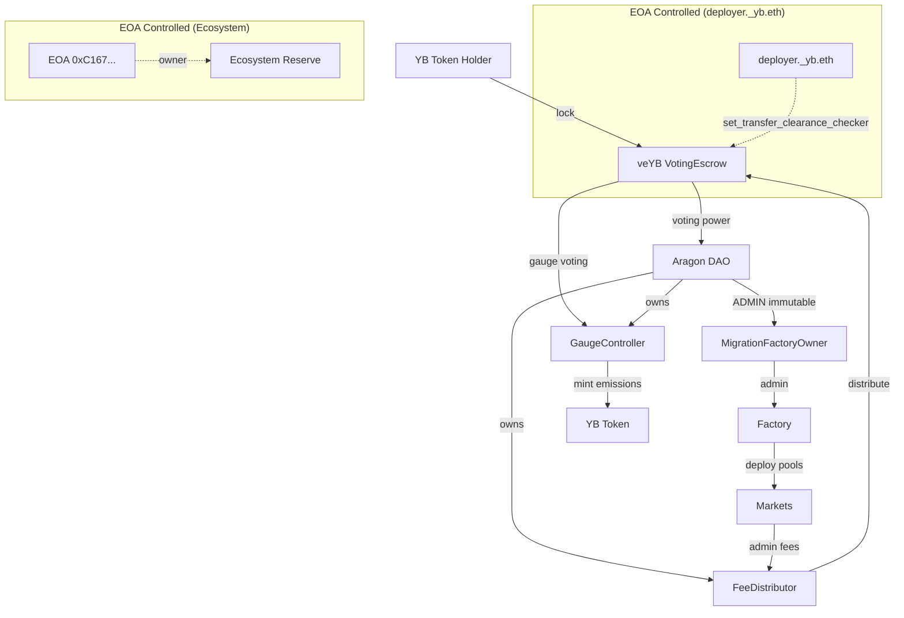

# YB Token Research Report

## Aragon Ownership Token Framework Analysis

**Token:** YB (YieldBasis)
**Address:** `0x01791F726B4103694969820be083196cC7c045fF`
**Network:** Ethereum Mainnet
**Date:** 2026-02-24
**Analyst:** Researcher Agent

---

## Executive Summary

**Protocol Description:** Yield Basis is the liquidity protocol designed to eliminate Impermanent Loss (IL) in AMMs using constantly-maintained 2x leveraged liquidity provision.

YB is the governance token of YieldBasis. This analysis evaluates YB against the Aragon Ownership Token Framework to answer three core questions:

1. **What do I own?** veYB (vote-escrowed YB) holders control protocol governance through Aragon OSx, direct emissions via gauge voting, and receive protocol admin fees. The YB token itself is non-upgradeable with renounced ownership. Protocol upgrades are controlled by the DAO through the MigrationFactoryOwner.

2. **Why should it have value?** veYB holders receive protocol admin fees (distributed weekly in yb-LP tokens via the FeeDistributor) and control emission allocation via gauge voting. Value accrual mechanisms are active and programmatic.

3. **What threatens that value?** The veYB contract owner is an EOA (deployer._yb.eth), not the DAO—this EOA can change transfer clearance rules for veYB positions but cannot censor the underlying YB token. Users remain custodians of their locked YB. The Ecosystem Reserve (~63.4M YB) is controlled by an EOA, not the DAO. Mixed licensing (proprietary Factory code) and Curve technology dependency are noted concerns.

**Overall Assessment:** 12 positive (✅), 2 neutral (TBD), 4 at-risk (⚠️)

---

## Contract Addresses and Ownership Verification

| Contract | Address | Owner | Verified |
|----------|---------|-------|----------|
| YB Token | `0x01791F726B4103694969820be083196cC7c045fF` | `0x0` (renounced) | ✅ On-chain |
| veYB (VotingEscrow) | `0x8235c179E9e84688FBd8B12295EfC26834dAC211` | `0xa39E4d6bb25A8E55552D6D9ab1f5f8889DDdC80d` (deployer._yb.eth) | ⚠️ EOA |
| GaugeController | `0x1Be14811A3a06F6aF4fA64310a636e1Df04c1c21` | `0x42F2A41A0D0e65A440813190880c8a65124895Fa` (DAO) | ✅ DAO |
| FeeDistributor | `0xD11b416573EbC59b6B2387DA0D2c0D1b3b1F7A90` | `0x42F2A41A0D0e65A440813190880c8a65124895Fa` (DAO) | ✅ DAO |
| Factory | `0x370a449FeBb9411c95bf897021377fe0B7D100c0` | `0xA68343ed4d517a277cFA1F2FC2b51f7a6794B6AD` (MigrationFactoryOwner) | ✅ Indirect DAO |
| MigrationFactoryOwner | `0xa68343ed4d517a277cfa1f2fc2b51f7a6794b6ad` | ADMIN immutable = `0x42F2A41A0D0e65A440813190880c8a65124895Fa` (DAO) | ✅ DAO |
| DAO | `0x42F2A41A0D0e65A440813190880c8a65124895Fa` | Aragon OSx | ✅ veYB holders |
| TokenVoting Plugin | `0x2be6670DE1cCEC715bDBBa2e3A6C1A05E496ec78` | - | ✅ Verified |
| Team Vesting | `0x93Eb25E380229bFED6AB4bf843E5f670c12785e3` | `0xC1671c9efc9A2ecC347238BeA054Fc6d1c6c28F9` (EOA) | EOA |
| Investor Vesting | `0x11988547B064CaBF65c431c14Ef1b7435084602e` | `0xC1671c9efc9A2ecC347238BeA054Fc6d1c6c28F9` (EOA) | EOA |
| Ecosystem Reserve | `0x7aC5922776034132D9ff5c7889d612d98e052Cf2` | `0xC1671c9efc9A2ecC347238BeA054Fc6d1c6c28F9` (EOA) | ⚠️ EOA |
| Curve Licensing Vesting | `0x36e36D5D588D480A15A40C7668Be52D36eb206A8` | `0x40907540d8a6c65c637785e8f8b742ae6b0b9968` | - |

### On-Chain Verification (2026-02-24)

```
cast call 0x01791F726B4103694969820be083196cC7c045fF "owner()(address)" --rpc-url https://ethereum.publicnode.com
→ 0x0000000000000000000000000000000000000000 (renounced)

cast call 0x8235c179E9e84688FBd8B12295EfC26834dAC211 "owner()(address)" --rpc-url https://ethereum.publicnode.com
→ 0xa39E4d6bb25A8E55552D6D9ab1f5f8889DDdC80d

cast lookup-address 0xa39E4d6bb25A8E55552D6D9ab1f5f8889DDdC80d --rpc-url https://ethereum.publicnode.com
→ deployer._yb.eth

cast call 0x1Be14811A3a06F6aF4fA64310a636e1Df04c1c21 "owner()(address)" --rpc-url https://ethereum.publicnode.com
→ 0x42F2A41A0D0e65A440813190880c8a65124895Fa (DAO)

cast call 0xD11b416573EbC59b6B2387DA0D2c0D1b3b1F7A90 "owner()(address)" --rpc-url https://ethereum.publicnode.com
→ 0x42F2A41A0D0e65A440813190880c8a65124895Fa (DAO)

cast call 0x370a449FeBb9411c95bf897021377fe0B7D100c0 "admin()(address)" --rpc-url https://ethereum.publicnode.com
→ 0xA68343ed4d517a277cFA1F2FC2b51f7a6794B6AD (MigrationFactoryOwner)

cast call 0xa68343ed4d517a277cfa1f2fc2b51f7a6794b6ad "ADMIN()(address)" --rpc-url https://ethereum.publicnode.com
→ 0x42F2A41A0D0e65A440813190880c8a65124895Fa (DAO)

cast call 0x8235c179E9e84688FBd8B12295EfC26834dAC211 "transfer_clearance_checker()(address)" --rpc-url https://ethereum.publicnode.com
→ 0x1Be14811A3a06F6aF4fA64310a636e1Df04c1c21 (GaugeController)

cast call 0x370a449FeBb9411c95bf897021377fe0B7D100c0 "fee_receiver()(address)" --rpc-url https://ethereum.publicnode.com
→ 0xD11b416573EbC59b6B2387DA0D2c0D1b3b1F7A90 (FeeDistributor)

cast call 0x7aC5922776034132D9ff5c7889d612d98e052Cf2 "owner()(address)" --rpc-url https://ethereum.publicnode.com
→ 0xC1671c9efc9A2ecC347238BeA054Fc6d1c6c28F9 (EOA - Ecosystem Reserve owner)
```

---

## Supply Metrics (Verified On-Chain 2026-02-24)

| Metric | Value |
|--------|-------|
| YB Total Supply | ~721.8M YB |
| YB Reserve (remaining to emit) | ~278.2M YB |
| veYB Supply (locked) | ~75.1M YB |
| Max Supply | 1,000,000,000 YB |
| Minted Percentage | ~72.2% |
| veYB Lock Rate | ~10.4% of minted supply |

```
cast call 0x01791F726B4103694969820be083196cC7c045fF "totalSupply()(uint256)" --rpc-url https://ethereum.publicnode.com
→ 721819114795797987206287628 [7.218e26]

cast call 0x01791F726B4103694969820be083196cC7c045fF "reserve()(uint256)" --rpc-url https://ethereum.publicnode.com
→ 278180885204202012793712372 [2.781e26]

cast call 0x8235c179E9e84688FBd8B12295EfC26834dAC211 "supply()(uint256)" --rpc-url https://ethereum.publicnode.com
→ 75074362325813852051904000 [7.507e25]
```

---

## Metric 1: Onchain Control

### 1.1 Onchain Governance Workflow ✅

**Finding:** veYB holders control the protocol through Aragon OSx governance. Proposals can be executed immediately when support and participation thresholds are met and remaining votes cannot change the outcome.

**Evidence:**
- DAO Contract: `0x42F2A41A0D0e65A440813190880c8a65124895Fa`
- TokenVoting Plugin: `0x2be6670DE1cCEC715bDBBa2e3A6C1A05E496ec78`
- Governance parameters (from [docs.yieldbasis.com/user/governance](https://docs.yieldbasis.com/user/governance)):
  - Participation threshold: 30% of veYB supply
  - Support threshold: 55% approval required
  - Voting duration: 604,800 seconds (7 days)
  - Proposal creation: Minimum 1 veYB required
  - Early execution: Proposals can be executed before the full voting period concludes when mathematical certainty is achieved (support and participation thresholds met, remaining votes cannot change outcome)

**Source Code:**
- VotingEscrow implements standard voting interface (IVotes): [`contracts/dao/VotingEscrow.vy:34`](https://github.com/yield-basis/yb-core/blob/41137e5837e411c9d60be8705ca74304b082fa92/contracts/dao/VotingEscrow.vy#L34)
- `getVotes()` function: [`contracts/dao/VotingEscrow.vy:462-474`](https://github.com/yield-basis/yb-core/blob/41137e5837e411c9d60be8705ca74304b082fa92/contracts/dao/VotingEscrow.vy#L462-L474)
- `getPastVotes()` function: [`contracts/dao/VotingEscrow.vy:477-505`](https://github.com/yield-basis/yb-core/blob/41137e5837e411c9d60be8705ca74304b082fa92/contracts/dao/VotingEscrow.vy#L477-L505)

---

### 1.2 Role Accountability ✅

**Finding:** Core protocol roles (GaugeController, FeeDistributor, Factory via MigrationFactoryOwner) are DAO-controlled. The veYB contract owner is an EOA (deployer._yb.eth), but this does not constitute material censorship risk.

**DAO-Controlled Contracts:**
- GaugeController.owner() = DAO ✅
- FeeDistributor.owner() = DAO ✅
- MigrationFactoryOwner.ADMIN = DAO (immutable) ✅

**EOA-Controlled Contract:**
- veYB.owner() = `0xa39E4d6bb25A8E55552D6D9ab1f5f8889DDdC80d` (ENS: deployer._yb.eth)
  - Power: `set_transfer_clearance_checker()` - can change veYB transfer rules
  - Current setting: GaugeController, which only checks `self.vote_user_power[user] == 0` (users cannot transfer while votes are active)
  - Source: [`contracts/dao/VotingEscrow.vy:640-647`](https://github.com/yield-basis/yb-core/blob/41137e5837e411c9d60be8705ca74304b082fa92/contracts/dao/VotingEscrow.vy#L640-L647)

**Transfer Restriction Analysis:**
The deployer EOA could theoretically change the transfer clearance checker to restrict veYB transfers. However:
- A transfer restriction is NOT censorship—it restricts moving the veNFT or toggling infinite locks, but the user remains custodian of underlying assets
- The underlying YB token has no such restriction capability (renounced ownership, no blacklist)
- Users can always withdraw YB after lock expiry regardless of transfer restrictions

**Conclusion:** YB and veYB are not materially exposed to censorship.

---

### 1.3 Protocol Upgrade Authority ✅

**Finding:** The DAO controls protocol upgrades through the MigrationFactoryOwner. This constitutes ownership—the indirection through governance is the standard mechanism for tokenholder control.

**Upgrade Chain:**
```
Factory.set_implementations()
  → requires msg.sender == self.admin
  → admin = MigrationFactoryOwner
  → MigrationFactoryOwner.set_implementations()
    → requires msg.sender == ADMIN (immutable)
    → ADMIN = DAO
```

**Source Code:**
- Factory.set_implementations(): [`contracts/Factory.vy:389-410`](https://github.com/yield-basis/yb-core/blob/41137e5837e411c9d60be8705ca74304b082fa92/contracts/Factory.vy#L389-L410)
- MigrationFactoryOwner.set_implementations(): [`contracts/MigrationFactoryOwner.vy:148-151`](https://github.com/yield-basis/yb-core/blob/41137e5837e411c9d60be8705ca74304b082fa92/contracts/MigrationFactoryOwner.vy#L148-L151)
- MigrationFactoryOwner.ADMIN immutable: [`contracts/MigrationFactoryOwner.vy:47`](https://github.com/yield-basis/yb-core/blob/41137e5837e411c9d60be8705ca74304b082fa92/contracts/MigrationFactoryOwner.vy#L47)

**On-Chain Verification:**
```
Factory.admin() = 0xA68343ed4d517a277cFA1F2FC2b51f7a6794B6AD (MigrationFactoryOwner)
MigrationFactoryOwner.ADMIN() = 0x42F2A41A0D0e65A440813190880c8a65124895Fa (DAO)
```

---

### 1.4 Token Upgrade Authority ✅

**Finding:** YB token is non-upgradeable with renounced ownership.

**Evidence:**
- owner() = `0x0000000000000000000000000000000000000000` (verified on-chain)
- No proxy pattern (plain Vyper contract)
- Uses standard ERC-20 implementation with ownership renounced at deployment

**Source Code:**
- `renounce_ownership()`: [`contracts/dao/YB.vy:90-100`](https://github.com/yield-basis/yb-core/blob/41137e5837e411c9d60be8705ca74304b082fa92/contracts/dao/YB.vy#L90-L100)
- Constructor comment explaining deployment sequence: [`contracts/dao/YB.vy:42-46`](https://github.com/yield-basis/yb-core/blob/41137e5837e411c9d60be8705ca74304b082fa92/contracts/dao/YB.vy#L42-L46)

```vyper
# The setup includes:
# * Minting preallocations
# * set_minter(GaugeController, True)
# * renounce_ownership(deployer) - will also unset the minter
```

---

### 1.5 Supply Control ✅

**Finding:** 1B max supply with programmatic emission based on gauge staking levels. Only GaugeController can mint. No discretionary minting.

**Emission Mechanism:**
The emission rate is determined by the `rate_factor`, which is calculated from gauge staking levels. The `get_adjustment()` function in each LiquidityGauge returns `sqrt(staked / totalSupply)`, meaning higher staking participation = higher emission rate (up to 100% of max rate).

**Source Code:**
- `get_adjustment()` - calculates rate factor based on LP staking: [`contracts/dao/LiquidityGauge.vy:133-142`](https://github.com/yield-basis/yb-core/blob/41137e5837e411c9d60be8705ca74304b082fa92/contracts/dao/LiquidityGauge.vy#L133-L142)
```vyper
@external
@view
def get_adjustment() -> uint256:
    """
    @notice Get a measure of how many Liquidity Tokens are staked: sqrt(staked / totalSupply)
    @return Result from 0.0 (0) to 1.0 (1e18)
    """
    staked: uint256 = staticcall LP_TOKEN.balanceOf(self)
    supply: uint256 = staticcall LP_TOKEN.totalSupply()
    return isqrt(unsafe_div(staked * 10**36, supply))
```
- GaugeController uses adjustment to calculate emissions: [`contracts/dao/GaugeController.vy:155-173`](https://github.com/yield-basis/yb-core/blob/41137e5837e411c9d60be8705ca74304b082fa92/contracts/dao/GaugeController.vy#L155-L173)
- `_emissions()` formula (exponential decay): [`contracts/dao/YB.vy:52-65`](https://github.com/yield-basis/yb-core/blob/41137e5837e411c9d60be8705ca74304b082fa92/contracts/dao/YB.vy#L52-L65)
- `emit()` function with minter check: [`contracts/dao/YB.vy:103-122`](https://github.com/yield-basis/yb-core/blob/41137e5837e411c9d60be8705ca74304b082fa92/contracts/dao/YB.vy#L103-L122)

---

### 1.6 Privileged Access Gating ✅

**Finding:** User exits are permissionless. No team-controlled pause on user funds.

**Exit Paths Verified:**
1. **veYB Withdrawal:** Permissionless after lock expiry
   - Source: [`contracts/dao/VotingEscrow.vy:428-457`](https://github.com/yield-basis/yb-core/blob/41137e5837e411c9d60be8705ca74304b082fa92/contracts/dao/VotingEscrow.vy#L428-L457)
   - Only check: `assert block.timestamp >= _locked.end, "The lock didn't expire"`

2. **Fee Claim:** Permissionless
   - Source: [`contracts/dao/FeeDistributor.vy:269-277`](https://github.com/yield-basis/yb-core/blob/41137e5837e411c9d60be8705ca74304b082fa92/contracts/dao/FeeDistributor.vy#L269-L277)
   - No admin check in claim flow

**Gauge Killing:** DAO-controlled via `GaugeController.set_killed()` - affects emissions not user funds.

---

### 1.7 Token Censorship ✅

**Finding:** No blacklist, freeze, or seizure functions in YB token. The veYB transfer clearance checker does not constitute censorship.

**YB Token:**
- Full source review: [`contracts/dao/YB.vy`](https://github.com/yield-basis/yb-core/blob/41137e5837e411c9d60be8705ca74304b082fa92/contracts/dao/YB.vy)
- Uses standard ERC-20 implementation with no custom transfer restrictions
- Standard `transfer()` and `transferFrom()` with no admin checks
- No pause function
- Ownership renounced

**veYB Transfer Restrictions:**
- The deployer EOA (deployer._yb.eth) can change transfer rules via `set_transfer_clearance_checker()`
- However, this restricts veNFT transfers, NOT custody—users remain owners of their locked YB
- Users can always withdraw after lock expiry regardless of transfer restrictions

**Conclusion:** YB and veYB are not materially exposed to censorship.

---

## Metric 2: Value Accrual

### 2.1 Accrual Active ✅

**Finding:** The FeeDistributor is actively distributing protocol admin fees to veYB holders.

**Important Distinction:**
- **Protocol revenue** = LP fees + position rebalancing expenses
- **veYB revenue** = `admin_fee` (protocol fee) — a **subset** of protocol revenue, not the whole thing

**Fee Source - Admin Fees from LT Vaults:**
Admin fees are generated from leveraged LP positions in each LT (Liquidity Token) vault. The fee mechanism:
1. Each LT vault accrues admin fees based on trading activity and borrowing
2. Anyone can call `withdraw_admin_fees()` on LT contracts to mint new LT tokens to the Factory's `fee_receiver`
3. The `fee_receiver` is set to the FeeDistributor (`0xD11b416573EbC59b6B2387DA0D2c0D1b3b1F7A90`)
4. FeeDistributor's `fill_epochs()` detects new token balances and distributes them over 4 weeks

**Source Code:**
- LT.withdraw_admin_fees(): [`contracts/LT.vy:866-896`](https://github.com/yield-basis/yb-core/blob/41137e5837e411c9d60be8705ca74304b082fa92/contracts/LT.vy#L866-L896)
  ```vyper
  fee_receiver: address = staticcall Factory(admin).fee_receiver()
  # ...
  to_mint: uint256 = v.supply_tokens * new_total // v.total - v.supply_tokens
  self._mint(fee_receiver, to_mint)
  ```
- Factory.fee_receiver: [`contracts/Factory.vy:98`](https://github.com/yield-basis/yb-core/blob/41137e5837e411c9d60be8705ca74304b082fa92/contracts/Factory.vy#L98)
- FeeDistributor._fill_epochs(): [`contracts/dao/FeeDistributor.vy:86-107`](https://github.com/yield-basis/yb-core/blob/41137e5837e411c9d60be8705ca74304b082fa92/contracts/dao/FeeDistributor.vy#L86-L107)
  ```vyper
  for token: IERC20 in token_set:
      balance: uint256 = staticcall token.balanceOf(self)
      old_balance: uint256 = self.token_balances[token]
      if balance > old_balance:
          self.token_balances[token] = balance
          balance_per_epoch: uint256 = (balance - old_balance) // OVER_WEEKS
          for epoch: uint256 in epochs:
              self.balances_for_epoch[epoch][token] += balance_per_epoch
  ```
- OVER_WEEKS = 4: [`contracts/dao/FeeDistributor.vy:49`](https://github.com/yield-basis/yb-core/blob/41137e5837e411c9d60be8705ca74304b082fa92/contracts/dao/FeeDistributor.vy#L49)

**Distribution:**
- Tokens: yb-cbBTC, yb-WBTC, yb-tBTC, yb-WETH
- Schedule: Weekly (Thursdays at 00:00 UTC), split over 4 epochs
- Basis: Pro-rata to veYB voting power at each epoch

**Data Source:** [ValueVerse Dashboard](https://yb.valueverse.ai)

**Documentation:** [docs.yieldbasis.com/user/veyb](https://docs.yieldbasis.com/user/veyb)

---

### 2.2 Treasury Ownership TBD

**Finding:** The Ecosystem Reserve (~63.4M YB) is controlled by an EOA, not the DAO. The DAO holds a small amount of YB directly (~887K YB).

**Treasury Ownership** refers to non-automated revenues that require discrete transactions (DAO or multisig votes) to distribute—distinct from programmatic fee flows like the FeeDistributor.

**On-Chain Verification (2026-02-24):**
```
cast call 0x01791F726B4103694969820be083196cC7c045fF "balanceOf(address)(uint256)" 0x42F2A41A0D0e65A440813190880c8a65124895Fa --rpc-url https://ethereum.publicnode.com
→ 887206684424150177574835 [8.872e23] (~887K YB)

cast call 0x01791F726B4103694969820be083196cC7c045fF "balanceOf(address)(uint256)" 0x7aC5922776034132D9ff5c7889d612d98e052Cf2 --rpc-url https://ethereum.publicnode.com
→ 63411655726788432267884323 [6.341e25] (~63.4M YB)

cast call 0x7aC5922776034132D9ff5c7889d612d98e052Cf2 "owner()(address)" --rpc-url https://ethereum.publicnode.com
→ 0xC1671c9efc9A2ecC347238BeA054Fc6d1c6c28F9 (EOA)
```

**Key Finding:** The Ecosystem Reserve (`0x7aC5922776034132D9ff5c7889d612d98e052Cf2`) is controlled by an EOA (`0xC1671c9efc9A2ecC347238BeA054Fc6d1c6c28F9`), not the DAO. This represents the largest pool of discretionary YB outside of the vesting contracts.

**Status Rationale:** TBD because the primary discretionary reserve (Ecosystem Reserve) is not DAO-controlled. The DAO holds only a small amount directly.

---

### 2.3 Accrual Mechanism Control ✅

**Finding:** veYB holders control both the direction of automated value flows (fee_receiver, gauge weights) and emission routing.

**Fee Flow Direction (DAO-Controlled):**
- Factory.fee_receiver parameter controlled by DAO via MigrationFactoryOwner
- DAO can change where admin fees are directed
- Source: [`contracts/Factory.vy:358-364`](https://github.com/yield-basis/yb-core/blob/41137e5837e411c9d60be8705ca74304b082fa92/contracts/Factory.vy#L358-L364)
- Source: [`contracts/MigrationFactoryOwner.vy:143-145`](https://github.com/yield-basis/yb-core/blob/41137e5837e411c9d60be8705ca74304b082fa92/contracts/MigrationFactoryOwner.vy#L143-L145)

**Gauge Voting = Fee Control by veYB:**
- veYB holders vote on gauge weights via `vote_for_gauge_weights()`
- Higher gauge weight = more YB emissions to that pool's stakers
- This incentivizes LP staking, which generates the admin fees distributed to veYB holders
- 10-day vote lock prevents manipulation
- GaugeController is DAO-owned

**Source Code:**
- `vote_for_gauge_weights()`: [`contracts/dao/GaugeController.vy:206-287`](https://github.com/yield-basis/yb-core/blob/41137e5837e411c9d60be8705ca74304b082fa92/contracts/dao/GaugeController.vy#L206-L287)
- `WEIGHT_VOTE_DELAY = 10 * 86400`: [`contracts/dao/GaugeController.vy:24`](https://github.com/yield-basis/yb-core/blob/41137e5837e411c9d60be8705ca74304b082fa92/contracts/dao/GaugeController.vy#L24)

---

### 2.4 Offchain Value Accrual TBD

**Finding:** Aragon has not been able to verify whether YieldBasis AG (operating entity) provides any offchain value to token holders.

**[UNVERIFIED]** No evidence of:
- Equity linkage between YB token and YieldBasis AG
- Offchain revenue sharing agreements
- Legal commitments to token holders

---

## Metric 3: Verifiability

### 3.1 Token Contract Source Verification ✅

**Finding:** YB token is verified on Etherscan with matching GitHub source.

**Evidence:**
- Contract: `0x01791F726B4103694969820be083196cC7c045fF`
- Compiler: Vyper 0.4.3
- License: GNU Affero General Public License v3.0
- Source: [`contracts/dao/YB.vy:1-7`](https://github.com/yield-basis/yb-core/blob/41137e5837e411c9d60be8705ca74304b082fa92/contracts/dao/YB.vy#L1-L7)

---

### 3.2 Protocol Component Source Verification ✅

**Finding:** All core contracts are verified on Etherscan. 6 independent security audits completed.

**Audits:**
1. Statemind — February 24 to May 22, 2025
2. Chainsecurity — July 7, 2025
3. Quantstamp — April 1 to April 16, 2025
4. Mixbytes — August 11, 2025
5. Electisec — August 3, 2025
6. Pashov — March 26 to April 1, 2025

**Source:** [docs.yieldbasis.com/user/audits-bug-bounties](https://docs.yieldbasis.com/user/audits-bug-bounties)

---

## Metric 4: Token Distribution

### 4.1 Ownership Concentration ⚠️

**Finding:** ~75M veYB locked (~10% of minted supply). Post-cliff, team + investors could represent 37% of supply.

**Token Distribution (from tokenomics):**
| Allocation | Amount | Percentage |
|------------|--------|------------|
| Team | 250M YB | 25% |
| Investors | 121M YB | 12.1% |
| Ecosystem Reserve | 125M YB | 12.5% |
| Curve Licensing | 75M YB | 7.5% |
| Liquidity Mining | 300M YB | 30% |
| Other/TGE | ~129M YB | ~12.9% |

**On-Chain Verification:**
- veYB supply: ~75.1M YB
- YB total supply: ~721.8M YB
- Lock rate: ~10.4%

**Risk:** If team and investors coordinate post-cliff, they could potentially control governance with 37% of supply, especially given current low veYB participation (~10%).

---

### 4.2 Future Token Unlocks ⚠️

**Finding:** Vesting follows a 24-month schedule with a 6-month cliff. Team and investors have locked ~35M YB into veYB during the cliff period, choosing protocol fees over liquidity.

**Vesting Schedule (Verified On-Chain):**
```
cast call 0x93Eb25E380229bFED6AB4bf843E5f670c12785e3 "START_TIME()(uint256)" --rpc-url https://ethereum.publicnode.com
→ 1757969372 = 2025-09-15

cast call 0x93Eb25E380229bFED6AB4bf843E5f670c12785e3 "END_TIME()(uint256)" --rpc-url https://ethereum.publicnode.com
→ 1821041372 = 2027-09-15
```

**Timeline:**
- **Start date:** September 15, 2025 (protocol deployment)
- **Total vesting duration:** 24 months
- **Cliff:** 6 months → ends March 15, 2026
- **During cliff:** Cannot sell, but **can lock into veYB**
  - ~35M YB was locked by team and investors during cliff
  - Holders chose protocol fees over liquidity
- **At cliff end (March 2026):** 25% unlocks (6/24 months = 25%)
- **Post-cliff:** Remaining 75% vests linearly over 18 months
- **Full vest:** September 15, 2027

**Affected Allocations:**
- Team: 250M YB
- Investors: 121M YB
- Total: 371M YB (37% of max supply)

**Key Insight:** Vesting tokens cannot be instantly used to influence governance—they release gradually over 18 months post-cliff. The decision by team/investors to lock tokens into veYB during the cliff demonstrates alignment with protocol fees over liquidity.

---

## Offchain Dependencies

### Trademark TBD

**Finding:** Aragon has not been able to verify YieldBasis trademark registration status.

Trademark likely owned by YieldBasis AG (Swiss company), which is team-controlled, not tokenholder-controlled.

---

### Distribution ⚠️

**Finding:** Primary domains and interfaces are team-controlled.

**Evidence:**
- yieldbasis.com - team controlled
- app.yieldbasis.com - team controlled
- No evidence of DAO control over distribution channels

**Note:** Smart contracts are permissionless and can be accessed via alternative interfaces.

---

### Licensing ⚠️

**Finding:** Mixed licensing with significant concerns.

**License Analysis:**

| Contract | License | Risk |
|----------|---------|------|
| YB.vy | AGPL v3.0 | Open source ✅ |
| VotingEscrow.vy | AGPL v3.0 | Open source ✅ |
| GaugeController.vy | AGPL v3.0 | Open source ✅ |
| FeeDistributor.vy | AGPL v3.0 | Open source ✅ |
| VestingEscrow.vy | AGPL v3.0 | Open source ✅ |
| **Factory.vy** | **Copyright (c) 2025** | **Proprietary ⚠️** |
| **MigrationFactoryOwner.vy** | **Copyright (c) 2025** | **Proprietary ⚠️** |

**Source Code Headers:**
- YB.vy: `@license GNU Affero General Public License v3.0` - [`contracts/dao/YB.vy:5`](https://github.com/yield-basis/yb-core/blob/41137e5837e411c9d60be8705ca74304b082fa92/contracts/dao/YB.vy#L5)
- Factory.vy: `@license Copyright (c) 2025` - [`contracts/Factory.vy:6`](https://github.com/yield-basis/yb-core/blob/41137e5837e411c9d60be8705ca74304b082fa92/contracts/Factory.vy#L6)

**Curve Dependency:**
- 75M YB (7.5% of supply) allocated to Curve licensing
- Technology dependency on Curve's infrastructure
- Vesting contract: `0x36e36D5D588D480A15A40C7668Be52D36eb206A8`

---

## Governance Flow Diagram



---

## Risk Summary

### Areas of Concern

1. **veYB Owner EOA** - `0xa39E4d6bb25A8E55552D6D9ab1f5f8889DDdC80d` (deployer._yb.eth)
   - Can modify transfer clearance rules for veYB positions
   - Does NOT constitute censorship—users remain custodians of locked YB
   - Should ideally be transferred to DAO

2. **Ecosystem Reserve EOA Control** - `0xC1671c9efc9A2ecC347238BeA054Fc6d1c6c28F9`
   - Controls ~63.4M YB
   - Not DAO-controlled
   - Represents primary discretionary reserve outside vesting

3. **Proprietary Factory License**
   - Core protocol component under "Copyright (c) 2025"
   - Not open source

4. **Curve Technology Dependency**
   - 7.5% of supply as licensing fee
   - Infrastructure dependency

5. **Team-Controlled Distribution**
   - Domains and UI are team controlled
   - Mitigated by permissionless contracts

---

## Conclusion

The YB token demonstrates strong on-chain governance properties with Aragon OSx, programmatic value accrual via FeeDistributor, and a non-upgradeable token with renounced ownership. Protocol upgrades are controlled by the DAO through the MigrationFactoryOwner—this constitutes ownership.

The veYB contract owner (deployer._yb.eth) can modify transfer clearance rules for veYB positions, but this does not constitute censorship—users remain custodians of their locked YB and can always withdraw after lock expiry. YB and veYB are not materially exposed to censorship.

The Ecosystem Reserve (~63.4M YB) is controlled by an EOA, not the DAO—this is a notable finding for Treasury Ownership evaluation.

The mixed licensing model (AGPL for DAO contracts, proprietary for Factory) and Curve technology dependency are noted concerns.

---

## Sources

### Primary Sources (Code)
- yb-core GitHub: https://github.com/yield-basis/yb-core
- Commit: 41137e5837e411c9d60be8705ca74304b082fa92

### On-Chain Verification
- RPC Endpoint: https://ethereum.publicnode.com
- All owner() calls verified 2026-02-24

### Documentation
- Governance: https://docs.yieldbasis.com/user/governance
- Tokenomics: https://docs.yieldbasis.com/user/tokenomics
- veYB: https://docs.yieldbasis.com/user/veyb
- Audits: https://docs.yieldbasis.com/user/audits-bug-bounties

### Data Sources
- Fee Data: [ValueVerse](https://yb.valueverse.ai)

### Contract Explorers
- YB Token: https://etherscan.io/address/0x01791F726B4103694969820be083196cC7c045fF
- veYB: https://etherscan.io/address/0x8235c179E9e84688FBd8B12295EfC26834dAC211
- GaugeController: https://etherscan.io/address/0x1Be14811A3a06F6aF4fA64310a636e1Df04c1c21
- FeeDistributor: https://etherscan.io/address/0xD11b416573EbC59b6B2387DA0D2c0D1b3b1F7A90
- Factory: https://etherscan.io/address/0x370a449FeBb9411c95bf897021377fe0B7D100c0
- DAO: https://etherscan.io/address/0x42F2A41A0D0e65A440813190880c8a65124895Fa
- Ecosystem Reserve: https://etherscan.io/address/0x7aC5922776034132D9ff5c7889d612d98e052Cf2
- MigrationFactoryOwner: https://etherscan.io/address/0xa68343ed4d517a277cfa1f2fc2b51f7a6794b6ad
