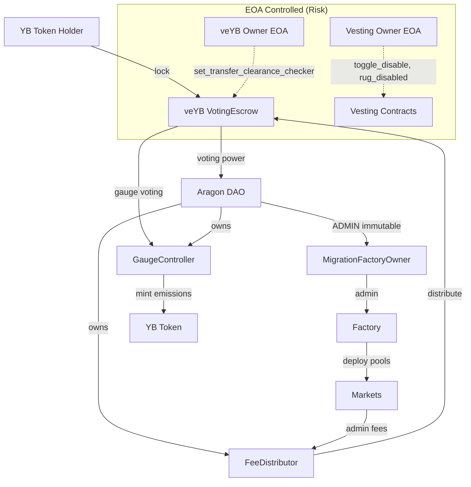

# YB Token Research Report

## Aragon Ownership Token Framework Analysis

**Token:** YB (YieldBasis)
**Address:** `0x01791F726B4103694969820be083196cC7c045fF`
**Network:** Ethereum Mainnet
**Date:** 2026-02-18
**Analyst:** Researcher Agent

---

## Executive Summary

YB is the governance token of YieldBasis, a leveraged LP yield farming protocol built on Curve infrastructure. This analysis evaluates YB against the Aragon Ownership Token Framework to answer three core questions:

1. **What do I own?** veYB holders control protocol governance through Aragon OSx, direct emissions via gauge voting, and receive protocol revenue. The YB token itself is non-upgradeable with renounced ownership.

2. **Why should it have value?** veYB holders receive protocol admin fees (distributed weekly in yb-LP tokens) and control emission allocation. Value accrual mechanisms are active and programmatic.

3. **What threatens that value?** Key concerns include: (a) veYB contract owner is an EOA, not the DAO; (b) vesting contract owners are EOAs with disable/rug capability; (c) imminent cliff unlock (~March 2026) of 37% supply; (d) mixed licensing with proprietary Factory code; (e) Curve technology dependency.

**Overall Assessment:** 10 positive (✅), 2 neutral (TBD), 6 at-risk (⚠️)

---

## Contract Addresses and Ownership Verification

| Contract | Address | Owner | Verified |
|----------|---------|-------|----------|
| YB Token | `0x01791F726B4103694969820be083196cC7c045fF` | `0x0` (renounced) | ✅ On-chain |
| veYB (VotingEscrow) | `0x8235c179E9e84688FBd8B12295EfC26834dAC211` | `0xa39e4d6bb25a8e55552d6d9ab1f5f8889dddc80d` (EOA) | ⚠️ EOA |
| GaugeController | `0x1Be14811A3a06F6aF4fA64310a636e1Df04c1c21` | `0x42F2A41A0D0e65A440813190880c8a65124895Fa` (DAO) | ✅ DAO |
| FeeDistributor | `0xD11b416573EbC59b6B2387DA0D2c0D1b3b1F7A90` | `0x42F2A41A0D0e65A440813190880c8a65124895Fa` (DAO) | ✅ DAO |
| Factory | `0x370a449FeBb9411c95bf897021377fe0B7D100c0` | `0xa68343ed4d517a277cfa1f2fc2b51f7a6794b6ad` (MigrationFactoryOwner) | ✅ Indirect DAO |
| MigrationFactoryOwner | `0xa68343ed4d517a277cfa1f2fc2b51f7a6794b6ad` | ADMIN immutable = `0x42F2A41A0D0e65A440813190880c8a65124895Fa` (DAO) | ✅ DAO |
| DAO | `0x42F2A41A0D0e65A440813190880c8a65124895Fa` | Aragon OSx | ✅ veYB holders |
| TokenVoting Plugin | `0x2be6670DE1cCEC715bDBBa2e3A6C1A05E496ec78` | - | ✅ Verified |
| Team Vesting | `0x93Eb25E380229bFED6AB4bf843E5f670c12785e3` | `0xc1671c9efc9a2ecc347238bea054fc6d1c6c28f9` (EOA) | ⚠️ EOA |
| Investor Vesting | `0x11988547B064CaBF65c431c14Ef1b7435084602e` | `0xc1671c9efc9a2ecc347238bea054fc6d1c6c28f9` (EOA) | ⚠️ EOA |
| Curve Licensing Vesting | `0x36e36D5D588D480A15A40C7668Be52D36eb206A8` | `0x40907540d8a6c65c637785e8f8b742ae6b0b9968` | - |
| Ecosystem Reserve | `0x7aC5922776034132D9ff5c7889d612d98e052Cf2` | - | - |

### On-Chain Verification

```
YB Token owner(): 0x0000000000000000000000000000000000000000 (renounced)
veYB owner(): 0xa39e4d6bb25a8e55552d6d9ab1f5f8889dddc80d (EOA)
GaugeController owner(): 0x42f2a41a0d0e65a440813190880c8a65124895fa (DAO)
FeeDistributor owner(): 0x42f2a41a0d0e65a440813190880c8a65124895fa (DAO)
Factory admin(): 0xa68343ed4d517a277cfa1f2fc2b51f7a6794b6ad (MigrationFactoryOwner)
MigrationFactoryOwner ADMIN(): 0x42f2a41a0d0e65a440813190880c8a65124895fa (DAO)
Team Vesting owner(): 0xc1671c9efc9a2ecc347238bea054fc6d1c6c28f9 (EOA)
Investor Vesting owner(): 0xc1671c9efc9a2ecc347238bea054fc6d1c6c28f9 (EOA)
```

**RPC Endpoint:** `https://eth.llamarpc.com`

---

## Supply Metrics (Verified On-Chain)

| Metric | Value |
|--------|-------|
| YB Total Supply | 720,908,837.28 YB |
| YB Reserve (remaining to emit) | 279,091,162.72 YB |
| veYB Supply (locked) | 70,823,178.71 YB |
| Max Supply | 1,000,000,000 YB |
| Minted Percentage | ~72.1% |
| veYB Lock Rate | ~9.8% of minted supply |

---

## Metric 1: Onchain Control

### 1.1 Onchain Governance Workflow ✅

**Finding:** veYB holders control the protocol through Aragon OSx governance with automatic execution.

**Evidence:**
- DAO Contract: `0x42F2A41A0D0e65A440813190880c8a65124895Fa`
- TokenVoting Plugin: `0x2be6670DE1cCEC715bDBBa2e3A6C1A05E496ec78`
- Governance parameters (from [docs.yieldbasis.com/user/governance](https://docs.yieldbasis.com/user/governance)):
  - Participation threshold: 30% of veYB supply
  - Support threshold: 55% approval required
  - Voting duration: 604,800 seconds (7 days)
  - Proposal creation: Minimum 1 veYB required
  - Early execution: Enabled when mathematical certainty achieved

**Source Code:**
- VotingEscrow implements IVotes interface: [`contracts/dao/VotingEscrow.vy:34`](https://github.com/yield-basis/yb-core/blob/master/contracts/dao/VotingEscrow.vy#L34)
- `getVotes()` function: [`contracts/dao/VotingEscrow.vy:462-474`](https://github.com/yield-basis/yb-core/blob/master/contracts/dao/VotingEscrow.vy#L462-L474)
- `getPastVotes()` function: [`contracts/dao/VotingEscrow.vy:477-505`](https://github.com/yield-basis/yb-core/blob/master/contracts/dao/VotingEscrow.vy#L477-L505)

---

### 1.2 Role Accountability ⚠️

**Finding:** Core protocol roles (GaugeController, FeeDistributor) are DAO-controlled, but veYB owner and vesting owners are EOAs.

**DAO-Controlled Contracts:**
- GaugeController.owner() = DAO ✅
- FeeDistributor.owner() = DAO ✅
- MigrationFactoryOwner.ADMIN = DAO (immutable) ✅

**EOA-Controlled Contracts:**
- veYB.owner() = `0xa39e4d6bb25a8e55552d6d9ab1f5f8889dddc80d` ⚠️
  - Powers: `set_transfer_clearance_checker()` - can change veYB transfer rules
  - Source: [`contracts/dao/VotingEscrow.vy:641-647`](https://github.com/yield-basis/yb-core/blob/master/contracts/dao/VotingEscrow.vy#L641-L647)

- Vesting.owner() = `0xc1671c9efc9a2ecc347238bea054fc6d1c6c28f9` ⚠️
  - Powers: `toggle_disable()`, `rug_disabled()` - can disable recipients and reclaim unvested tokens
  - Source: [`contracts/dao/VestingEscrow.vy:138-179`](https://github.com/yield-basis/yb-core/blob/master/contracts/dao/VestingEscrow.vy#L138-L179)

**Risk Assessment:** The veYB owner EOA can modify transfer clearance rules, potentially affecting governance. The vesting owner EOA has significant power over team/investor allocations but cannot affect already-vested tokens.

---

### 1.3 Protocol Upgrade Authority ⚠️

**Finding:** Factory controls implementation upgrades. Factory is indirectly DAO-controlled via MigrationFactoryOwner wrapper contract.

**Upgrade Chain:**
```
Factory.set_implementations()
  → requires msg.sender == self.admin
  → admin = MigrationFactoryOwner
  → MigrationFactoryOwner.set_implementations()
    → requires msg.sender == ADMIN (immutable)
    → ADMIN = DAO
```

**Source Code:**
- Factory.set_implementations(): [`contracts/Factory.vy:390-410`](https://github.com/yield-basis/yb-core/blob/master/contracts/Factory.vy#L390-L410)
- MigrationFactoryOwner.set_implementations(): [`contracts/MigrationFactoryOwner.vy:149-151`](https://github.com/yield-basis/yb-core/blob/master/contracts/MigrationFactoryOwner.vy#L149-L151)
- MigrationFactoryOwner.ADMIN immutable: [`contracts/MigrationFactoryOwner.vy:47`](https://github.com/yield-basis/yb-core/blob/master/contracts/MigrationFactoryOwner.vy#L47)

**On-Chain Verification:**
```
Factory.admin() = 0xa68343ed4d517a277cfa1f2fc2b51f7a6794b6ad (MigrationFactoryOwner)
MigrationFactoryOwner.ADMIN() = 0x42f2a41a0d0e65a440813190880c8a65124895fa (DAO)
```

**Assessment:** DAO control exists but is indirect. The wrapper pattern adds a layer but preserves tokenholder sovereignty.

---

### 1.4 Token Upgrade Authority ✅

**Finding:** YB token is non-upgradeable with renounced ownership.

**Evidence:**
- owner() = `0x0000000000000000000000000000000000000000` (verified on-chain)
- No proxy pattern (plain Vyper contract)
- Uses snekmate ERC-20 with ownership renounced at deployment

**Source Code:**
- `renounce_ownership()`: [`contracts/dao/YB.vy:90-100`](https://github.com/yield-basis/yb-core/blob/master/contracts/dao/YB.vy#L90-L100)
- Constructor comment explaining deployment sequence: [`contracts/dao/YB.vy:42-46`](https://github.com/yield-basis/yb-core/blob/master/contracts/dao/YB.vy#L42-L46)

```vyper
# The setup includes:
# * Minting preallocations
# * set_minter(GaugeController, True)
# * renounce_ownership(deployer) - will also unset the minter
```

---

### 1.5 Supply Control ✅

**Finding:** 1B max supply with programmatic exponential decay emission. Only GaugeController can mint. No discretionary minting.

**Evidence:**
- Max supply enforced via reserve mechanism
- Emission formula: exponential decay based on time and rate_factor
- Only minter (GaugeController) can call `emit()`

**Source Code:**
- `_emissions()` formula: [`contracts/dao/YB.vy:52-65`](https://github.com/yield-basis/yb-core/blob/master/contracts/dao/YB.vy#L52-L65)
- `emit()` function with minter check: [`contracts/dao/YB.vy:103-122`](https://github.com/yield-basis/yb-core/blob/master/contracts/dao/YB.vy#L103-L122)

```vyper
@external
def emit(owner: address, rate_factor: uint256) -> uint256:
    assert erc20.is_minter[msg.sender], "erc20: access is denied"
    # ... emission logic
```

**On-Chain Verification:**
- Total Supply: 720,908,837.28 YB
- Reserve: 279,091,162.72 YB
- Total: 1,000,000,000 YB (matches max supply)

---

### 1.6 Privileged Access Gating ✅

**Finding:** User exits are permissionless. No team-controlled pause on user funds.

**Exit Paths Verified:**
1. **veYB Withdrawal:** Permissionless after lock expiry
   - Source: [`contracts/dao/VotingEscrow.vy:428-457`](https://github.com/yield-basis/yb-core/blob/master/contracts/dao/VotingEscrow.vy#L428-L457)
   - Only check: `assert block.timestamp >= _locked.end, "The lock didn't expire"`

2. **Fee Claim:** Permissionless
   - Source: [`contracts/dao/FeeDistributor.vy:269-277`](https://github.com/yield-basis/yb-core/blob/master/contracts/dao/FeeDistributor.vy#L269-L277)
   - No admin check in claim flow

3. **Vesting Claim:** Permissionless for vested tokens
   - Source: [`contracts/dao/VestingEscrow.vy:273-285`](https://github.com/yield-basis/yb-core/blob/master/contracts/dao/VestingEscrow.vy#L273-L285)
   - Note: toggle_disable can freeze unvested portion but NOT already-vested tokens

**Gauge Killing:** DAO-controlled via `GaugeController.set_killed()` - affects emissions not user funds.

---

### 1.7 Token Censorship ✅

**Finding:** No blacklist, freeze, or seizure functions in YB token.

**Evidence:**
- Full source review: [`contracts/dao/YB.vy`](https://github.com/yield-basis/yb-core/blob/master/contracts/dao/YB.vy)
- Uses snekmate ERC-20 with no custom transfer restrictions
- Standard `transfer()` and `transferFrom()` with no admin checks
- No pause function

---

## Metric 2: Value Accrual

### 2.1 Accrual Active ✅

**Finding:** FeeDistributor is actively distributing protocol revenue to veYB holders.

**Evidence:**
- FeeDistributor: `0xD11b416573EbC59b6B2387DA0D2c0D1b3b1F7A90`
- Distribution tokens: yb-cbBTC, yb-WBTC, yb-tBTC, yb-WETH
- Schedule: Weekly (Thursdays at 00:00 UTC), split across 4 weeks

**Source Code:**
- `_fill_epochs()`: [`contracts/dao/FeeDistributor.vy:86-107`](https://github.com/yield-basis/yb-core/blob/master/contracts/dao/FeeDistributor.vy#L86-L107)
- `OVER_WEEKS = 4`: [`contracts/dao/FeeDistributor.vy:49`](https://github.com/yield-basis/yb-core/blob/master/contracts/dao/FeeDistributor.vy#L49)

**Documentation:** [docs.yieldbasis.com/user/veyb](https://docs.yieldbasis.com/user/veyb)

---

### 2.2 Treasury Ownership ✅

**Finding:** FeeDistributor is DAO-controlled. Fee parameters controlled by DAO via Factory.

**Evidence:**
- FeeDistributor.owner() = DAO (verified on-chain)
- Factory.fee_receiver controlled by DAO via MigrationFactoryOwner chain

**Source Code:**
- FeeDistributor constructor with owner parameter: [`contracts/dao/FeeDistributor.vy:71-83`](https://github.com/yield-basis/yb-core/blob/master/contracts/dao/FeeDistributor.vy#L71-L83)
- Factory.set_fee_receiver(): [`contracts/Factory.vy:358-364`](https://github.com/yield-basis/yb-core/blob/master/contracts/Factory.vy#L358-L364)

---

### 2.3 Accrual Mechanism Control ✅

**Finding:** veYB holders control gauge weights (emission routing). Fee parameters controlled by DAO.

**Gauge Voting:**
- veYB holders vote on gauge weights via `vote_for_gauge_weights()`
- 10-day vote lock prevents manipulation
- GaugeController is DAO-owned

**Source Code:**
- `vote_for_gauge_weights()`: [`contracts/dao/GaugeController.vy:206-287`](https://github.com/yield-basis/yb-core/blob/master/contracts/dao/GaugeController.vy#L206-L287)
- `WEIGHT_VOTE_DELAY = 10 * 86400`: [`contracts/dao/GaugeController.vy:24`](https://github.com/yield-basis/yb-core/blob/master/contracts/dao/GaugeController.vy#L24)

---

### 2.4 Offchain Value Accrual TBD

**Finding:** Whether YieldBasis AG (operating entity) provides any offchain value to token holders has not been verified.

**[UNVERIFIED]** No evidence of:
- Equity linkage between YB token and YieldBasis AG
- Offchain revenue sharing agreements
- Legal commitments to token holders

---

## Metric 3: Verifiability

### 3.1 Token Contract Source Verification ✅

**Finding:** YB token is verified on Etherscan with matching GitHub source.

**Evidence:**
- Contract: `0x01791F726B4103694969820be083196cC7c045fF`
- Compiler: Vyper 0.4.3
- License: GNU Affero General Public License v3.0
- Source: [`contracts/dao/YB.vy:1-7`](https://github.com/yield-basis/yb-core/blob/master/contracts/dao/YB.vy#L1-L7)

---

### 3.2 Protocol Component Source Verification ✅

**Finding:** All core contracts are verified on Etherscan. 6 independent security audits completed.

**Audits:**
1. Statemind — February 24 to May 22, 2025
2. Chainsecurity — July 7, 2025
3. Quantstamp — April 1 to April 16, 2025
4. Mixbytes — August 11, 2025
5. Electisec — August 3, 2025
6. Pashov — March 26 to April 1, 2025

**Source:** [docs.yieldbasis.com/user/audits-bug-bounties](https://docs.yieldbasis.com/user/audits-bug-bounties)

---

## Metric 4: Token Distribution

### 4.1 Ownership Concentration ⚠️

**Finding:** ~70M veYB locked (~10% of minted supply). Post-cliff, team + investors could control 37% of supply.

**Token Distribution (from tokenomics):**
| Allocation | Amount | Percentage |
|------------|--------|------------|
| Team | 250M YB | 25% |
| Investors | 121M YB | 12.1% |
| Ecosystem Reserve | 125M YB | 12.5% |
| Curve Licensing | 75M YB | 7.5% |
| Liquidity Mining | 300M YB | 30% |
| Other/TGE | ~129M YB | ~12.9% |

**On-Chain Verification:**
- veYB supply: 70,823,178.71 YB
- YB total supply: 720,908,837.28 YB
- Lock rate: ~9.8%

**Risk:** If team and investors coordinate post-cliff, they could potentially control governance with 37% of supply, especially given current low veYB participation (~10%).

---

### 4.2 Future Token Unlocks ⚠️

**Finding:** 6-month cliff ends ~March 15, 2026 (imminent). 37% of supply begins unlocking.

**Vesting Schedule:**
- Start date: September 15, 2025 (protocol deployment)
- Cliff: 6 months = March 15, 2026
- Vesting duration: 24 months (linear after cliff)
- Affected allocations: Team (250M) + Investors (121M) = 371M YB

**Source:** [docs.yieldbasis.com/user/tokenomics](https://docs.yieldbasis.com/user/tokenomics)

**Vesting Contract Powers (EOA-controlled):**
- `toggle_disable()`: Can disable recipient's ability to claim unvested tokens
- `rug_disabled()`: Can reclaim tokens from disabled accounts
- `disable_can_disable()`: Can permanently disable the disable function

**Source Code:**
- toggle_disable: [`contracts/dao/VestingEscrow.vy:138-162`](https://github.com/yield-basis/yb-core/blob/master/contracts/dao/VestingEscrow.vy#L138-L162)
- rug_disabled: [`contracts/dao/VestingEscrow.vy:165-179`](https://github.com/yield-basis/yb-core/blob/master/contracts/dao/VestingEscrow.vy#L165-L179)

**Risk:** EOA owner has significant power over vesting recipients. This is a trust-based system, not code-enforced.

---

## Offchain Dependencies

### Trademark TBD

**Finding:** YieldBasis trademark registration status not verified.

**[UNVERIFIED]** Trademark likely owned by YieldBasis AG (Swiss company), which is team-controlled, not tokenholder-controlled.

---

### Distribution ⚠️

**Finding:** Primary domains and interfaces are team-controlled.

**Evidence:**
- yieldbasis.com - team controlled
- app.yieldbasis.com - team controlled
- No evidence of DAO control over distribution channels

**Note:** Smart contracts are permissionless and can be accessed via alternative interfaces.

---

### Licensing ⚠️

**Finding:** Mixed licensing with significant concerns.

**License Analysis:**

| Contract | License | Risk |
|----------|---------|------|
| YB.vy | AGPL v3.0 | Open source ✅ |
| VotingEscrow.vy | AGPL v3.0 | Open source ✅ |
| GaugeController.vy | AGPL v3.0 | Open source ✅ |
| FeeDistributor.vy | AGPL v3.0 | Open source ✅ |
| VestingEscrow.vy | AGPL v3.0 | Open source ✅ |
| **Factory.vy** | **Copyright (c) 2025** | **Proprietary ⚠️** |
| **MigrationFactoryOwner.vy** | **Copyright (c) 2025** | **Proprietary ⚠️** |

**Source Code Headers:**
- YB.vy: `@license GNU Affero General Public License v3.0` - [`contracts/dao/YB.vy:5`](https://github.com/yield-basis/yb-core/blob/master/contracts/dao/YB.vy#L5)
- Factory.vy: `@license Copyright (c) 2025` - [`contracts/Factory.vy:6`](https://github.com/yield-basis/yb-core/blob/master/contracts/Factory.vy#L6)

**Curve Dependency:**
- 75M YB (7.5% of supply) allocated to Curve licensing
- Technology dependency on Curve's infrastructure
- Vesting contract: `0x36e36D5D588D480A15A40C7668Be52D36eb206A8`

---

## Governance Flow Diagram



---

## Risk Summary

### High Priority Concerns

1. **veYB Owner EOA** - `0xa39e4d6bb25a8e55552d6d9ab1f5f8889dddc80d`
   - Can modify transfer clearance rules
   - Should be transferred to DAO

2. **Vesting Owner EOA** - `0xc1671c9efc9a2ecc347238bea054fc6d1c6c28f9`
   - Can disable/rug vesting recipients
   - Significant trust assumption

3. **Imminent Cliff** - ~March 15, 2026
   - 371M YB (37%) begins unlocking
   - Potential concentration if coordinated

### Medium Priority Concerns

4. **Proprietary Factory License**
   - Core protocol component under "Copyright (c) 2025"
   - Not open source

5. **Curve Technology Dependency**
   - 7.5% of supply as licensing fee
   - Infrastructure dependency

### Lower Priority

6. **Team-Controlled Distribution**
   - Domains and UI are team controlled
   - Mitigated by permissionless contracts

---

## Conclusion

The YB token demonstrates strong on-chain governance properties with Aragon OSx, programmatic value accrual via FeeDistributor, and a non-upgradeable token with renounced ownership. However, several EOA-controlled roles (veYB owner, vesting owners) represent centralization risks that should be addressed through governance proposals to transfer ownership to the DAO.

The imminent vesting cliff (~March 2026) represents a significant concentration risk, and the mixed licensing model (AGPL for DAO contracts, proprietary for Factory) creates uncertainty about long-term token holder control over core protocol IP.

**Recommendation:** Token holders should advocate for (a) transferring veYB ownership to the DAO, (b) transferring vesting contract ownership to the DAO or calling `disable_can_disable()`, and (c) clarifying the licensing situation for Factory contracts.

---

## Sources

### Primary Sources (Code)
- yb-core GitHub: https://github.com/yield-basis/yb-core

### On-Chain Verification
- RPC Endpoint: https://eth.llamarpc.com
- All owner() calls verified 2026-02-18

### Documentation
- Governance: https://docs.yieldbasis.com/user/governance
- Tokenomics: https://docs.yieldbasis.com/user/tokenomics
- veYB: https://docs.yieldbasis.com/user/veyb
- Audits: https://docs.yieldbasis.com/user/audits-bug-bounties

### Contract Explorers
- YB Token: https://etherscan.io/address/0x01791F726B4103694969820be083196cC7c045fF
- veYB: https://etherscan.io/address/0x8235c179E9e84688FBd8B12295EfC26834dAC211
- GaugeController: https://etherscan.io/address/0x1Be14811A3a06F6aF4fA64310a636e1Df04c1c21
- FeeDistributor: https://etherscan.io/address/0xD11b416573EbC59b6B2387DA0D2c0D1b3b1F7A90
- Factory: https://etherscan.io/address/0x370a449FeBb9411c95bf897021377fe0B7D100c0
- DAO: https://etherscan.io/address/0x42F2A41A0D0e65A440813190880c8a65124895Fa
